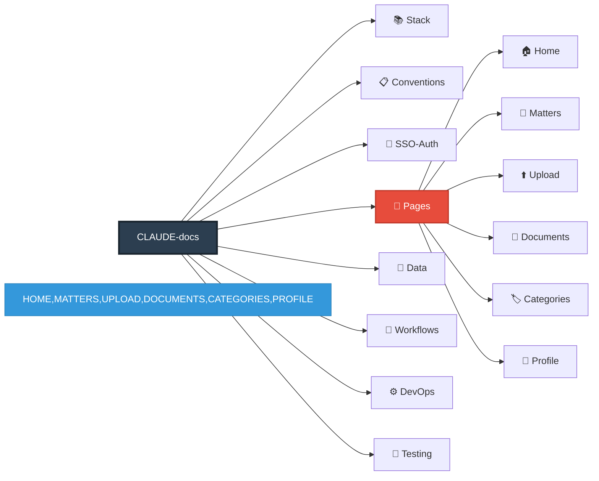
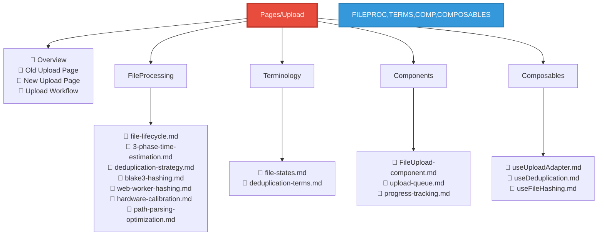
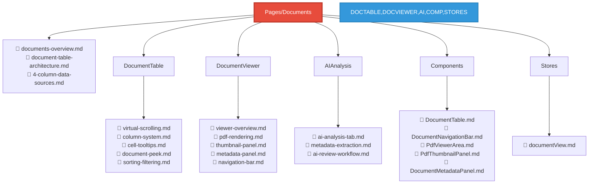

# Documentation Structure - Plan 1: Page-Centric Organization

This file provides a visual representation of the Page-Centric documentation structure using Mermaid diagrams.

## Overview

**Philosophy**: Organize documentation by UI pages/routes. When an LLM is working on a specific page feature, all relevant documentation is grouped together.

**Optimization**: Best for feature-focused work where tasks are scoped to specific user-facing pages.

## Full Structure Diagram

```mermaid
graph TD
    ROOT[CLAUDE-docs]

    ROOT --> STACK[Stack]
    ROOT --> CONV[Conventions]
    ROOT --> SSO[SSO-Auth]
    ROOT --> PAGES[Pages]
    ROOT --> DATA[Data]
    ROOT --> WORKFLOWS[Workflows]
    ROOT --> DEVOPS[DevOps]
    ROOT --> TESTING[Testing]
    ROOT --> DEBT[TechnicalDebt]
    ROOT --> AGENTS[AgentInstructions]

    %% Stack
    STACK --> STACK_FILES["📄 vue3-composition-api.md<br/>📄 vuetify3-components.md<br/>📄 vite-build-system.md<br/>📄 firebase-services.md<br/>📄 pinia-state-management.md<br/>📄 tailwind-styling.md<br/>📄 vitest-testing.md"]

    %% Conventions
    CONV --> CONV_FILES["📄 typescript-ref-typing.md<br/>📄 component-naming.md<br/>📄 file-organization.md<br/>📄 commit-messages.md<br/>📄 design-system.md"]

    %% SSO-Auth
    SSO --> SSO_FILES["📄 auth-state-machine.md<br/>📄 solo-firm-architecture.md<br/>📄 route-guards.md<br/>📄 firebase-auth-integration.md<br/>📄 multi-app-session-sync.md"]
    SSO --> SSO_COMP[Components]
    SSO --> SSO_STORES[Stores]
    SSO_COMP --> SSO_COMP_FILES["📄 LoginForm.md<br/>📄 AppSwitcher.md"]
    SSO_STORES --> SSO_STORES_FILES["📄 authStore.md<br/>📄 teamStore.md"]

    %% Pages
    PAGES --> HOME[Home]
    PAGES --> MATTERS[Matters]
    PAGES --> UPLOAD[Upload]
    PAGES --> DOCUMENTS[Documents]
    PAGES --> CATEGORIES[Categories]
    PAGES --> PROFILE[Profile]

    %% Home
    HOME --> HOME_FILES["📄 overview.md<br/>📄 home-tabs.md<br/>📄 first-app-setup.md"]

    %% Matters
    MATTERS --> MATTERS_FILES["📄 matters-list.md<br/>📄 matter-detail.md<br/>📄 new-matter.md<br/>📄 edit-matter.md<br/>📄 import-matters.md<br/>📄 solo-firm-matters-architecture.md"]
    MATTERS --> MATTERS_COMP[Components]
    MATTERS --> MATTERS_STORES[Stores]
    MATTERS_COMP --> MATTERS_COMP_FILES["📄 matter-table.md<br/>📄 matter-form.md"]
    MATTERS_STORES --> MATTERS_STORES_FILES["📄 matterStore.md<br/>📄 matterView.md"]

    %% Upload
    UPLOAD --> UPLOAD_FILES["📄 upload-overview.md<br/>📄 old-upload-page.md<br/>📄 new-upload-page-testing-route.md<br/>📄 upload-workflow.md"]
    UPLOAD --> FILEPROC[FileProcessing]
    UPLOAD --> TERMS[Terminology]
    UPLOAD --> UPLOAD_COMP[Components]
    UPLOAD --> UPLOAD_COMPOSABLES[Composables]

    FILEPROC --> FILEPROC_FILES["📄 file-lifecycle.md<br/>📄 3-phase-time-estimation.md<br/>📄 deduplication-strategy.md<br/>📄 blake3-hashing.md<br/>📄 web-worker-hashing.md<br/>📄 hardware-calibration-h-factor.md<br/>📄 path-parsing-optimization.md"]

    TERMS --> TERMS_FILES["📄 file-states.md<br/>📄 deduplication-terms.md"]

    UPLOAD_COMP --> UPLOAD_COMP_FILES["📄 FileUpload-component.md<br/>📄 upload-queue.md<br/>📄 progress-tracking.md"]

    UPLOAD_COMPOSABLES --> UPLOAD_COMPOSABLES_FILES["📄 useUploadAdapter.md<br/>📄 useDeduplication.md<br/>📄 useFileHashing.md"]

    %% Documents
    DOCUMENTS --> DOCUMENTS_FILES["📄 documents-overview.md<br/>📄 document-table-architecture.md<br/>📄 4-column-data-sources.md"]
    DOCUMENTS --> DOCTABLE[DocumentTable]
    DOCUMENTS --> DOCVIEWER[DocumentViewer]
    DOCUMENTS --> AI[AIAnalysis]
    DOCUMENTS --> DOC_COMP[Components]
    DOCUMENTS --> DOC_STORES[Stores]

    DOCTABLE --> DOCTABLE_FILES["📄 virtual-scrolling.md<br/>📄 column-system.md<br/>📄 cell-tooltips.md<br/>📄 document-peek.md<br/>📄 sorting-filtering.md"]

    DOCVIEWER --> DOCVIEWER_FILES["📄 viewer-overview.md<br/>📄 pdf-rendering.md<br/>📄 thumbnail-panel.md<br/>📄 metadata-panel.md<br/>📄 navigation-bar.md"]

    AI --> AI_FILES["📄 ai-analysis-tab.md<br/>📄 metadata-extraction.md<br/>📄 ai-review-workflow.md"]

    DOC_COMP --> DOC_COMP_FILES["📄 DocumentTable.md<br/>📄 DocumentNavigationBar.md<br/>📄 PdfViewerArea.md<br/>📄 PdfThumbnailPanel.md<br/>📄 DocumentMetadataPanel.md"]

    DOC_STORES --> DOC_STORES_FILES["📄 documentView.md"]

    %% Categories
    CATEGORIES --> CATEGORIES_FILES["📄 category-manager.md<br/>📄 category-creation-wizard.md<br/>📄 category-edit-wizard.md<br/>📄 tag-architecture.md"]
    CATEGORIES --> CAT_COMP[Components]
    CAT_COMP --> CAT_COMP_FILES["📄 EditableTag.md<br/>📄 category-forms.md"]

    %% Profile
    PROFILE --> PROFILE_FILES["📄 profile-page.md<br/>📄 settings-page.md<br/>📄 user-preferences.md"]

    %% Data
    DATA --> DATA_FILES["📄 firestore-collections.md<br/>📄 document-metadata-schema.md<br/>📄 matter-schema.md<br/>📄 category-schema.md<br/>📄 user-schema.md<br/>📄 firm-schema.md"]
    DATA --> STORAGE[Storage]
    DATA --> SECURITY[Security]
    STORAGE --> STORAGE_FILES["📄 firebase-storage-architecture.md<br/>📄 storage-paths.md<br/>📄 file-naming.md"]
    SECURITY --> SECURITY_FILES["📄 firestore-security-rules.md<br/>📄 storage-security-rules.md<br/>📄 team-based-isolation.md"]

    %% Workflows
    WORKFLOWS --> WORKFLOWS_FILES["📄 document-processing-workflow.md<br/>📄 firm-workflows.md<br/>📄 evidence-list-workflow.md"]

    %% DevOps
    DEVOPS --> DEVOPS_FILES["📄 local-dev-setup.md<br/>📄 sso-development-setup.md<br/>📄 build-process.md<br/>📄 deployment-promotion.md<br/>📄 hosting-tips.md"]

    %% Testing
    TESTING --> TESTING_FILES["📄 vitest-setup.md<br/>📄 unit-testing.md<br/>📄 component-testing.md<br/>📄 sso-e2e-testing.md<br/>📄 performance-testing.md"]

    %% Technical Debt
    DEBT --> DEBT_FILES["📄 build-debt.md<br/>📄 refactoring-todos.md"]

    %% Agent Instructions
    AGENTS --> AGENTS_FILES["📄 file-relocator.md<br/>📄 beautifier.md<br/>📄 test-engineer.md"]

    classDef folderStyle fill:#4A90E2,stroke:#2E5C8A,stroke-width:2px,color:#fff
    classDef filesStyle fill:#E8F4F8,stroke:#4A90E2,stroke-width:1px,color:#333

    class ROOT,STACK,CONV,SSO,PAGES,DATA,WORKFLOWS,DEVOPS,TESTING,DEBT,AGENTS folderStyle
    class HOME,MATTERS,UPLOAD,DOCUMENTS,CATEGORIES,PROFILE folderStyle
    class FILEPROC,TERMS,DOCTABLE,DOCVIEWER,AI,STORAGE,SECURITY folderStyle
    class SSO_COMP,SSO_STORES,MATTERS_COMP,MATTERS_STORES,UPLOAD_COMP,UPLOAD_COMPOSABLES folderStyle
    class DOC_COMP,DOC_STORES,CAT_COMP folderStyle
```



## Simplified Page-Level View



## Upload Page Deep Dive



## Documents Page Deep Dive



## LLM Discovery Patterns

### Pattern 1: Direct Page Query
```
Task: "Fix upload progress bar"
→ Navigate to: CLAUDE-docs/Pages/Upload/Components/
→ Find: progress-tracking.md
```

### Pattern 2: Feature Understanding
```
Task: "How does file deduplication work?"
→ Navigate to: CLAUDE-docs/Pages/Upload/FileProcessing/
→ Find: deduplication-strategy.md, blake3-hashing.md
```

### Pattern 3: Component Documentation
```
Task: "Update DocumentTable sorting"
→ Navigate to: CLAUDE-docs/Pages/Documents/DocumentTable/
→ Find: sorting-filtering.md, column-system.md
```

## Key Advantages

1. **Intuitive Navigation**: Page name in task → folder name in docs
2. **Scoped Context**: All upload-related docs in one place
3. **Low Cognitive Load**: Mirrors user's mental model
4. **Feature Isolation**: Each page is self-contained

## When to Use This Structure

✅ Most tasks reference specific pages
✅ Team thinks in "pages" not "features"
✅ Bug reports mention page names
✅ New developers learn page-by-page

## File Count Summary

- **Total Folders**: ~35
- **Estimated Files**: ~85
- **Max Depth**: 4 levels
- **Pages Covered**: 6 main pages
