# Documentation Structure - Plan 2: Architectural Layer Organization

This file provides a visual representation of the Architectural Layer documentation structure using Mermaid diagrams.

## Overview

**Philosophy**: Organize documentation by architectural concerns (Frontend, Backend, State, Data). When an LLM needs to understand system-wide patterns, all related documentation is grouped by layer.

**Optimization**: Best for architectural work, refactoring, and understanding system-wide patterns.

## Full Structure Diagram

```mermaid
graph TD
    ROOT[CLAUDE-docs]

    ROOT --> ARCH[Architecture]
    ROOT --> FRONTEND[Frontend]
    ROOT --> STATE[State]
    ROOT --> DATA[Data]
    ROOT --> BIZLOGIC[Business-Logic]
    ROOT --> AUTH[Authentication]
    ROOT --> WORKFLOWS[Workflows]
    ROOT --> TESTING[Testing]
    ROOT --> DEVOPS[DevOps]
    ROOT --> DEBT[TechnicalDebt]
    ROOT --> CONV[Conventions]
    ROOT --> AGENTS[AgentInstructions]

    %% Architecture
    ARCH --> ARCH_FILES["📄 overview.md<br/>📄 multi-app-sso-architecture.md<br/>📄 solo-firm-architecture.md<br/>📄 data-flow.md"]

    %% Frontend
    FRONTEND --> FRAMEWORK[Framework]
    FRONTEND --> UI[UI-Components]
    FRONTEND --> STYLING[Styling]
    FRONTEND --> VIEWS[Views]

    FRAMEWORK --> FRAMEWORK_FILES["📄 vue3-composition-api.md<br/>📄 vite-configuration.md<br/>📄 router-setup.md<br/>📄 route-guards.md"]

    UI --> UI_FILES["📄 vuetify3-integration.md<br/>📄 base-components.md<br/>📄 feature-components.md<br/>📄 component-naming-conventions.md"]
    UI --> LAYOUT[Layout]
    UI --> TABLES[Tables]
    UI --> FORMS[Forms]
    UI --> UPLOAD_UI[Upload]
    UI --> DOCVIEWER[DocumentViewer]

    LAYOUT --> LAYOUT_FILES["📄 AppHeader.md<br/>📄 AppSideBar.md<br/>📄 page-layouts.md"]

    TABLES --> TABLES_FILES["📄 DocumentTable-architecture.md<br/>📄 virtual-scrolling.md<br/>📄 column-system.md<br/>📄 cell-tooltips.md<br/>📄 sorting-filtering.md"]

    FORMS --> FORMS_FILES["📄 matter-forms.md<br/>📄 category-forms.md<br/>📄 form-validation.md"]

    UPLOAD_UI --> UPLOAD_UI_FILES["📄 FileUpload-component.md<br/>📄 upload-queue-ui.md<br/>📄 progress-indicators.md"]

    DOCVIEWER --> DOCVIEWER_FILES["📄 pdf-viewer.md<br/>📄 thumbnail-panel.md<br/>📄 metadata-panel.md<br/>📄 navigation-controls.md"]

    STYLING --> STYLING_FILES["📄 tailwind-configuration.md<br/>📄 vuetify-tailwind-integration.md<br/>📄 design-guidelines.md<br/>📄 responsive-design.md"]

    VIEWS --> VIEWS_FILES["📄 Home.md<br/>📄 Matters.md<br/>📄 Documents.md<br/>📄 Upload.md<br/>📄 Categories.md<br/>📄 Profile.md<br/>📄 Settings.md"]

    %% State
    STATE --> STORES[Pinia-Stores]
    STATE --> COMPOSABLES[Composables]

    STORES --> STORES_FILES["📄 store-architecture.md<br/>📄 authStore.md<br/>📄 teamStore.md<br/>📄 matterStore.md<br/>📄 documentView.md<br/>📄 matterView.md"]

    COMPOSABLES --> COMPOSABLES_FILES["📄 composables-overview.md<br/>📄 useMatters.md<br/>📄 useUsers.md<br/>📄 useFirmMembers.md<br/>📄 useAIAnalysis.md<br/>📄 useDocumentPeek.md<br/>📄 useVirtualTable.md<br/>📄 useColumnResize.md<br/>📄 useColumnSort.md<br/>📄 useColumnVisibility.md"]
    COMPOSABLES --> UPLOAD_COMPOSABLES[Upload]
    UPLOAD_COMPOSABLES --> UPLOAD_COMPOSABLES_FILES["📄 useUploadAdapter.md<br/>📄 useDeduplication.md<br/>📄 useFileHashing.md<br/>📄 useFileQueue.md"]

    %% Data
    DATA --> FIRESTORE[Firestore]
    DATA --> FBSTORAGE[FirebaseStorage]
    DATA --> SECURITY[Security]

    FIRESTORE --> FIRESTORE_FILES["📄 collections-overview.md<br/>📄 document-schema.md<br/>📄 matter-schema.md<br/>📄 category-schema.md<br/>📄 user-schema.md<br/>📄 firm-schema.md<br/>📄 query-patterns.md"]

    FBSTORAGE --> FBSTORAGE_FILES["📄 storage-architecture.md<br/>📄 path-structure.md<br/>📄 file-naming.md<br/>📄 upload-strategies.md"]

    SECURITY --> SECURITY_FILES["📄 firestore-security-rules.md<br/>📄 storage-security-rules.md<br/>📄 team-based-isolation.md<br/>📄 security-testing.md"]

    %% Business Logic
    BIZLOGIC --> FILEPROC[FileProcessing]
    BIZLOGIC --> DEDUPE[Deduplication]
    BIZLOGIC --> AI_BIZ[AI]
    BIZLOGIC --> CATEGORIES[Categories]

    FILEPROC --> FILEPROC_FILES["📄 file-lifecycle.md<br/>📄 file-lifecycle-terminology.md<br/>📄 3-phase-processing.md<br/>📄 time-estimation-formulas.md<br/>📄 hardware-calibration.md"]

    DEDUPE --> DEDUPE_FILES["📄 deduplication-strategy.md<br/>📄 deduplication-terminology.md<br/>📄 blake3-hashing.md<br/>📄 size-prefilter.md<br/>📄 hash-as-id.md<br/>📄 web-worker-implementation.md"]

    AI_BIZ --> AI_BIZ_FILES["📄 ai-analysis-system.md<br/>📄 metadata-extraction.md<br/>📄 ai-review-workflow.md<br/>📄 ai-requirements.md"]

    CATEGORIES --> CATEGORIES_FILES["📄 category-architecture.md<br/>📄 tag-system.md<br/>📄 category-workflows.md"]

    %% Authentication
    AUTH --> AUTH_FILES["📄 auth-state-machine.md<br/>📄 firebase-auth-v9.md<br/>📄 route-guards.md<br/>📄 session-persistence.md<br/>📄 multi-app-sync.md"]
    AUTH --> AUTH_COMP[Components]
    AUTH_COMP --> AUTH_COMP_FILES["📄 LoginForm.md<br/>📄 AppSwitcher.md"]

    %% Workflows
    WORKFLOWS --> WORKFLOWS_FILES["📄 document-processing-workflow.md<br/>📄 firm-workflows.md<br/>📄 upload-to-review-flow.md<br/>📄 matter-creation-flow.md"]

    %% Testing
    TESTING --> TESTING_FILES["📄 testing-overview.md<br/>📄 vitest-configuration.md<br/>📄 unit-testing.md<br/>📄 component-testing.md<br/>📄 e2e-testing.md<br/>📄 performance-testing.md<br/>📄 web-worker-testing.md"]

    %% DevOps
    DEVOPS --> DEVOPS_FILES["📄 local-development.md<br/>📄 sso-dev-setup.md<br/>📄 build-process.md<br/>📄 deployment-promotion.md<br/>📄 hosting-tips.md"]

    %% Technical Debt
    DEBT --> DEBT_FILES["📄 build-debt.md<br/>📄 refactoring-priorities.md"]

    %% Conventions
    CONV --> CONV_FILES["📄 typescript-conventions.md<br/>📄 vue-best-practices.md<br/>📄 component-organization.md<br/>📄 naming-conventions.md<br/>📄 commit-messages.md"]

    %% Agent Instructions
    AGENTS --> AGENTS_FILES["📄 file-relocator.md<br/>📄 beautifier.md<br/>📄 test-engineer.md"]

    classDef folderStyle fill:#9B59B6,stroke:#7D3C98,stroke-width:2px,color:#fff
    classDef filesStyle fill:#E8E8F8,stroke:#9B59B6,stroke-width:1px,color:#333

    class ROOT,ARCH,FRONTEND,STATE,DATA,BIZLOGIC,AUTH,WORKFLOWS,TESTING,DEVOPS,DEBT,CONV,AGENTS folderStyle
    class FRAMEWORK,UI,STYLING,VIEWS,STORES,COMPOSABLES,FIRESTORE,FBSTORAGE,SECURITY folderStyle
    class FILEPROC,DEDUPE,AI_BIZ,CATEGORIES,LAYOUT,TABLES,FORMS,UPLOAD_UI,DOCVIEWER folderStyle
```



## Simplified Layer View

```mermaid
graph LR
    ROOT[CLAUDE-docs]

    ROOT --> ARCH[🏛️ Architecture]
    ROOT --> FRONTEND[🎨 Frontend]
    ROOT --> STATE[🔄 State]
    ROOT --> DATA[💾 Data]
    ROOT --> BIZLOGIC[⚙️ Business-Logic]
    ROOT --> AUTH[🔐 Authentication]

    FRONTEND --> FRAMEWORK[Framework]
    FRONTEND --> UI[UI-Components]
    FRONTEND --> STYLING[Styling]

    STATE --> STORES[Pinia-Stores]
    STATE --> COMPOSABLES[Composables]

    DATA --> FIRESTORE[Firestore]
    DATA --> FBSTORAGE[Firebase Storage]
    DATA --> SECURITY[Security]

    BIZLOGIC --> FILEPROC[FileProcessing]
    BIZLOGIC --> DEDUPE[Deduplication]
    BIZLOGIC --> AI[AI]

    style ROOT fill:#2C3E50,stroke:#1A252F,stroke-width:3px,color:#fff
    style FRONTEND fill:#E74C3C,stroke:#C0392B,stroke-width:2px,color:#fff
    style STATE fill:#3498DB,stroke:#2980B9,stroke-width:2px,color:#fff
    style DATA fill:#2ECC71,stroke:#27AE60,stroke-width:2px,color:#fff
    style BIZLOGIC fill:#F39C12,stroke:#D68910,stroke-width:2px,color:#fff
```



## State Layer Deep Dive

```mermaid
graph TD
    STATE[State]

    STATE --> STORES[Pinia-Stores]
    STATE --> COMPOSABLES[Composables]

    STORES --> STORES_FILES["📄 store-architecture.md<br/>📄 authStore.md<br/>📄 teamStore.md<br/>📄 matterStore.md<br/>📄 documentView.md<br/>📄 matterView.md"]

    COMPOSABLES --> COMP_GENERAL["General Composables"]
    COMPOSABLES --> COMP_UPLOAD[Upload Composables]

    COMP_GENERAL --> COMP_GEN_FILES["📄 composables-overview.md<br/>📄 useMatters.md<br/>📄 useUsers.md<br/>📄 useFirmMembers.md<br/>📄 useAIAnalysis.md<br/>📄 useDocumentPeek.md<br/>📄 useVirtualTable.md<br/>📄 useColumnResize.md<br/>📄 useColumnSort.md<br/>📄 useColumnVisibility.md"]

    COMP_UPLOAD --> COMP_UP_FILES["📄 useUploadAdapter.md<br/>📄 useDeduplication.md<br/>📄 useFileHashing.md<br/>📄 useFileQueue.md"]

    style STATE fill:#3498DB,stroke:#2980B9,stroke-width:3px,color:#fff
    style STORES,COMPOSABLES fill:#5DADE2,stroke:#3498DB,stroke-width:2px,color:#fff
    style COMP_GENERAL,COMP_UPLOAD fill:#85C1E9,stroke:#5DADE2,stroke-width:1px,color:#333
```



## Data Layer Deep Dive

```mermaid
graph TD
    DATA[Data]

    DATA --> FIRESTORE[Firestore]
    DATA --> FBSTORAGE[Firebase Storage]
    DATA --> SECURITY[Security]

    FIRESTORE --> FS_FILES["📄 collections-overview.md<br/>📄 document-schema.md<br/>📄 matter-schema.md<br/>📄 category-schema.md<br/>📄 user-schema.md<br/>📄 firm-schema.md<br/>📄 query-patterns.md"]

    FBSTORAGE --> FBS_FILES["📄 storage-architecture.md<br/>📄 path-structure.md<br/>📄 file-naming.md<br/>📄 upload-strategies.md"]

    SECURITY --> SEC_FILES["📄 firestore-security-rules.md<br/>📄 storage-security-rules.md<br/>📄 team-based-isolation.md<br/>📄 security-testing.md"]

    style DATA fill:#2ECC71,stroke:#27AE60,stroke-width:3px,color:#fff
    style FIRESTORE,FBSTORAGE,SECURITY fill:#58D68D,stroke:#2ECC71,stroke-width:2px,color:#fff
```



## Business Logic Layer Deep Dive

```mermaid
graph TD
    BIZLOGIC[Business-Logic]

    BIZLOGIC --> FILEPROC[FileProcessing]
    BIZLOGIC --> DEDUPE[Deduplication]
    BIZLOGIC --> AI[AI]
    BIZLOGIC --> CATEGORIES[Categories]

    FILEPROC --> FP_FILES["📄 file-lifecycle.md<br/>📄 file-lifecycle-terminology.md<br/>📄 3-phase-processing.md<br/>📄 time-estimation-formulas.md<br/>📄 hardware-calibration.md"]

    DEDUPE --> DD_FILES["📄 deduplication-strategy.md<br/>📄 deduplication-terminology.md<br/>📄 blake3-hashing.md<br/>📄 size-prefilter.md<br/>📄 hash-as-id.md<br/>📄 web-worker-implementation.md"]

    AI --> AI_FILES["📄 ai-analysis-system.md<br/>📄 metadata-extraction.md<br/>📄 ai-review-workflow.md<br/>📄 ai-requirements.md"]

    CATEGORIES --> CAT_FILES["📄 category-architecture.md<br/>📄 tag-system.md<br/>📄 category-workflows.md"]

    style BIZLOGIC fill:#F39C12,stroke:#D68910,stroke-width:3px,color:#fff
    style FILEPROC,DEDUPE,AI,CATEGORIES fill:#F8C471,stroke:#F39C12,stroke-width:2px,color:#333
```



## LLM Discovery Patterns

### Pattern 1: Layer-Wide Refactoring
```
Task: "Refactor all Pinia stores to use new pattern"
→ Navigate to: CLAUDE-docs/State/Pinia-Stores/
→ Find: All store documentation in one place
```

### Pattern 2: Cross-Feature Pattern Discovery
```
Task: "Find all composables that use Firebase"
→ Navigate to: CLAUDE-docs/State/Composables/
→ Scan: All composable docs for Firebase usage
```

### Pattern 3: Architectural Understanding
```
Task: "How does data flow through the app?"
→ Navigate to: CLAUDE-docs/Architecture/
→ Find: data-flow.md, overview.md
→ Then explore: State/ and Data/ layers
```

## Key Advantages

1. **System-Wide Patterns**: Easy to find all state management in one place
2. **Architectural Refactoring**: Refactor entire layers cleanly
3. **Cross-Cutting Concerns**: Security, testing organized by concern
4. **Specialization**: Frontend/backend devs can focus on their layers

## When to Use This Structure

✅ Frequent architectural refactoring
✅ Team has specialized roles (frontend, backend, data)
✅ Need to understand cross-cutting patterns
✅ System-wide framework upgrades

## File Count Summary

- **Total Folders**: ~40
- **Estimated Files**: ~90
- **Max Depth**: 4 levels
- **Layers**: 6 primary architectural layers
