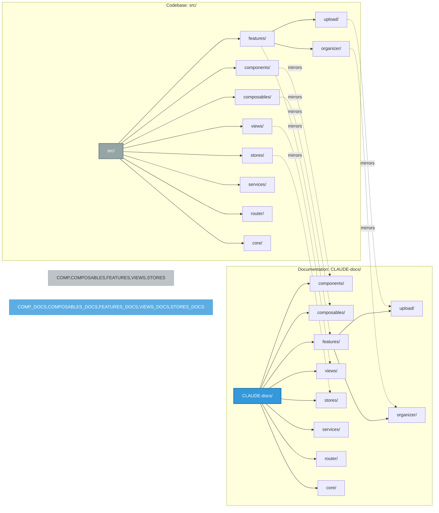

# Documentation Structure - Plan 4: Mirror Codebase Structure

This file provides a documentation structure that **directly mirrors** the actual `src/` folder organization in the codebase. This enables direct comparison between code organization and documentation organization.

## Overview

**Philosophy**: Documentation structure mirrors code structure exactly. Every folder in `src/` has a corresponding documentation folder in `CLAUDE-docs/`.

**Optimization**: Best for maintaining 1:1 alignment between code and documentation, making it trivial to find docs for any code file.

## Side-by-Side Comparison



## Complete Mirrored Structure

```mermaid
graph TD
    ROOT[CLAUDE-docs/]

    %% Top-level folders
    ROOT --> ASSETS[assets/]
    ROOT --> COMPONENTS[components/]
    ROOT --> COMPOSABLES[composables/]
    ROOT --> CONFIG[config/]
    ROOT --> CORE[core/]
    ROOT --> DEV_DEMOS[dev-demos/]
    ROOT --> FEATURES[features/]
    ROOT --> PLUGINS[plugins/]
    ROOT --> ROUTER[router/]
    ROOT --> SERVICES[services/]
    ROOT --> SHARED[shared/]
    ROOT --> STORES[stores/]
    ROOT --> STYLES[styles/]
    ROOT --> UTILS[utils/]
    ROOT --> VIEWS[views/]
    ROOT --> SYSTEM[_system/]

    %% Assets
    ASSETS --> ASSETS_FILES["📄 overview.md<br/>📁 icons/<br/>📁 images/<br/>📁 precedents/"]

    %% Components
    COMPONENTS --> COMP_BASE[base/]
    COMPONENTS --> COMP_DOCUMENT[document/]
    COMPONENTS --> COMP_FEATURES[features/]
    COMPONENTS --> COMP_HOME[home/]
    COMPONENTS --> COMP_LAYOUT[layout/]
    COMPONENTS --> COMP_UI[ui/]
    COMPONENTS --> COMP_FILES["📄 AppSwitcher.md"]

    COMP_BASE --> COMP_BASE_FILES["📄 overview.md<br/>📄 DocumentTable.md<br/>📄 BaseSearchBar.md<br/>📄 CellContentTooltip.md<br/>📄 DocumentPeekTooltip.md<br/>📄 DragHandle.md<br/>📄 HoldToConfirmButton.md"]

    COMP_DOCUMENT --> COMP_DOC_FILES["📄 overview.md<br/>📄 DocumentMetadataPanel.md<br/>📄 DocumentNavigationBar.md<br/>📄 PdfThumbnailPanel.md<br/>📄 PdfViewerArea.md"]
    COMP_DOCUMENT --> COMP_DOC_TABS[tabs/]
    COMP_DOC_TABS --> COMP_DOC_TABS_FILES["📄 AIAnalysisTab.md<br/>📄 DigitalFileTab.md<br/>📄 DocumentTab.md<br/>📄 ReviewTab.md"]
    COMP_DOC_TABS --> COMP_DOC_AI[ai-analysis/]
    COMP_DOC_AI --> COMP_DOC_AI_FILES["📄 AIAnalysisButton.md<br/>📄 AIAnalysisError.md<br/>📄 AIAnalysisFieldItem.md<br/>📄 AIReviewFieldItem.md"]

    COMP_FEATURES --> COMP_FEAT_AUTH[auth/]
    COMP_FEATURES --> COMP_FEAT_TAGS[tags/]
    COMP_FEAT_AUTH --> COMP_FEAT_AUTH_FILES["📄 LoginForm.md"]
    COMP_FEAT_TAGS --> COMP_FEAT_TAGS_FILES["📄 EditableTag.md<br/>📁 composables/"]

    COMP_LAYOUT --> COMP_LAYOUT_FILES["📄 overview.md<br/>📄 AppHeader.md<br/>📄 AppSideBar.md"]

    COMP_UI --> COMP_UI_FILES["📄 overview.md<br/>📄 SegmentedControl.md"]

    %% Composables
    COMPOSABLES --> COMPOSABLES_FILES["📄 overview.md<br/>📄 useAIAnalysis.md<br/>📄 useAsyncInspector.md<br/>📄 useAsyncRegistry.md<br/>📄 useCellTooltip.md<br/>📄 useColumnDragDrop.md<br/>📄 useColumnResize.md<br/>📄 useColumnSort.md<br/>📄 useColumnVisibility.md<br/>📄 useDocumentPeek.md<br/>📄 useDocumentTablePeek.md<br/>📄 useFavicon.md<br/>📄 useFirmMembers.md<br/>📄 useMatters.md<br/>📄 useTooltipTiming.md<br/>📄 useUsers.md<br/>📄 useVirtualTable.md"]

    %% Core
    CORE --> CORE_FILES["📄 overview.md"]
    CORE --> CORE_COMPOSABLES[composables/]
    CORE --> CORE_SERVICES[services/]
    CORE --> CORE_STORES[stores/]
    CORE_COMPOSABLES --> CORE_COMPOSABLES_FILES["📄 auth-composables.md"]
    CORE_SERVICES --> CORE_SERVICES_FILES["📄 firebase.md<br/>📄 auth-service.md"]
    CORE_STORES --> CORE_STORES_FILES["📄 authStore.md<br/>📄 teamStore.md<br/>📄 matterStore.md"]

    %% Features
    FEATURES --> FEATURES_UPLOAD[upload/]
    FEATURES --> FEATURES_ORGANIZER[organizer/]

    %% Upload Feature
    FEATURES_UPLOAD --> UPLOAD_FILES["📄 overview.md<br/>📄 FileUpload-page.md<br/>📄 architecture.md"]
    FEATURES_UPLOAD --> UPLOAD_COMPONENTS[components/]
    FEATURES_UPLOAD --> UPLOAD_COMPOSABLES[composables/]
    FEATURES_UPLOAD --> UPLOAD_UTILS[utils/]
    FEATURES_UPLOAD --> UPLOAD_WORKERS[workers/]

    UPLOAD_COMPONENTS --> UPLOAD_COMPONENTS_FILES["📄 overview.md<br/>📄 FileUploadQueue.md<br/>📄 UploadTable.md<br/>📄 UploadDropzone.md<br/>📄 ProcessingProgressModal.md<br/>📄 QueueProgressIndicator.md<br/>📄 UploadButtons.md<br/>+ 20 more component docs"]

    UPLOAD_COMPOSABLES --> UPLOAD_COMPOSABLES_FILES["📄 overview.md<br/>📄 useUploadAdapter.md<br/>📄 useFileQueue.md<br/>📄 useFileProcessor.md<br/>📄 useUploadOrchestrator.md"]
    UPLOAD_COMPOSABLES --> UPLOAD_DEDUPE[deduplication/]
    UPLOAD_COMPOSABLES --> UPLOAD_WEBWORKER[webWorker/]

    UPLOAD_DEDUPE --> UPLOAD_DEDUPE_FILES["📄 overview.md<br/>📄 detection.md<br/>📄 hashing.md<br/>📄 prefilter.md<br/>📄 deduplication-terminology.md"]

    UPLOAD_WEBWORKER --> UPLOAD_WEBWORKER_FILES["📄 overview.md<br/>📄 useWebWorkerHealth.md<br/>📄 useWebWorkerMessages.md<br/>📄 useWebWorkerState.md<br/>📄 webWorkerConstants.md"]

    UPLOAD_UTILS --> UPLOAD_UTILS_FILES["📄 overview.md<br/>📄 fileAnalysis.md<br/>📄 filePathExtractor.md<br/>📄 hardwareCalibration.md<br/>📄 processingTimer.md<br/>📄 uploadHelpers.md"]

    UPLOAD_WORKERS --> UPLOAD_WORKERS_FILES["📄 overview.md<br/>📄 fileHashWorker.md<br/>📄 worker-implementation.md"]

    %% Organizer Feature
    FEATURES_ORGANIZER --> ORGANIZER_FILES["📄 overview.md<br/>📄 architecture.md"]
    FEATURES_ORGANIZER --> ORGANIZER_COMPONENTS[components/]
    FEATURES_ORGANIZER --> ORGANIZER_COMPOSABLES[composables/]
    FEATURES_ORGANIZER --> ORGANIZER_CONSTANTS[constants/]
    FEATURES_ORGANIZER --> ORGANIZER_SERVICES[services/]
    FEATURES_ORGANIZER --> ORGANIZER_STORES[stores/]
    FEATURES_ORGANIZER --> ORGANIZER_TYPES[types/]
    FEATURES_ORGANIZER --> ORGANIZER_UTILS[utils/]
    FEATURES_ORGANIZER --> ORGANIZER_VIEWS[views/]

    ORGANIZER_COMPONENTS --> ORGANIZER_COMPONENTS_FILES["📄 overview.md<br/>📄 FileGrid.md<br/>📄 FileItem.md<br/>📄 FilePreview.md<br/>📄 PdfPageCanvas.md<br/>📄 TagOptionsManager.md"]
    ORGANIZER_COMPONENTS --> ORGANIZER_CELLS[cells/]
    ORGANIZER_CELLS --> ORGANIZER_CELLS_FILES["📄 BadgeCell.md<br/>📄 DateCell.md<br/>📄 FileSizeCell.md<br/>📄 TagListCell.md<br/>📄 TextCell.md"]

    ORGANIZER_COMPOSABLES --> ORGANIZER_COMPOSABLES_FILES["📄 overview.md<br/>📄 useCategoryManager.md<br/>📄 useEvidenceLoader.md<br/>📄 useFilePreview.md<br/>📄 usePdfViewer.md<br/>📄 useDocumentNavigation.md<br/>+ 15 more composable docs"]

    ORGANIZER_SERVICES --> ORGANIZER_SERVICES_FILES["📄 overview.md<br/>📄 categoryService.md<br/>📄 evidenceService.md<br/>📄 aiProcessingService.md<br/>📄 tagOperationService.md"]

    ORGANIZER_STORES --> ORGANIZER_STORES_FILES["📄 overview.md<br/>📄 categoryStore.md<br/>📄 organizer.md<br/>📄 virtualFolderStore.md"]

    ORGANIZER_VIEWS --> ORGANIZER_VIEWS_FILES["📄 overview.md<br/>📄 CategoryManager.md<br/>📄 CategoryCreationWizard.md<br/>📄 ViewDocument.md"]

    %% Router
    ROUTER --> ROUTER_FILES["📄 overview.md<br/>📄 router-setup.md<br/>📄 route-definitions.md"]
    ROUTER --> ROUTER_GUARDS[guards/]
    ROUTER_GUARDS --> ROUTER_GUARDS_FILES["📄 auth.md<br/>📄 matter.md"]

    %% Services
    SERVICES --> SERVICES_FILES["📄 overview.md<br/>📄 service-architecture.md"]

    %% Stores
    STORES --> STORES_FILES["📄 overview.md<br/>📄 documentView.md<br/>📄 matterView.md"]

    %% Views
    VIEWS --> VIEWS_FILES["📄 overview.md<br/>📄 About.md<br/>📄 Analyze.md<br/>📄 Documents.md<br/>📄 Home.md<br/>📄 Matters.md<br/>📄 Profile.md<br/>📄 Settings.md<br/>📄 Testing.md<br/>+ matter views"]

    %% System (non-mirrored, system-wide docs)
    SYSTEM --> SYSTEM_FILES["📄 tech-stack.md<br/>📄 conventions.md<br/>📄 architecture-overview.md<br/>📄 data-schemas.md<br/>📄 workflows.md<br/>📄 testing.md<br/>📄 devops.md"]

    classDef folderStyle fill:#16A085,stroke:#117A65,stroke-width:2px,color:#fff
    classDef featuresStyle fill:#E74C3C,stroke:#C0392B,stroke-width:2px,color:#fff
    classDef systemStyle fill:#F39C12,stroke:#D68910,stroke-width:2px,color:#fff

    class ROOT,COMPONENTS,COMPOSABLES,CORE,FEATURES,ROUTER,SERVICES,STORES,VIEWS folderStyle
    class FEATURES_UPLOAD,FEATURES_ORGANIZER featuresStyle
    class SYSTEM systemStyle
```



## Detailed Mapping: src/ → CLAUDE-docs/

### 1. Top-Level Structure

| src/ | CLAUDE-docs/ | Contains |
|------|--------------|----------|
| `assets/` | `assets/` | Icons, images, precedents documentation |
| `components/` | `components/` | All component documentation |
| `composables/` | `composables/` | Composable function documentation |
| `config/` | `config/` | Configuration documentation |
| `core/` | `core/` | Core system documentation |
| `dev-demos/` | `dev-demos/` | Demo system documentation |
| `features/` | `features/` | Feature module documentation |
| `plugins/` | `plugins/` | Plugin documentation |
| `router/` | `router/` | Routing documentation |
| `services/` | `services/` | Service layer documentation |
| `shared/` | `shared/` | Shared utilities documentation |
| `stores/` | `stores/` | Store documentation |
| `styles/` | `styles/` | Styling documentation |
| `utils/` | `utils/` | Utility function documentation |
| `views/` | `views/` | View/page documentation |
| _(none)_ | `_system/` | System-wide docs (architecture, conventions, etc.) |

### 2. Components Structure

```
src/components/                    CLAUDE-docs/components/
├── AppSwitcher.vue           →    ├── AppSwitcher.md
├── base/                     →    ├── base/
│   ├── DocumentTable.vue     →    │   ├── overview.md
│   ├── BaseSearchBar.vue     →    │   ├── DocumentTable.md
│   └── ...                   →    │   └── BaseSearchBar.md
├── document/                 →    ├── document/
│   ├── tabs/                 →    │   ├── overview.md
│   │   ├── AIAnalysisTab.vue →    │   ├── tabs/
│   │   └── ai-analysis/      →    │   │   ├── AIAnalysisTab.md
│   │       └── *.vue         →    │   │   └── ai-analysis/
│   └── ...                   →    │   │       └── *.md
├── features/                 →    ├── features/
│   ├── auth/                 →    │   ├── auth/
│   │   └── LoginForm.vue     →    │   │   └── LoginForm.md
│   └── tags/                 →    │   └── tags/
│       └── EditableTag.vue   →    │       └── EditableTag.md
├── layout/                   →    ├── layout/
│   ├── AppHeader.vue         →    │   ├── overview.md
│   └── AppSideBar.vue        →    │   ├── AppHeader.md
│                             →    │   └── AppSideBar.md
└── ui/                       →    └── ui/
    └── SegmentedControl.vue  →        ├── overview.md
                              →        └── SegmentedControl.md
```

### 3. Composables Structure

```
src/composables/                        CLAUDE-docs/composables/
├── useAIAnalysis.js               →    ├── overview.md
├── useVirtualTable.js             →    ├── useAIAnalysis.md
├── useColumnResize.js             →    ├── useVirtualTable.md
├── useMatters.js                  →    ├── useColumnResize.md
└── ... (16 composables)           →    ├── useMatters.md
                                   →    └── ... (16 docs)
```

### 4. Features/Upload Structure (Detailed)

```
src/features/upload/                          CLAUDE-docs/features/upload/
├── FileUpload.vue                       →    ├── overview.md
│                                        →    ├── FileUpload-page.md
│                                        →    ├── architecture.md
├── components/                          →    ├── components/
│   ├── FileUploadQueue.vue              →    │   ├── overview.md
│   ├── UploadTable.vue                  →    │   ├── FileUploadQueue.md
│   ├── ProcessingProgressModal.vue      →    │   ├── UploadTable.md
│   ├── QueueProgressIndicator.vue       →    │   ├── ProcessingProgressModal.md
│   └── ... (30 components)              →    │   └── ... (30 component docs)
├── composables/                         →    ├── composables/
│   ├── useUploadAdapter.js              →    │   ├── overview.md
│   ├── useFileQueue.js                  →    │   ├── useUploadAdapter.md
│   ├── useFileProcessor.js              →    │   ├── useFileQueue.md
│   ├── deduplication/                   →    │   ├── deduplication/
│   │   ├── detection.js                 →    │   │   ├── overview.md
│   │   ├── hashing.js                   →    │   │   ├── detection.md
│   │   └── prefilter.js                 →    │   │   ├── hashing.md
│   │                                    →    │   │   ├── prefilter.md
│   │                                    →    │   │   └── deduplication-terminology.md
│   ├── webWorker/                       →    │   ├── webWorker/
│   │   ├── useWebWorkerHealth.js        →    │   │   ├── overview.md
│   │   ├── useWebWorkerMessages.js      →    │   │   ├── useWebWorkerHealth.md
│   │   ├── useWebWorkerState.js         →    │   │   ├── useWebWorkerMessages.md
│   │   └── webWorkerConstants.js        →    │   │   ├── useWebWorkerState.md
│   │                                    →    │   │   └── webWorkerConstants.md
│   └── ... (40+ composables)            →    │   └── ... (40+ composable docs)
├── utils/                               →    ├── utils/
│   ├── fileAnalysis.js                  →    │   ├── overview.md
│   ├── hardwareCalibration.js           →    │   ├── fileAnalysis.md
│   ├── processingTimer.js               →    │   ├── hardwareCalibration.md
│   └── uploadHelpers.js                 →    │   ├── processingTimer.md
│                                        →    │   └── uploadHelpers.md
└── workers/                             →    └── workers/
    └── fileHashWorker.js                →        ├── overview.md
                                         →        ├── fileHashWorker.md
                                         →        └── worker-implementation.md
```

### 5. Features/Organizer Structure (Detailed)

```
src/features/organizer/                       CLAUDE-docs/features/organizer/
├── (no root files)                      →    ├── overview.md
│                                        →    ├── architecture.md
├── components/                          →    ├── components/
│   ├── FileGrid.vue                     →    │   ├── overview.md
│   ├── FileItem.vue                     →    │   ├── FileGrid.md
│   ├── PdfPageCanvas.vue                →    │   ├── FileItem.md
│   ├── cells/                           →    │   ├── cells/
│   │   ├── BadgeCell.vue                →    │   │   ├── BadgeCell.md
│   │   ├── DateCell.vue                 →    │   │   ├── DateCell.md
│   │   └── ... (5 cells)                →    │   │   └── ... (5 cell docs)
│   └── ... (18 components)              →    │   └── ... (18 component docs)
├── composables/                         →    ├── composables/
│   ├── useCategoryManager.js            →    │   ├── overview.md
│   ├── useEvidenceLoader.js             →    │   ├── useCategoryManager.md
│   ├── usePdfViewer.js                  →    │   ├── useEvidenceLoader.md
│   └── ... (25 composables)             →    │   └── ... (25 composable docs)
├── constants/                           →    ├── constants/
│   └── systemCategories.js              →    │   ├── overview.md
│                                        →    │   └── systemCategories.md
├── services/                            →    ├── services/
│   ├── categoryService.js               →    │   ├── overview.md
│   ├── evidenceService.js               →    │   ├── categoryService.md
│   ├── aiProcessingService.js           →    │   ├── evidenceService.md
│   └── ... (9 services)                 →    │   └── ... (9 service docs)
├── stores/                              →    ├── stores/
│   ├── categoryStore.js                 →    │   ├── overview.md
│   ├── organizer.js                     →    │   ├── categoryStore.md
│   └── virtualFolderStore.js            →    │   └── organizer.md
├── types/                               →    ├── types/
│   └── viewer.types.js                  →    │   ├── overview.md
│                                        →    │   └── viewer.types.md
├── utils/                               →    ├── utils/
│   ├── categoryFormHelpers.js           →    │   ├── overview.md
│   ├── fileUtils.js                     →    │   ├── categoryFormHelpers.md
│   └── ... (12 utils)                   →    │   └── ... (12 util docs)
└── views/                               →    └── views/
    ├── CategoryManager.vue              →        ├── overview.md
    ├── CategoryCreationWizard.vue       →        ├── CategoryManager.md
    ├── ViewDocument.vue                 →        ├── CategoryCreationWizard.md
    └── ... (5 views)                    →        └── ... (5 view docs)
```

### 6. Views Structure

```
src/views/                     CLAUDE-docs/views/
├── About.vue             →    ├── overview.md
├── Analyze.vue           →    ├── About.md
├── Documents.vue         →    ├── Analyze.md
├── Home.vue              →    ├── Documents.md
├── Matters.vue           →    ├── Home.md
├── Profile.vue           →    ├── Matters.md
├── Settings.vue          →    ├── Profile.md
├── Testing.vue           →    ├── Settings.md
├── EditMatter.vue        →    ├── Testing.md
├── MatterDetail.vue      →    ├── EditMatter.md
├── MatterImport.vue      →    ├── MatterDetail.md
├── NewMatter.vue         →    ├── MatterImport.md
│                         →    ├── NewMatter.md
└── defaults/             →    └── defaults/
    ├── PageNotFound.vue  →        ├── PageNotFound.md
    └── ...               →        └── UnderConstruction.md
```

### 7. System-Wide Documentation (_system/)

This folder contains documentation that doesn't map to specific code files but covers cross-cutting concerns:

```
CLAUDE-docs/_system/
├── architecture-overview.md      # High-level architecture
├── multi-app-sso.md              # SSO architecture
├── solo-firm-architecture.md     # Solo firm data model
├── tech-stack.md                 # Technology choices
├── conventions.md                # Coding standards
├── data-schemas.md               # Firestore/Storage schemas
├── workflows.md                  # End-to-end workflows
├── testing.md                    # Testing strategy
├── devops.md                     # Build/deploy
└── agent-instructions/           # Claude Code agent docs
    ├── beautifier.md
    ├── file-relocator.md
    └── test-engineer.md
```

## LLM Discovery Patterns

### Pattern 1: Direct Code-to-Doc Lookup
```
Working on: src/features/upload/composables/useFileQueue.js
→ Navigate to: CLAUDE-docs/features/upload/composables/useFileQueue.md
→ Guaranteed 1:1 mapping
```

### Pattern 2: Component Understanding
```
Working on: src/components/document/tabs/AIAnalysisTab.vue
→ Navigate to: CLAUDE-docs/components/document/tabs/AIAnalysisTab.md
→ Same folder structure, just replace .vue with .md
```

### Pattern 3: Feature Module Work
```
Working on: Upload feature deduplication
→ Navigate to: CLAUDE-docs/features/upload/composables/deduplication/
→ Find: overview.md, detection.md, hashing.md, prefilter.md
→ Exactly mirrors src/features/upload/composables/deduplication/
```

### Pattern 4: Cross-Feature Patterns
```
Need: All composable patterns
→ Navigate to: CLAUDE-docs/composables/ (root-level)
→ Then: CLAUDE-docs/features/upload/composables/ (feature-specific)
→ Then: CLAUDE-docs/features/organizer/composables/ (feature-specific)
→ Compare patterns across locations
```

## Key Advantages

1. **Perfect 1:1 Mapping**: Every code file has a corresponding doc file in the same relative location
2. **Zero Cognitive Load**: Path translation is trivial (src/ → CLAUDE-docs/, .vue/.js → .md)
3. **Refactoring Alignment**: When code is moved, docs move with same structure
4. **New Developer Friendly**: Learn code structure = learn doc structure
5. **IDE Integration**: Can jump between code and docs easily
6. **Consistency**: Same organizational principles for code and docs

## Potential Drawbacks

1. **Deep Nesting**: Some paths are very deep (e.g., `features/upload/composables/deduplication/`)
2. **Cross-Cutting Docs**: System-wide concerns need special `_system/` folder
3. **Duplicate Concepts**: Related concepts may be split across multiple folders
4. **File Granularity**: Each code file gets a doc file, which can be verbose

## When to Use This Structure

✅ You want absolute alignment between code and docs
✅ Refactoring code frequently and docs should move with it
✅ Team is comfortable with current code organization
✅ Want trivial path translation for LLMs
✅ IDE navigation between code and docs is important

## Comparison Table

| Aspect | Plan 1 (Page) | Plan 2 (Layer) | Plan 3 (Feature) | Plan 4 (Mirror) |
|--------|---------------|----------------|------------------|-----------------|
| **Alignment with code** | Medium | Low | High | Perfect |
| **Path translation** | Manual mapping | Manual mapping | Feature-level | Exact 1:1 |
| **Refactoring sync** | Manual | Manual | Moderate | Automatic |
| **Discovery ease** | High (intuitive) | Medium (requires arch knowledge) | High (feature-focused) | Highest (exact match) |
| **Cross-cutting docs** | Good | Excellent | Good | Requires `_system/` |
| **Nesting depth** | 3-4 levels | 3-4 levels | 3-4 levels | 4-5 levels |

## File Count Summary

- **Total Folders**: ~60 (mirrors src/ exactly)
- **Estimated Files**: ~150-200 (one per component/composable/service)
- **Max Depth**: 5 levels (matches deepest src/ paths)
- **Alignment**: 100% with src/ structure
- **Extra Folders**: 1 (`_system/` for cross-cutting docs)

## Implementation Notes

### File Naming Convention
- Code file: `src/features/upload/composables/useFileQueue.js`
- Doc file: `CLAUDE-docs/features/upload/composables/useFileQueue.md`

### Overview Files
Each directory should have an `overview.md`:
- Explains the purpose of files in that directory
- Links to related directories
- Describes patterns used

### Cross-References
When docs need to reference other docs:
```markdown
See also:
- [useUploadAdapter](./useUploadAdapter.md) (same directory)
- [FileUploadQueue](../components/FileUploadQueue.md) (sibling directory)
- [Architecture Overview](../../_system/architecture-overview.md) (system-wide)
```

## Migration Strategy

1. **Start with features**: Document `features/upload/` and `features/organizer/` first
2. **Add overview.md files**: Each directory gets context
3. **Document components**: `components/` folder second
4. **Document composables**: Both root and feature-specific
5. **System docs last**: Create `_system/` for cross-cutting concerns
6. **Update CLAUDE.md**: Add @-imports pointing to mirrored structure
