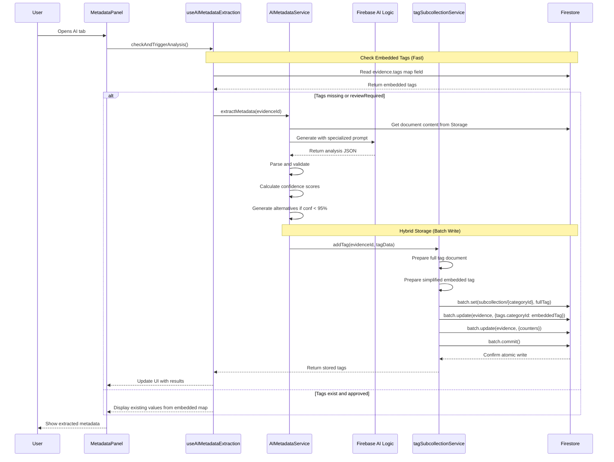
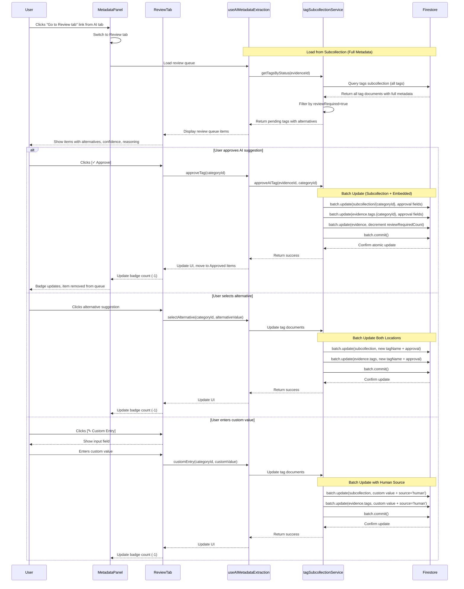

# AI Metadata Extraction - Technical Architecture

**Part of**: [AI Requirements Overview](./25-11-09-ai-requirements.md)
**Last Updated**: 2025-11-09

## Hybrid Storage Architecture

**Critical Design Decision**: The system uses a **dual-storage hybrid architecture** to optimize for both performance and functionality:

### Why Hybrid Storage?

**Problem**: Loading 10,000 documents with subcollection queries would require 10,001 Firestore reads (1 for evidence list + 10,000 for tag subcollections), causing severe performance degradation.

**Solution**: Store tags in **two synchronized locations**:

1. **Subcollection** (`/evidence/{id}/tags/{categoryId}`):
   - **Purpose**: Full metadata, audit trail, review workflows
   - **Contains**: Complete AI analysis including alternatives, confidence scores, reasoning, review history
   - **Accessed by**: Review Tab, detailed document view
   - **Performance**: Only queried when viewing individual document details

2. **Embedded Map** (`evidence.tags[categoryId]`):
   - **Purpose**: Fast table loading without N+1 queries
   - **Contains**: Simplified tag data (tagName, confidence, reviewRequired, autoApproved)
   - **Accessed by**: DocumentTable, AI Tab initial display
   - **Performance**: Loaded in single query for entire evidence collection

### Synchronization Pattern

All tag writes use **atomic batch writes** to keep both locations synchronized:

```javascript
// tagSubcollectionService.js - addTag() method
const batch = writeBatch(db);

// Write full metadata to subcollection
batch.set(subcollectionRef, {
  categoryId, categoryName, tagName,
  confidence, autoApproved, reviewRequired,
  metadata: { aiAlternatives, contentMatch, ... }
});

// Write simplified data to embedded map
batch.update(evidenceRef, {
  [`tags.${categoryId}`]: {
    tagName, confidence, autoApproved,
    reviewRequired, source, createdAt
  }
});

// Update counters
batch.update(evidenceRef, {
  tagCount: increment(1),
  reviewRequiredCount: reviewRequired ? increment(1) : 0
});

await batch.commit(); // Atomic transaction
```

### Data Flow by Use Case

| Use Case | Data Source | Why |
|----------|-------------|-----|
| Load DocumentTable (10,000 docs) | Embedded map | Single query, no subcollection overhead |
| Display AI Tab initial view | Embedded map | Fast display, status icons only |
| Display Review Tab queue | Subcollection | Need alternatives, reasoning, full metadata |
| Approve/reject AI suggestion | Both (batch write) | Keep synchronized atomically |
| Export document list | Embedded map | Fast bulk operations |

### Benefits

✅ **Performance**: DocumentTable loads 10,000+ docs in ~2 seconds (vs ~30+ seconds with subcollections)
✅ **Rich Metadata**: Review workflows have access to full AI analysis
✅ **Audit Trail**: Complete history preserved in subcollection
✅ **Consistency**: Batch writes ensure atomic synchronization
✅ **Scalability**: Embedded map approach scales linearly with document count

## Components

### 1. DocumentMetadataPanel.vue (existing, enhanced)
   - **Tab State Management**:
     - Manages active tab (Metadata, AI, Review)
     - Computes badge count for Review tab from tag counters
     - Handles tab switching with navigation hints
   - **AI Tab** (simplified):
     - Displays extracted values with status icons
     - Shows loading/error/success states
     - Simple "Edit" buttons for manual override
     - "Go to Review tab" prompt when items need review
   - **Review Tab** (new):
     - Review Queue component
     - Approved Items component
     - Review History component
     - Review action handlers

### 2. AIMetadataExtractionService.js (new)
   - Extends `AIProcessingService`
   - Specialized prompts for document date extraction
   - Specialized prompts for document type classification
   - Handles confidence calculation and alternative generation
   - Formats responses for hybrid tag storage (subcollection + embedded map)
   - Parses AI responses into structured tag documents
   - Delegates to `tagSubcollectionService.js` for atomic batch writes

### 3. useAIMetadataExtraction.js (new composable)
   - Reactive state management for extraction status
   - Orchestrates extraction workflow on AI tab open
   - Queries tag subcollection for existing metadata
   - Triggers AI analysis when needed
   - Provides computed properties for badge counts
   - Exposes review action methods

### 4. ReviewQueueItem.vue (new component)
   - Displays single review item (Document Date or Document Type)
   - Shows AI suggestion, alternatives, and context
   - Provides approve/reject/custom entry actions
   - Emits events for parent handling

### 5. ApprovedItemsList.vue (new component)
   - Displays auto-approved and human-approved items
   - Shows approval details (timestamp, reviewer)
   - Allows re-opening for re-review

### 6. ReviewHistoryTimeline.vue (new component)
   - Timeline view of review actions
   - Shows audit trail for quality control

## Data Flow



## Review Tab Workflow



## Prompt Engineering

### Document Date Extraction Prompt (Specialized)

```
You are a document date extraction specialist. Analyze the provided document and extract the primary document date.

PRIORITY ORDER (extract the MOST RELEVANT date):
1. Signature date or execution date
2. Document creation date stated in header/footer
3. Letterhead date or "Date:" field
4. Latest substantive content date
5. Metadata creation date (lowest priority)

DO NOT extract:
- Received dates or routing dates
- Metadata modification dates unless no other date exists
- Future dates (unless document is explicitly forward-dated)

Return your analysis as JSON:
{
  "primaryDate": "YYYY-MM-DD",
  "confidence": 0.95,
  "location": "Brief description of where date was found",
  "alternatives": [
    {
      "date": "YYYY-MM-DD",
      "confidence": 0.65,
      "location": "Where this alternative was found",
      "reason": "Why this might be the document date"
    }
  ]
}

RULES:
- confidence must be between 0 and 1 (decimal)
- Only include alternatives if primaryDate confidence < 0.95
- Include up to 2 alternatives maximum
- Sum of all confidences should approach or exceed 0.95
- If no date found, return primaryDate: null, confidence: 0

Document to analyze:
[document content]
```

### Document Type Classification Prompt (Specialized)

```
You are a legal document classifier. Analyze the provided document and classify its type.

PREDEFINED TYPES (prefer these if they fit):
- Email: Electronic correspondence
- Memo: Internal memorandum or note
- Letter: Formal correspondence
- Contract: Agreement, contract, or binding document
- Invoice: Bill, invoice, or payment request
- Report: Analysis, report, or formal documentation

You may suggest NEW types if none of the predefined types fit well.

Consider these indicators:
- Document structure (header, footer, signature block)
- Formatting conventions
- Language and tone
- Presence of legal terminology
- Standard document elements (RE:, Dear, Sincerely, etc.)

Return your analysis as JSON:
{
  "primaryType": "Email",
  "confidence": 0.92,
  "reasoning": "Brief explanation of classification",
  "indicators": ["List", "of", "key", "indicators"],
  "alternatives": [
    {
      "type": "Memo",
      "confidence": 0.45,
      "reasoning": "Why this alternative is possible"
    }
  ]
}

RULES:
- confidence must be between 0 and 1 (decimal)
- Only include alternatives if primaryType confidence < 0.95
- Include up to 2 alternatives maximum
- Rank alternatives by confidence (highest first)
- Sum of all confidences should approach or exceed 0.95
- Prefer predefined types unless document clearly doesn't fit any

Document to analyze:
[document content]
```
