# Document Processing Workflow

## Overview

A visual file organization system for managing uploaded files in Firebase Storage, designed to help users categorize and process documents that require different types of handling.

## Three-Tier File Lifecycle

This workflow operates on files that have progressed through the application's three-tier file lifecycle:

1. **Original** - Original real-world artifact (e.g., paper receipt, dated when business transaction occurred)
2. **Source** - Digital file created by user for upload (e.g., scanned PDF, photo taken with phone)
3. **File** - Digital file stored in Firebase Storage (deduplicated, hash-named)

The workflow below processes **files** (tier 3) that have already been uploaded to Firebase Storage, applying various transformations (split, merge, OCR) to create new derivative files.

## Core Concept

A multi-column interface that allows users to visually organize uploaded files into different processing categories through an automated analysis and processing workflow.

Note: This Workflow does not OCR PDFs because it will use natively multimodal LLMs that work best without OCRed files.

## Kanban Board Workflow

```mermaid
flowchart TB
    subgraph Col0 ["📁 Storage 1: Uploads"]
        SingleUpload["📧email in .msg format"]
        OnePageUpload["📸photograph#2.jpg"]
        PhotoOfDoc["📸photograph#1.jpg"]
        PdfUpload["📖PDF Document #1"]
        Bundle["📚3 Bundled Documents"]
        Incomplete["📋⚠️Incomplete Document PDF"]
    end

    subgraph Col2 ["📂 Storage 2: Split Files"]
        DocA["📖Complete Document"]
        DocC["📋Incomplete PDF"]

    end

    subgraph Col3 ["📄 Storage 3: Pages"]
        SoloPage1["♙Page 1 of 3"]
        PageRaw2["♙Page 2 of 3"]
        SoloPage2["♙Page 2 of 3"]
        PageRaw3["♙Page 3 of 3"]
        PageRaw1["♙Page 4 of 7"]
        OnePage_split["♙Page 4 of 7"]
    end

    subgraph Col5 ["📁 Storage 4: Merged"]
        CompleteMerged["📖PDF Document #3"]
        IncompleteFinal["📋⚠️PDF document with missing pages"]

    end

    subgraph DB3 ["🗄️ Database 2: Evidence"]
        EmailRef["{<br/>  storage: 'uploads',<br/>  fileHash: 'abc123...',<br/>  isProcessed: true,<br/>  hasAllPages: true<br/>}"]
        Photo1Ref["{<br/>  storage: 'uploads',<br/>  fileHash: 'def456...',<br/>  isProcessed: true,<br/>  hasAllPages: true<br/>}"]
        Photo2Ref["{<br/>  storage: 'uploads',<br/>  fileHash: 'ghi789...',<br/>  isProcessed: true,<br/>  hasAllPages: true<br/>}"]
        PdfRef["{<br/>  storage: 'uploads',<br/>  fileHash: 'jkl012...',<br/>  isProcessed: true,<br/>  hasAllPages: true<br/>}"]
        CompleteSplitRef["{<br/>  storage: 'split',<br/>  fileHash: 'mno345...',<br/>  isProcessed: true,<br/>  hasAllPages: true<br/>}"]
        CompleteMergedRef["{<br/>  storage: 'merged',<br/>  fileHash: 'pqr678...',<br/>  isProcessed: true,<br/>  hasAllPages: true<br/>}"]
        IncompleteFinalRef["{<br/>  storage: 'merged',<br/>  fileHash: 'stu901...',<br/>  isProcessed: true,<br/>  hasAllPages: false<br/>}"]
    end

    subgraph DB1 ["🗄️ Database 1: Pages"]
        ChooseBestCopy3{"Choose Best:<br/>👉Page 1 of 3"}
        ChooseBestCopy2{"Choose Best:<br/>👉Page 2 of 3<br/>👉Page 2 of 3"}
        ChooseBestCopy4{"Choose Best:<br/>👉Page 3 of 3"}
        ChooseBestCopy{"Choose Best:<br/>👉Page 4 of 7<br/>👉Page 4 of 7"}
        MergedDoc{"Find & Associate<br/>👉 page 1 of 3<br/>👉 page 2 of 3<br/>👉 page 3 of 3"}
        FindsPages{"Find & Associate<br/>👉Page 4 of 7"}
    end

    %% Flow from Storage 1 to Database 3 (Evidence Pointers)
    SingleUpload -->|Reference| EmailRef
    PhotoOfDoc -->|Reference| Photo1Ref
    OnePageUpload -->|Reference| Photo2Ref
    PdfUpload -->|Reference| PdfRef

    Bundle -.->|Split| DocA
    Bundle -.->|Split to Pages| OnePage_split
    Bundle -.->|Split| DocC

    %% Flow from Column 2

    DocA -->|Reference| CompleteSplitRef

    DocC -.->|Split to Pages| SoloPage1
    DocC -.->|Split to Pages| SoloPage2




    %% Flow from Column 1 direct to Column 3
    Incomplete -.->|Split to Pages| PageRaw1
    Incomplete -.->|Split to Pages| PageRaw2
    Incomplete -.->|Split to Pages| PageRaw3

    %% Flow from Column 3 to Column 4 - References
    OnePage_split -->|Reference| ChooseBestCopy
    PageRaw1 -->|Reference| ChooseBestCopy

    SoloPage2 -->|Reference| ChooseBestCopy2
    PageRaw2 -->|Reference| ChooseBestCopy2

    %% Flow from Column 3 to Database 1 - Pages to decision nodes
    SoloPage1 -->|Reference| ChooseBestCopy3
    PageRaw3 -->|Reference| ChooseBestCopy4

    %% Flow within Database 1 - Decision nodes to assembly document
    ChooseBestCopy2 -->|Get Best| MergedDoc
    ChooseBestCopy3 -->|Get Best| MergedDoc
    ChooseBestCopy4 -->|Get Best| MergedDoc
    ChooseBestCopy -->|GetBest| FindsPages

    %% Flow from Database 1 to Storage 4
    MergedDoc -->|Assemble| CompleteMerged
    FindsPages -->|Assemble| IncompleteFinal

    %% Flow from Storage 4 to Database 3 (Evidence Pointers)
    CompleteMerged -->|Reference| CompleteMergedRef
    IncompleteFinal -->|Reference| IncompleteFinalRef


    %% Color Coding by Document Source/Family
    classDef singleDocFamily fill:#ffebee,stroke:#e53935,stroke-width:2px,color:#000000
    classDef bundleDocFamily fill:#fff9c4,stroke:#ffeb3b,stroke-width:2px,color:#000000
    classDef incompleteDocFamily fill:#e3f2fd,stroke:#1976d2,stroke-width:2px,color:#000000
    classDef onePageDocFamily fill:#f3e5f5,stroke:#9c27b0,stroke-width:2px,color:#000000
    classDef blendedDocFamily fill:#e8f5e8,stroke:#4caf50,stroke-width:2px,color:#000000
    classDef duplicateNode fill:#fff3e0,stroke:#ff9800,stroke-width:2px,color:#000000
    classDef photoTwoFamily fill:#fff8e1,stroke:#f57c00,stroke-width:3px,color:#000000
    classDef pdfDocFamily fill:#e8eaf6,stroke:#e91e63,stroke-width:2px,color:#000000
    classDef databaseObject fill:#000000,stroke:#ffffff,stroke-width:2px,color:#ffffff

    %% Single Complete Document Family (Light Red)
    class Single singleDocFamily

    %% PDF Document Family (Light Indigo)
    class PdfUpload pdfDocFamily

    %% Bundle Document Family (Light Yellow)
    class Bundle,DocA,OnePage_split,DocC,SoloPage1,SoloPage2 bundleDocFamily

    %% Incomplete Document Family (Light Blue)
    class Incomplete,PageRaw1,PageRaw2,PageRaw3,IncompleteFinal incompleteDocFamily

    %% One Page Document Family (Light Purple)
    class OnePage onePageDocFamily

    %% Blended Document Family (Green - Yellow+Blue blend for multi-source documents)
    class CompleteMerged blendedDocFamily

    %% Storage 1 Upload nodes inherit same colors as their Storage 2 counterparts
    class OnePageUpload onePageDocFamily
    class SingleUpload singleDocFamily
    class IncompleteUpload incompleteDocFamily
    class Bundle bundleDocFamily
    class Incomplete incompleteDocFamily

    %% Photo Document #1 Family (Light Amber)
    class PhotoOfDoc photoTwoFamily

    %% Evidence Reference Nodes (Database Objects)
    class EmailRef,Photo1Ref,Photo2Ref,PdfRef,CompleteSplitRef,CompleteMergedRef,IncompleteFinalRef databaseObject

```

