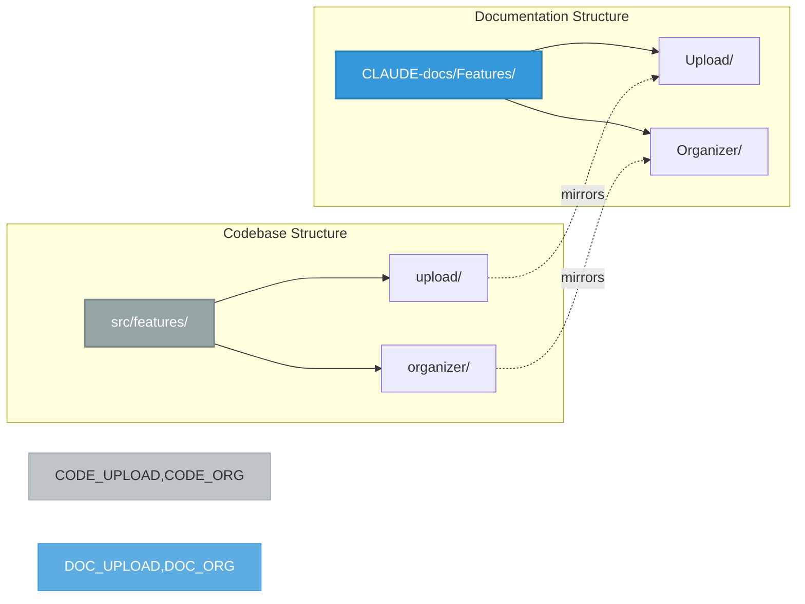

# Documentation Structure - Plan 3: Feature-Module Organization

This file provides a visual representation of the Feature-Module documentation structure using Mermaid diagrams.

## Overview

**Philosophy**: Organize documentation by business features/modules, mirroring the `src/features/` structure. When an LLM works on a feature, all documentation (UI, state, data, logic) is grouped together as a vertical slice.

**Optimization**: Best for vertical slice development, feature ownership, and modular architecture.

## Full Structure Diagram

```mermaid
graph TD
    ROOT[CLAUDE-docs]

    ROOT --> SYSTEM[System]
    ROOT --> FEATURES[Features]
    ROOT --> DATA[Data]
    ROOT --> TESTING[Testing]
    ROOT --> DEVOPS[DevOps]
    ROOT --> DEBT[TechnicalDebt]
    ROOT --> AGENTS[AgentInstructions]

    %% System
    SYSTEM --> SYS_ARCH[Architecture]
    SYSTEM --> SYS_STACK[Stack]
    SYSTEM --> SYS_CONV[Conventions]
    SYSTEM --> SYS_SHARED[Shared]

    SYS_ARCH --> SYS_ARCH_FILES["📄 overview.md<br/>📄 multi-app-sso.md<br/>📄 solo-firm-architecture.md<br/>📄 data-flow.md"]

    SYS_STACK --> SYS_STACK_FILES["📄 vue3-composition-api.md<br/>📄 vuetify3.md<br/>📄 vite.md<br/>📄 firebase.md<br/>📄 pinia.md<br/>📄 tailwind.md<br/>📄 vitest.md"]

    SYS_CONV --> SYS_CONV_FILES["📄 coding-standards.md<br/>📄 typescript-best-practices.md<br/>📄 component-naming.md<br/>📄 file-organization.md<br/>📄 commit-messages.md<br/>📄 design-system.md"]

    SYS_SHARED --> SHARED_BASE[BaseComponents]
    SYS_SHARED --> SHARED_LAYOUT[Layout]
    SYS_SHARED --> SHARED_COMP[Composables]

    SHARED_BASE --> SHARED_BASE_FILES["📄 DocumentTable.md<br/>📄 BaseSearchBar.md<br/>📄 HoldToConfirmButton.md<br/>📄 DragHandle.md<br/>📄 SegmentedControl.md"]

    SHARED_LAYOUT --> SHARED_LAYOUT_FILES["📄 AppHeader.md<br/>📄 AppSideBar.md"]

    SHARED_COMP --> SHARED_COMP_FILES["📄 useVirtualTable.md<br/>📄 useColumnResize.md<br/>📄 useColumnSort.md<br/>📄 useColumnVisibility.md<br/>📄 useDocumentPeek.md<br/>📄 useFirmMembers.md<br/>📄 useMatters.md<br/>📄 useUsers.md"]

    %% Features
    FEATURES --> AUTH[Authentication]
    FEATURES --> UPLOAD[Upload]
    FEATURES --> ORGANIZER[Organizer]
    FEATURES --> MATTERS[Matters]
    FEATURES --> PROFILE[Profile]

    %% Authentication Feature
    AUTH --> AUTH_FILES["📄 feature-overview.md<br/>📄 auth-state-machine.md<br/>📄 firebase-auth-integration.md<br/>📄 session-management.md"]
    AUTH --> AUTH_COMP[Components]
    AUTH --> AUTH_STORES[Stores]
    AUTH --> AUTH_GUARDS[Guards]
    AUTH --> AUTH_SEC[Security]

    AUTH_COMP --> AUTH_COMP_FILES["📄 LoginForm.md<br/>📄 AppSwitcher.md"]
    AUTH_STORES --> AUTH_STORES_FILES["📄 authStore.md<br/>📄 teamStore.md"]
    AUTH_GUARDS --> AUTH_GUARDS_FILES["📄 auth-guard.md<br/>📄 matter-guard.md"]
    AUTH_SEC --> AUTH_SEC_FILES["📄 security-rules.md<br/>📄 team-isolation.md"]

    %% Upload Feature
    UPLOAD --> UPLOAD_FILES["📄 feature-overview.md<br/>📄 old-upload-page.md<br/>📄 new-upload-page-testing-route.md<br/>📄 upload-roadmap.md"]
    UPLOAD --> UPLOAD_UI[UI]
    UPLOAD --> UPLOAD_PROC[Processing]
    UPLOAD --> UPLOAD_DEDUPE[Deduplication]
    UPLOAD --> UPLOAD_WORKERS[Workers]
    UPLOAD --> UPLOAD_COMP[Composables]
    UPLOAD --> UPLOAD_STORAGE[Storage]

    UPLOAD_UI --> UPLOAD_UI_FILES["📄 FileUpload-component.md<br/>📄 upload-queue.md<br/>📄 progress-tracking.md<br/>📄 drag-drop.md"]

    UPLOAD_PROC --> UPLOAD_PROC_FILES["📄 file-lifecycle.md<br/>📄 file-lifecycle-terminology.md<br/>📄 3-phase-processing.md<br/>📄 time-estimation.md<br/>📄 hardware-calibration.md<br/>📄 path-parsing.md"]

    UPLOAD_DEDUPE --> UPLOAD_DEDUPE_FILES["📄 deduplication-overview.md<br/>📄 deduplication-terminology.md<br/>📄 blake3-hashing.md<br/>📄 size-prefilter.md<br/>📄 hash-as-firestore-id.md<br/>📄 duplicate-vs-copy-vs-redundant.md"]

    UPLOAD_WORKERS --> UPLOAD_WORKERS_FILES["📄 fileHashWorker.md<br/>📄 worker-communication.md<br/>📄 worker-testing.md"]

    UPLOAD_COMP --> UPLOAD_COMP_FILES["📄 useUploadAdapter.md<br/>📄 useDeduplication.md<br/>📄 useFileHashing.md<br/>📄 useFileQueue.md"]

    UPLOAD_STORAGE --> UPLOAD_STORAGE_FILES["📄 firebase-storage-paths.md<br/>📄 upload-strategies.md<br/>📄 file-naming.md"]

    %% Organizer Feature
    ORGANIZER --> ORGANIZER_FILES["📄 feature-overview.md<br/>📄 organizer-architecture.md"]
    ORGANIZER --> ORG_DOCTABLE[DocumentTable]
    ORGANIZER --> ORG_DOCVIEWER[DocumentViewer]
    ORGANIZER --> ORG_CATEGORIES[Categories]
    ORGANIZER --> ORG_AI[AIAnalysis]
    ORGANIZER --> ORG_COMP[Components]
    ORGANIZER --> ORG_STORES[Stores]
    ORGANIZER --> ORG_DATA[Data]

    ORG_DOCTABLE --> ORG_DOCTABLE_FILES["📄 document-table-architecture.md<br/>📄 4-column-data-sources.md<br/>📄 virtual-scrolling.md<br/>📄 column-system.md<br/>📄 cell-tooltips.md<br/>📄 document-peek.md<br/>📄 sorting-filtering.md"]

    ORG_DOCVIEWER --> ORG_DOCVIEWER_FILES["📄 viewer-overview.md<br/>📄 pdf-rendering.md<br/>📄 thumbnail-panel.md<br/>📄 metadata-panel.md<br/>📄 navigation-bar.md<br/>📄 tabs-system.md"]

    ORG_CATEGORIES --> ORG_CATEGORIES_FILES["📄 category-system-overview.md<br/>📄 category-manager.md<br/>📄 category-wizard.md<br/>📄 tag-architecture.md<br/>📄 editable-tags.md"]

    ORG_AI --> ORG_AI_FILES["📄 ai-analysis-overview.md<br/>📄 metadata-extraction.md<br/>📄 ai-review-workflow.md<br/>📄 ai-requirements.md"]

    ORG_COMP --> ORG_COMP_FILES["📄 DocumentTable-component.md<br/>📄 DocumentNavigationBar.md<br/>📄 PdfViewerArea.md<br/>📄 PdfThumbnailPanel.md<br/>📄 DocumentMetadataPanel.md<br/>📄 AIAnalysisTab.md<br/>📄 EditableTag.md"]

    ORG_STORES --> ORG_STORES_FILES["📄 documentView.md"]

    ORG_DATA --> ORG_DATA_FILES["📄 document-metadata-schema.md<br/>📄 category-schema.md<br/>📄 firestore-queries.md"]

    %% Matters Feature
    MATTERS --> MATTERS_FILES["📄 feature-overview.md<br/>📄 solo-firm-matters.md<br/>📄 matter-workflows.md"]
    MATTERS --> MATTERS_UI[UI]
    MATTERS --> MATTERS_COMP[Components]
    MATTERS --> MATTERS_STORES[Stores]
    MATTERS --> MATTERS_DATA[Data]

    MATTERS_UI --> MATTERS_UI_FILES["📄 matters-list.md<br/>📄 matter-detail.md<br/>📄 new-matter.md<br/>📄 edit-matter.md<br/>📄 import-matters.md"]

    MATTERS_COMP --> MATTERS_COMP_FILES["📄 matter-table.md<br/>📄 matter-forms.md"]

    MATTERS_STORES --> MATTERS_STORES_FILES["📄 matterStore.md<br/>📄 matterView.md"]

    MATTERS_DATA --> MATTERS_DATA_FILES["📄 matter-schema.md<br/>📄 matter-queries.md"]

    %% Profile Feature
    PROFILE --> PROFILE_FILES["📄 feature-overview.md<br/>📄 profile-page.md<br/>📄 settings-page.md<br/>📄 user-preferences.md"]
    PROFILE --> PROFILE_DATA[Data]
    PROFILE_DATA --> PROFILE_DATA_FILES["📄 user-schema.md<br/>📄 firm-schema.md"]

    %% Data
    DATA --> DATA_FILES["📄 firestore-overview.md<br/>📄 collections-map.md<br/>📄 query-patterns.md<br/>📄 data-relationships.md"]
    DATA --> DATA_SEC[Security]
    DATA_SEC --> DATA_SEC_FILES["📄 firestore-security-rules.md<br/>📄 storage-security-rules.md<br/>📄 team-based-isolation.md"]

    %% Testing
    TESTING --> TESTING_FILES["📄 testing-overview.md<br/>📄 vitest-setup.md<br/>📄 unit-testing.md<br/>📄 component-testing.md<br/>📄 e2e-testing.md<br/>📄 performance-testing.md<br/>📄 web-worker-testing.md"]

    %% DevOps
    DEVOPS --> DEVOPS_FILES["📄 local-development.md<br/>📄 sso-dev-setup.md<br/>📄 multi-app-development.md<br/>📄 build-process.md<br/>📄 deployment-promotion.md<br/>📄 hosting-tips.md"]

    %% Technical Debt
    DEBT --> DEBT_FILES["📄 build-debt.md<br/>📄 refactoring-priorities.md"]

    %% Agent Instructions
    AGENTS --> AGENTS_FILES["📄 file-relocator.md<br/>📄 beautifier.md<br/>📄 test-engineer.md<br/>📄 docs-engineer.md"]

    classDef folderStyle fill:#16A085,stroke:#117A65,stroke-width:2px,color:#fff
    classDef filesStyle fill:#D5F4E6,stroke:#16A085,stroke-width:1px,color:#333

    class ROOT,SYSTEM,FEATURES,DATA,TESTING,DEVOPS,DEBT,AGENTS folderStyle
    class AUTH,UPLOAD,ORGANIZER,MATTERS,PROFILE folderStyle
```



## Simplified Feature View

```mermaid
graph LR
    ROOT[CLAUDE-docs]

    ROOT --> SYSTEM[⚙️ System]
    ROOT --> FEATURES[🎯 Features]
    ROOT --> DATA[💾 Data]
    ROOT --> TESTING[🧪 Testing]
    ROOT --> DEVOPS[🚀 DevOps]

    FEATURES --> AUTH[🔐 Authentication]
    FEATURES --> UPLOAD[⬆️ Upload]
    FEATURES --> ORGANIZER[📋 Organizer]
    FEATURES --> MATTERS[📁 Matters]
    FEATURES --> PROFILE[👤 Profile]

    ORGANIZER --> DOCTABLE[DocumentTable]
    ORGANIZER --> DOCVIEWER[DocumentViewer]
    ORGANIZER --> CATEGORIES[Categories]
    ORGANIZER --> AI[AIAnalysis]

    style ROOT fill:#2C3E50,stroke:#1A252F,stroke-width:3px,color:#fff
    style FEATURES fill:#E74C3C,stroke:#C0392B,stroke-width:2px,color:#fff
    style AUTH,UPLOAD,ORGANIZER,MATTERS,PROFILE fill:#3498DB,stroke:#2980B9,color:#fff
```



## Upload Feature Deep Dive (Vertical Slice)

```mermaid
graph TD
    UPLOAD[Features/Upload]

    UPLOAD --> UPLOAD_FILES["📄 Feature Overview<br/>📄 Old Upload Page<br/>📄 New Upload Page<br/>📄 Upload Roadmap"]

    UPLOAD --> UI[UI Layer]
    UPLOAD --> PROC[Processing Layer]
    UPLOAD --> DEDUPE[Deduplication Layer]
    UPLOAD --> WORKERS[Workers Layer]
    UPLOAD --> COMP[Composables Layer]
    UPLOAD --> STORAGE[Storage Layer]

    UI --> UI_FILES["📄 FileUpload-component.md<br/>📄 upload-queue.md<br/>📄 progress-tracking.md<br/>📄 drag-drop.md"]

    PROC --> PROC_FILES["📄 file-lifecycle.md<br/>📄 file-lifecycle-terminology.md<br/>📄 3-phase-processing.md<br/>📄 time-estimation.md<br/>📄 hardware-calibration.md<br/>📄 path-parsing.md"]

    DEDUPE --> DEDUPE_FILES["📄 deduplication-overview.md<br/>📄 deduplication-terminology.md<br/>📄 blake3-hashing.md<br/>📄 size-prefilter.md<br/>📄 hash-as-firestore-id.md<br/>📄 duplicate-vs-copy-vs-redundant.md"]

    WORKERS --> WORKERS_FILES["📄 fileHashWorker.md<br/>📄 worker-communication.md<br/>📄 worker-testing.md"]

    COMP --> COMP_FILES["📄 useUploadAdapter.md<br/>📄 useDeduplication.md<br/>📄 useFileHashing.md<br/>📄 useFileQueue.md"]

    STORAGE --> STORAGE_FILES["📄 firebase-storage-paths.md<br/>📄 upload-strategies.md<br/>📄 file-naming.md"]

    style UPLOAD fill:#E74C3C,stroke:#C0392B,stroke-width:3px,color:#fff
    style UI,PROC,DEDUPE,WORKERS,COMP,STORAGE fill:#3498DB,stroke:#2980B9,stroke-width:2px,color:#fff
```



## Organizer Feature Deep Dive (Vertical Slice)

```mermaid
graph TD
    ORGANIZER[Features/Organizer]

    ORGANIZER --> ORG_FILES["📄 Feature Overview<br/>📄 Organizer Architecture"]

    ORGANIZER --> DOCTABLE[DocumentTable Sub-Feature]
    ORGANIZER --> DOCVIEWER[DocumentViewer Sub-Feature]
    ORGANIZER --> CATEGORIES[Categories Sub-Feature]
    ORGANIZER --> AI[AIAnalysis Sub-Feature]
    ORGANIZER --> COMP[Components]
    ORGANIZER --> STORES[Stores]
    ORGANIZER --> DATA[Data]

    DOCTABLE --> DOCTABLE_FILES["📄 document-table-architecture.md<br/>📄 4-column-data-sources.md<br/>📄 virtual-scrolling.md<br/>📄 column-system.md<br/>📄 cell-tooltips.md<br/>📄 document-peek.md<br/>📄 sorting-filtering.md"]

    DOCVIEWER --> DOCVIEWER_FILES["📄 viewer-overview.md<br/>📄 pdf-rendering.md<br/>📄 thumbnail-panel.md<br/>📄 metadata-panel.md<br/>📄 navigation-bar.md<br/>📄 tabs-system.md"]

    CATEGORIES --> CATEGORIES_FILES["📄 category-system-overview.md<br/>📄 category-manager.md<br/>📄 category-wizard.md<br/>📄 tag-architecture.md<br/>📄 editable-tags.md"]

    AI --> AI_FILES["📄 ai-analysis-overview.md<br/>📄 metadata-extraction.md<br/>📄 ai-review-workflow.md<br/>📄 ai-requirements.md"]

    COMP --> COMP_FILES["📄 DocumentTable-component.md<br/>📄 DocumentNavigationBar.md<br/>📄 PdfViewerArea.md<br/>📄 PdfThumbnailPanel.md<br/>📄 DocumentMetadataPanel.md<br/>📄 AIAnalysisTab.md<br/>📄 EditableTag.md"]

    STORES --> STORES_FILES["📄 documentView.md"]

    DATA --> DATA_FILES["📄 document-metadata-schema.md<br/>📄 category-schema.md<br/>📄 firestore-queries.md"]

    style ORGANIZER fill:#E74C3C,stroke:#C0392B,stroke-width:3px,color:#fff
    style DOCTABLE,DOCVIEWER,CATEGORIES,AI,COMP,STORES,DATA fill:#3498DB,stroke:#2980B9,stroke-width:2px,color:#fff
```



## Code-to-Docs Alignment



## LLM Discovery Patterns

### Pattern 1: Feature-Scoped Work
```
Task: "Implement deduplication in Upload feature"
→ Navigate to: CLAUDE-docs/Features/Upload/Deduplication/
→ Find: All deduplication docs in feature context
→ Access: UI, Processing, Composables all within Upload/
```

### Pattern 2: Vertical Slice Understanding
```
Task: "How does the Upload feature work end-to-end?"
→ Navigate to: CLAUDE-docs/Features/Upload/
→ Explore: feature-overview.md
→ Then traverse: UI → Processing → Deduplication → Workers → Storage
```

### Pattern 3: Sub-Feature Work
```
Task: "Update DocumentTable sorting"
→ Navigate to: CLAUDE-docs/Features/Organizer/DocumentTable/
→ Find: sorting-filtering.md, column-system.md
→ All within Organizer feature context
```

### Pattern 4: Shared Component Reference
```
Task: "Update BaseSearchBar component"
→ Navigate to: CLAUDE-docs/System/Shared/BaseComponents/
→ Find: BaseSearchBar.md
→ See which features use it via cross-references
```

## Key Advantages

1. **Feature Ownership**: All Upload docs in `Features/Upload/`
2. **Vertical Slices**: UI, logic, state, data grouped by feature
3. **Code Alignment**: Mirrors `src/features/` structure
4. **Independent Work**: Can work on Upload without touching Organizer
5. **Team Scaling**: Different teams own different features
6. **Modular Refactoring**: Easy to refactor entire features

## When to Use This Structure

✅ Code organized in `src/features/`
✅ Features can be developed independently
✅ Multiple teams with feature ownership
✅ Vertical slice development preferred
✅ Want docs to mirror code structure

## File Count Summary

- **Total Folders**: ~45
- **Estimated Files**: ~95
- **Max Depth**: 4 levels
- **Features**: 5 main business features
- **Feature alignment**: 100% with `src/features/`

## Comparison: src/features/ ↔ CLAUDE-docs/Features/

| Codebase | Documentation |
|----------|---------------|
| `src/features/upload/` | `CLAUDE-docs/Features/Upload/` |
| `src/features/upload/components/` | `CLAUDE-docs/Features/Upload/UI/` |
| `src/features/upload/composables/` | `CLAUDE-docs/Features/Upload/Composables/` |
| `src/features/upload/workers/` | `CLAUDE-docs/Features/Upload/Workers/` |
| `src/features/organizer/` | `CLAUDE-docs/Features/Organizer/` |
| `src/features/organizer/views/` | `CLAUDE-docs/Features/Organizer/DocumentTable/` + `DocumentViewer/` |
| `src/components/base/` | `CLAUDE-docs/System/Shared/BaseComponents/` |
