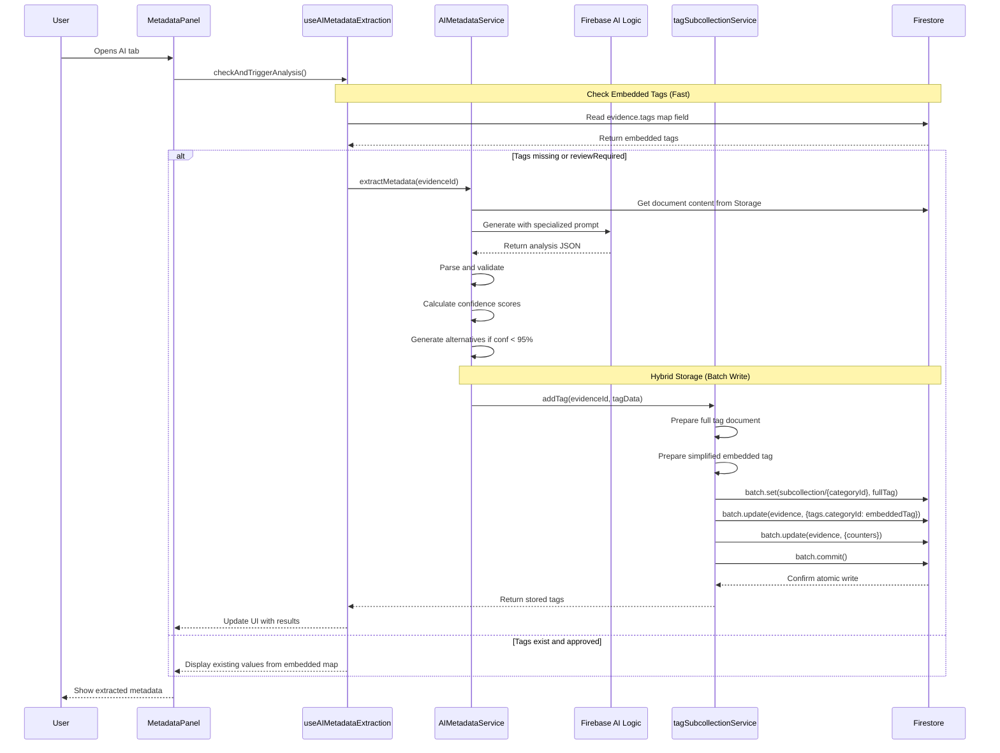
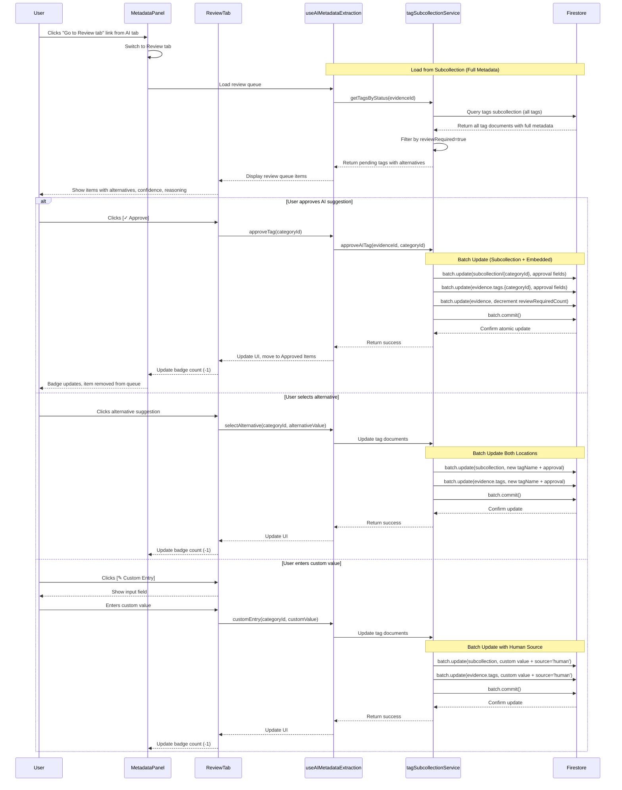

# AI Metadata Extraction - Product Requirements Document

**Status**: Phases 1-3 Implemented (Phase 4 Review Workflow Pending)
**Last Updated**: 2025-11-09
**Implementation Completion**: November 2025
**Related Documentation**:
- `docs/ai/aiAnalysis.md` - AI analysis system overview (implementation details)
- `docs/architecture/CategoryTags.md` - Tag system architecture
- `src/components/document/DocumentMetadataPanel.vue` - Metadata panel UI
- `planning/2. TODOs/2025-11-07-First-AI-analysis-dateNtype.md` - Implementation plan

## Executive Summary

This document defines the requirements for AI-powered extraction of document metadata fields (Document Date and Document Type). The system leverages Firebase AI Logic (Gemini 2.5 Flash Lite) to analyze document content and populate system category fields with confidence scoring.

**Implementation Status**: Core extraction features (Phases 1-3) are complete. Users manually trigger analysis via "Analyze Document" button in the AI tab. Results are displayed with confidence badges and stored in Firestore via the hybrid tag storage architecture. Review workflow (Phase 4) is planned for future implementation.

**Three-Tab Architecture**: The metadata panel uses three tabs with distinct purposes:
- **ℹ️ Metadata Tab**: Displays source file, storage, and embedded metadata
- **🤖 AI Tab**: Shows AI analysis results in a clean, simple view
- **👤Review Tab**: Dedicated workflow for reviewing and correcting low-confidence AI extractions

## Problem Statement

Currently, when users open the AI tab in the metadata panel, they see "Not yet analyzed" placeholders for Document Date and Document Type fields. Users must manually review documents and enter this metadata, which is time-consuming and error-prone. Our existing AI infrastructure for tag suggestions can be extended to automatically extract structured metadata fields.

The metadata panel already has a dedicated **👤Review tab** for human review workflows, which should be leveraged for reviewing low-confidence AI suggestions rather than cluttering the AI tab with review UI.

## Goals

1. **Manual Analysis Trigger**: User manually triggers AI analysis via "Analyze Document" button; AI tab loads existing results from Firestore when opened
2. **Structured Extraction**: Extract specific metadata fields (Document Date and Document Type) from document content
3. **Confidence Scoring**: Provide confidence scores for each extracted field
4. **Multiple Alternatives**: For low-confidence extractions (<95%), provide alternative suggestions
5. **Separation of Concerns**: AI tab shows results cleanly; Review tab handles all review workflows
6. **Clear Navigation**: Badge counts on Review tab indicate items needing attention
7. **User Review**: Dedicated Review tab allows users to accept, reject, or manually override AI suggestions
8. **Integration**: Seamlessly integrate with existing tag subcollection architecture

## User Personas

### Primary: Legal Document Reviewer
- Reviews 50-200 documents per day
- Needs quick metadata tagging for discovery management
- Values accuracy over speed but appreciates automation
- Comfortable reviewing and correcting AI suggestions

### Secondary: Paralegal/Legal Assistant
- Organizes incoming documents for case management
- Focuses on consistent categorization
- May have less domain expertise than attorneys
- Relies on system guidance for difficult classifications

## Requirements

### Functional Requirements

#### FR-1: Manual Analysis Trigger
- **Priority**: P0 (Critical)
- **Status**: ✅ IMPLEMENTED
- **Description**: User manually triggers AI analysis by clicking "Analyze Document" button in the AI tab
- **Acceptance Criteria**:
  - ✅ "Analyze Document" button displayed when no analysis results exist
  - ✅ Button disabled during analysis with spinner state
  - ✅ Loading state shows "Analyzing..." with progress indicator
  - ✅ Analysis processes Document Date and Document Type in single API call
  - ✅ Results stored in Firestore via tagSubcollectionService
  - ✅ Results persist across sessions (loaded from Firestore on tab open)
- **Implementation**: `src/components/document/tabs/AIAnalysisTab.vue` lines 67-77, 374-503

#### FR-2: Document Date Extraction
- **Priority**: P0 (Critical)
- **Status**: ✅ IMPLEMENTED
- **Description**: AI analyzes document content to determine the date the document was created or signed
- **Acceptance Criteria**:
  - ✅ AI extracts dates from document content (headers, footers, signatures, letterhead)
  - ✅ Prioritizes document creation/signature dates over payment stamps and received dates
  - ✅ Returns date in ISO 8601 format (YYYY-MM-DD)
  - ✅ Provides confidence score (0-100%)
  - ✅ For confidence <95%, provides up to 2 alternative date suggestions
  - ✅ Handles common date formats (MM/DD/YYYY, DD/MM/YYYY, Month DD, YYYY, etc.)
  - ✅ Prompt explicitly instructs AI to ignore payment stamps, received dates, scanned dates
- **Implementation**:
  - Service: `src/services/aiMetadataExtractionService.js` lines 32-141 (analyzeDocument method)
  - Prompt: Lines 148-194 (_buildPrompt method with date extraction rules)
  - Parser: Lines 201-249 (_parseResponse method)

#### FR-3: Document Type Classification
- **Priority**: P0 (Critical)
- **Status**: ✅ IMPLEMENTED
- **Description**: AI classifies document into predefined or suggested types from the DocumentType system category using 3-tier hierarchy
- **Acceptance Criteria**:
  - ✅ AI uses **3-tier document type hierarchy** (Matter-specific → Firm-wide → Global systemcategories)
  - ✅ Dynamically fetches document types from Firestore before analysis
  - ✅ Can suggest new document types not in the predefined list (Open List behavior)
  - ✅ Returns primary classification with confidence score (0-100%)
  - ✅ For confidence <95%, provides up to 2 alternative type suggestions
  - ✅ Considers document structure, formatting, headers, and content
  - ✅ Includes reasoning and context for each suggestion
- **Implementation**:
  - Service: `src/services/aiMetadataExtractionService.js` lines 258-351 (_getDocumentTypes method)
  - 3-Tier Hierarchy Logic: Matter (firmId/matterId/categories) → Firm (firmId/general/categories) → Global (systemcategories)
  - Prompt Building: Lines 148-194 (dynamically injects available types into prompt)

#### FR-4: Confidence Scoring
- **Priority**: P0 (Critical)
- **Status**: ✅ IMPLEMENTED
- **Description**: Each extracted field includes a confidence score that determines auto-approval and alternative suggestions
- **Acceptance Criteria**:
  - ✅ Confidence expressed as percentage (0-100%)
  - ✅ **Threshold: ≥95% for auto-approval** (implemented in AIAnalysisTab.vue:432)
  - ✅ Primary suggestion confidence ≥95% → auto-approve (autoApproved: true, reviewRequired: false)
  - ✅ Primary suggestion confidence <95% → mark for review (reviewRequired: true)
  - ✅ Alternative suggestions provided with confidence scores and reasoning
  - ✅ Alternatives displayed in tooltips on hover (AIAnalysisTab.vue:103-120)
- **Implementation**:
  - Threshold constant: `AIAnalysisTab.vue` line 432: `const confidenceThreshold = 95`
  - Badge colors: ≥95% green (success), 80-94% amber (warning), <80% red (error)
  - Badge computation: Lines 257-261 (getConfidenceBadgeColor method)

#### FR-5: Hybrid Tag Storage (Subcollection + Embedded Map)
- **Priority**: P0 (Critical)
- **Status**: ✅ IMPLEMENTED
- **Description**: Extracted metadata stored using hybrid architecture via tagSubcollectionService: **subcollections for full metadata/audit trail**, and **embedded map field for fast table loading**
- **Architecture Rationale**:
  - **Performance**: Embedded map enables loading 10,000+ documents in a single query (no N+1 subcollection queries)
  - **Rich Metadata**: Subcollection stores full AI metadata (alternatives, confidence, review history)
  - **Audit Trail**: Subcollection preserves complete review history and AI analysis details
  - **Atomic Writes**: Batch writes keep both locations synchronized
- **Implementation Service**: `src/features/organizer/services/tagSubcollectionService.js`
  - Method: `addTagsBatch()` - Atomic batch write to both subcollection and embedded map
  - Usage: `AIAnalysisTab.vue` lines 490-495
- **Acceptance Criteria**:

  **Subcollection Storage** (Full metadata, audit trail, alternatives):
  - Tags stored at `/firms/{firmId}/matters/{matterId}/evidence/{evidenceId}/tags/{categoryId}`
  - Uses `DocumentDate` and `DocumentType` as document IDs (one per category constraint)
  - Tag document structure:
    ```javascript
    {
      categoryId: 'DocumentDate' | 'DocumentType',
      categoryName: 'Document Date' | 'Document Type',
      tagName: string, // Date string or type name
      source: 'ai',
      confidence: number, // 0-100 (percentage)
      autoApproved: boolean, // true if confidence >= 95
      reviewRequired: boolean, // true if confidence < 95
      reviewedAt: Timestamp | null,
      reviewedBy: string | null,
      humanApproved: boolean | null,
      createdAt: Timestamp,
      createdBy: string,
      metadata: {
        model: 'gemini-2.5-flash-lite', // Current AI model for metadata extraction
        processingTime: number,
        context: string,
        aiAlternatives: [
          {
            value: string,
            confidence: number,
            reasoning: string
          }
        ],
        contentMatch: string, // Excerpt showing where info was found
        reviewReason: string | null
      }
    }
    ```

  **Embedded Map Storage** (Fast table loading):
  - Simplified tag data stored in `evidence.tags[categoryId]` map field
  - Denormalized for DocumentTable performance (single query loads all tags)
  - Structure:
    ```javascript
    evidence.tags = {
      'DocumentDate': {
        tagName: '2024-03-15',
        confidence: 97,
        source: 'ai',
        autoApproved: true,
        reviewRequired: false,
        createdAt: Timestamp
      },
      'DocumentType': {
        tagName: 'Invoice',
        confidence: 92,
        source: 'ai',
        autoApproved: false,
        reviewRequired: true,
        createdAt: Timestamp
      }
    }
    ```

  **Synchronization**:
  - **All tag writes use batch writes** to atomically update both locations
  - Subcollection write includes full metadata
  - Embedded map write includes only fields needed for table display
  - Evidence document counters updated (tagCount, autoApprovedCount, reviewRequiredCount)
  - Service: `tagSubcollectionService.js` handles synchronization automatically

#### FR-6: UI Display in 🤖 AI Tab (Configuration Panel)
- **Priority**: P0 (Critical)
- **Status**: 🚧 PHASE 4 IN PROGRESS
- **Description**: AI Tab serves as configuration panel for metadata extraction, with Get/Skip/Manual options for pending fields
- **Acceptance Criteria**:
  - **Configuration Panel**:
    - Shows only fields that have NOT been determined (no AI result and not manually accepted)
    - Each pending field displays Get | Skip | Manual radio buttons
    - **Get**: Include this field in AI extraction prompt
    - **Skip**: Don't ask AI about this field
    - **Manual**: User will enter manually (field appears on Review Tab with empty input)
  - **Dynamic Field Visibility**:
    - Fields disappear from AI Tab once determined (AI-extracted or manually accepted)
    - Fields set to "Manual" remain on AI Tab until accepted on Review Tab
  - **Analysis Trigger**:
    - "Analyze Document" button includes only fields marked "Get"
    - Button disabled during analysis with spinner state
    - Loading state shows "Analyzing..." with progress indicator
  - **Status Indicators** (Confidence Badges on Review Tab):
    - ≥95% confidence: Green badge (success color)
    - 80-94% confidence: Amber badge (warning color)
    - <80% confidence: Red badge (error color)
  - **Error Handling**:
    - Error alert with reason and [Retry] button
    - Failed fields remain on AI Tab for retry
- **Implementation**: `src/components/document/tabs/AIAnalysisTab.vue`
  - Configuration state: `extractionMode` ref
  - Field visibility: `shouldShowOnAITab()` method
  - Mode selection: `setExtractionMode()` method

#### FR-7: Tab Navigation and Badge Counts
- **Priority**: P1 (High)
- **Status**: ⏸️ NOT YET IMPLEMENTED (Phase 4)
- **Description**: Review tab will display badge count when items need review, providing clear navigation
- **Current State**:
  - ReviewTab.vue exists as minimal placeholder (`src/components/document/tabs/ReviewTab.vue`, 78 lines)
  - Shows basic structure: "Review tag: [tag name]"
  - No badge count implementation
  - No review queue functionality
- **Planned Acceptance Criteria** (Future):
  - Badge Display: "👤Review (2)" when reviewRequiredCount > 0
  - Badge updates in real-time as items are reviewed
  - Navigation hints from AI tab to Review tab
  - Active tab highlighting

#### FR-8: 👤Review Tab - Review & Accept Workflow
- **Priority**: P1 (High - Phase 4)
- **Status**: 🚧 PHASE 4 IN PROGRESS
- **Description**: Review Tab provides streamlined workflow for reviewing AI-extracted values and manual entry, with Accept/Reject actions
- **Acceptance Criteria**:
  - **Display Logic**:
    - Shows fields that are AI-extracted OR set to "Manual" on AI Tab
    - Empty state: "No data ready for review" when no fields to display
    - Fields disappear after acceptance

  - **AI-Extracted Fields Display**:
    - Field name (e.g., "Document Date")
    - Editable input field pre-filled with AI value
    - Confidence badge (e.g., "85%") with color coding:
      - ≥95% confidence: Green badge
      - 80-94% confidence: Amber badge
      - <80% confidence: Red badge
    - Tooltip on badge hover showing AI reasoning and context
    - ✓ Accept button (enabled when input is valid)
    - ✗ Reject button (mockup for Phase 4)

  - **Manual Entry Fields Display**:
    - Field name
    - Empty editable input field
    - No confidence badge (manual entry has no AI confidence)
    - ✓ Accept button (disabled until value entered)
    - ✗ Reject button (mockup for Phase 4)
    - Field appears on BOTH AI Tab and Review Tab until accepted

  - **Accept Action**:
    - Validates input (date format, not in future, non-empty, etc.)
    - Saves to Firestore with metadata:
      - `source: 'human-reviewed'` (if AI-extracted) or `source: 'human'` (if manual)
      - `humanReviewed: true`
      - `autoApproved: true`
      - `acceptedBy: userId`
      - `acceptedAt: timestamp`
      - `wasEdited: true/false` (tracks if user changed AI value)
      - `originalAI` (preserves original AI data if edited)
    - Field disappears from AI Tab
    - Reloads data to update UI state

  - **Reject Action** (Future):
    - Logs rejection to Firestore
    - Clears AI result for that field
    - Sends field back to AI Tab
    - Sets extraction mode back to 'get'

  - **Validation**:
    - Document Date: YYYY-MM-DD format, cannot be in future
    - Document Type: Must be from predefined list
    - Empty values prevent Accept button from enabling
    - Inline error messages display below input field

  - **Field Lifecycle on Review Tab**:
    - AI-extracted with confidence ≥95%: Pre-filled, ready to accept
    - AI-extracted with confidence <95%: Pre-filled, review recommended
    - Set to "Manual": Empty input, user must enter value
    - User can edit any pre-filled value before accepting

#### FR-9: Alternative Suggestions Management
- **Priority**: P1 (High)
- **Description**: Alternative suggestions are generated, stored, and displayed in the Review tab for low-confidence extractions
- **Acceptance Criteria**:
  - Alternatives stored in `AIanalysis.aiAlternatives` array (rank-ordered)
  - Primary suggestion stored in `tagName` field
  - Each alternative includes confidence score and reasoning
  - Review tab displays all alternatives with visual ranking (1st, 2nd alternative)
  - User can click any alternative to select it
  - Selecting alternative updates `tagName`, sets `humanApproved: true`, preserves alternative's confidence
  - Original AI selection preserved in `AIanalysis.aiSelection` for audit trail

### Non-Functional Requirements

#### NFR-1: Performance
- AI analysis completes within 10 seconds for files ≤20MB
- UI remains responsive during analysis (background processing)
- Loading indicators provide user feedback
- Failed analysis doesn't block UI

#### NFR-2: Accuracy
- Document Date extraction accuracy target: ≥90% for standard business documents
- Document Type classification accuracy target: ≥85% for predefined types
- False positive rate (incorrect high-confidence suggestions): <5%

#### NFR-3: Scalability
- Supports existing file size limits (20MB default, configurable via `VITE_AI_MAX_FILE_SIZE_MB`)
- Works with all supported file types (PDF, DOC, DOCX, images with OCR)
- Handles documents with poor formatting or degraded quality

#### NFR-4: Usability
- Manual analysis trigger via "Analyze Document" button for fields marked "Get"
- Clear separation of concerns: AI Tab (configuration) vs Review Tab (results)
- Get/Skip/Manual workflow provides user control over extraction
- Fields dynamically move between tabs based on determination status
- Manual fields appear on both tabs until accepted
- Review tab provides focused Accept/Reject workflow
- One-click acceptance of AI suggestions or manual entries
- Editable fields allow corrections before accepting
- Validation prevents invalid data entry
- Helpful error messages with recovery options

#### NFR-5: Integration
- Reuses existing `AIProcessingService` and `AITagService`
- Follows existing hybrid tag storage architecture (subcollection + embedded map)
- Uses existing `tagSubcollectionService.js` for atomic batch writes
- Compatible with existing category management system
- Works within Firebase AI Logic quotas and rate limits
- DocumentTable continues loading tags from embedded map (no performance impact)

## Technical Architecture

### Hybrid Storage Architecture

**Critical Design Decision**: The system uses a **dual-storage hybrid architecture** to optimize for both performance and functionality:

#### Why Hybrid Storage?

**Problem**: Loading 10,000 documents with subcollection queries would require 10,001 Firestore reads (1 for evidence list + 10,000 for tag subcollections), causing severe performance degradation.

**Solution**: Store tags in **two synchronized locations**:

1. **Subcollection** (`/evidence/{id}/tags/{categoryId}`):
   - **Purpose**: Full metadata, audit trail, review workflows
   - **Contains**: Complete AI analysis including alternatives, confidence scores, reasoning, review history
   - **Accessed by**: Review Tab, detailed document view
   - **Performance**: Only queried when viewing individual document details

2. **Embedded Map** (`evidence.tags[categoryId]`):
   - **Purpose**: Fast table loading without N+1 queries
   - **Contains**: Simplified tag data (tagName, confidence, reviewRequired, autoApproved)
   - **Accessed by**: DocumentTable, AI Tab initial display
   - **Performance**: Loaded in single query for entire evidence collection

#### Synchronization Pattern

All tag writes use **atomic batch writes** to keep both locations synchronized:

```javascript
// tagSubcollectionService.js - addTag() method
const batch = writeBatch(db);

// Write full metadata to subcollection
batch.set(subcollectionRef, {
  categoryId, categoryName, tagName,
  confidence, autoApproved, reviewRequired,
  metadata: { aiAlternatives, contentMatch, ... }
});

// Write simplified data to embedded map
batch.update(evidenceRef, {
  [`tags.${categoryId}`]: {
    tagName, confidence, autoApproved,
    reviewRequired, source, createdAt
  }
});

// Update counters
batch.update(evidenceRef, {
  tagCount: increment(1),
  reviewRequiredCount: reviewRequired ? increment(1) : 0
});

await batch.commit(); // Atomic transaction
```

#### Data Flow by Use Case

| Use Case | Data Source | Why |
|----------|-------------|-----|
| Load DocumentTable (10,000 docs) | Embedded map | Single query, no subcollection overhead |
| Display AI Tab initial view | Embedded map | Fast display, status icons only |
| Display Review Tab queue | Subcollection | Need alternatives, reasoning, full metadata |
| Approve/reject AI suggestion | Both (batch write) | Keep synchronized atomically |
| Export document list | Embedded map | Fast bulk operations |

#### Benefits

✅ **Performance**: DocumentTable loads 10,000+ docs in ~2 seconds (vs ~30+ seconds with subcollections)
✅ **Rich Metadata**: Review workflows have access to full AI analysis
✅ **Audit Trail**: Complete history preserved in subcollection
✅ **Consistency**: Batch writes ensure atomic synchronization
✅ **Scalability**: Embedded map approach scales linearly with document count

### Components

1. **DocumentMetadataPanel.vue** (existing, enhanced)
   - **Tab State Management**:
     - Manages active tab (Metadata, AI, Review)
     - Computes badge count for Review tab from tag counters
     - Handles tab switching with navigation hints
   - **AI Tab** (simplified):
     - Displays extracted values with status icons
     - Shows loading/error/success states
     - Simple "Edit" buttons for manual override
     - "Go to Review tab" prompt when items need review
   - **Review Tab** (new):
     - Review Queue component
     - Approved Items component
     - Review History component
     - Review action handlers

2. **AIMetadataExtractionService.js** (new)
   - Extends `AIProcessingService`
   - Specialized prompts for document date extraction
   - Specialized prompts for document type classification
   - Handles confidence calculation and alternative generation
   - Formats responses for hybrid tag storage (subcollection + embedded map)
   - Parses AI responses into structured tag documents
   - Delegates to `tagSubcollectionService.js` for atomic batch writes

3. **useAIMetadataExtraction.js** (new composable)
   - Reactive state management for extraction status
   - Orchestrates extraction workflow on AI tab open
   - Queries tag subcollection for existing metadata
   - Triggers AI analysis when needed
   - Provides computed properties for badge counts
   - Exposes review action methods

4. **ReviewQueueItem.vue** (new component)
   - Displays single review item (Document Date or Document Type)
   - Shows AI suggestion, alternatives, and context
   - Provides approve/reject/custom entry actions
   - Emits events for parent handling

5. **ApprovedItemsList.vue** (new component)
   - Displays auto-approved and human-approved items
   - Shows approval details (timestamp, reviewer)
   - Allows re-opening for re-review

6. **ReviewHistoryTimeline.vue** (new component)
   - Timeline view of review actions
   - Shows audit trail for quality control

### Data Flow



#### Review Tab Workflow



### Prompt Engineering

#### Document Date Extraction Prompt (Specialized)

```
You are a document date extraction specialist. Analyze the provided document and extract the primary document date.

PRIORITY ORDER (extract the MOST RELEVANT date):
1. Signature date or execution date
2. Document creation date stated in header/footer
3. Letterhead date or "Date:" field
4. Latest substantive content date
5. Metadata creation date (lowest priority)

DO NOT extract:
- Received dates or routing dates
- Metadata modification dates unless no other date exists
- Future dates (unless document is explicitly forward-dated)

Return your analysis as JSON:
{
  "primaryDate": "YYYY-MM-DD",
  "confidence": 0.95,
  "location": "Brief description of where date was found",
  "alternatives": [
    {
      "date": "YYYY-MM-DD",
      "confidence": 0.65,
      "location": "Where this alternative was found",
      "reason": "Why this might be the document date"
    }
  ]
}

RULES:
- confidence must be between 0 and 1 (decimal)
- Only include alternatives if primaryDate confidence < 0.95
- Include up to 2 alternatives maximum
- Sum of all confidences should approach or exceed 0.95
- If no date found, return primaryDate: null, confidence: 0

Document to analyze:
[document content]
```

#### Document Type Classification Prompt (Specialized)

```
You are a legal document classifier. Analyze the provided document and classify its type.

PREDEFINED TYPES (prefer these if they fit):
- Email: Electronic correspondence
- Memo: Internal memorandum or note
- Letter: Formal correspondence
- Contract: Agreement, contract, or binding document
- Invoice: Bill, invoice, or payment request
- Report: Analysis, report, or formal documentation

You may suggest NEW types if none of the predefined types fit well.

Consider these indicators:
- Document structure (header, footer, signature block)
- Formatting conventions
- Language and tone
- Presence of legal terminology
- Standard document elements (RE:, Dear, Sincerely, etc.)

Return your analysis as JSON:
{
  "primaryType": "Email",
  "confidence": 0.92,
  "reasoning": "Brief explanation of classification",
  "indicators": ["List", "of", "key", "indicators"],
  "alternatives": [
    {
      "type": "Memo",
      "confidence": 0.45,
      "reasoning": "Why this alternative is possible"
    }
  ]
}

RULES:
- confidence must be between 0 and 1 (decimal)
- Only include alternatives if primaryType confidence < 0.95
- Include up to 2 alternatives maximum
- Rank alternatives by confidence (highest first)
- Sum of all confidences should approach or exceed 0.95
- Prefer predefined types unless document clearly doesn't fit any

Document to analyze:
[document content]
```

## UI Mockups (Text Format)

### 🤖 AI Tab - Configuration Panel (Phase 4)

#### Scenario 1: Pending Fields (Not Yet Analyzed)
```
┌─────────────────────────────────────────┐
│ 🤖 AI Tab                               │
├─────────────────────────────────────────┤
│                                         │
│ System Fields                           │
│ ─────────────────                       │
│                                         │
│ DOCUMENT DATE:                          │
│ ◉ Get  ○ Skip  ○ Manual                │
│                                         │
│ DOCUMENT TYPE:                          │
│ ◉ Get  ○ Skip  ○ Manual                │
│                                         │
│ [Analyze Document]                      │
│                                         │
└─────────────────────────────────────────┘
```

#### Scenario 2: After AI Analysis (Fields Determined)
```
┌─────────────────────────────────────────┐
│ 🤖 AI Tab                               │
├─────────────────────────────────────────┤
│                                         │
│ System Fields                           │
│ ─────────────────                       │
│                                         │
│ (All fields determined - nothing to     │
│  configure)                             │
│                                         │
│ Switch to Review Tab to see results.    │
│                                         │
└─────────────────────────────────────────┘
```

#### Scenario 3: Manual Entry Mode Selected
```
┌─────────────────────────────────────────┐
│ 🤖 AI Tab                               │
├─────────────────────────────────────────┤
│                                         │
│ System Fields                           │
│ ─────────────────                       │
│                                         │
│ DOCUMENT DATE:                          │
│ ○ Get  ○ Skip  ◉ Manual                │
│                                         │
│ DOCUMENT TYPE:                          │
│ ◉ Get  ○ Skip  ○ Manual                │
│                                         │
│ [Analyze Document]                      │
│                                         │
│ Note: Document Date set to Manual.      │
│ Enter value on Review Tab.              │
│                                         │
└─────────────────────────────────────────┘
```

### 👤 Review Tab - Accept/Reject Workflow (Phase 4)

#### Scenario 1: AI-Extracted Field (High Confidence)
```
┌─────────────────────────────────────────┐
│ 👤 Review Tab                           │
├─────────────────────────────────────────┤
│                                         │
│ Document Date                           │
│ ─────────────                           │
│                                         │
│ [2024-03-15____] (editable text field) │
│ [97% ✓] ← confidence badge (green)     │
│                                         │
│ [✓ Accept] [✗ Reject]                  │
│                                         │
│ ────────────────────────────────────    │
│                                         │
│ Document Type                           │
│ ─────────────                           │
│                                         │
│ [Invoice ▼] (editable dropdown)        │
│ [98% ✓] ← confidence badge (green)     │
│                                         │
│ [✓ Accept] [✗ Reject]                  │
│                                         │
└─────────────────────────────────────────┘
```

#### Scenario 2: AI-Extracted Field (Low Confidence)
```
┌─────────────────────────────────────────┐
│ 👤 Review Tab                           │
├─────────────────────────────────────────┤
│                                         │
│ Document Date                           │
│ ─────────────                           │
│                                         │
│ [2024-03-15____] (editable text field) │
│ [82% ⚠️] ← confidence badge (amber)     │
│                                         │
│ Hover on badge shows:                   │
│ "Found: Invoice Date: March 15, 2024"   │
│ "Alternative: 2024-03-01 (45%)"         │
│                                         │
│ [✓ Accept] [✗ Reject]                  │
│                                         │
└─────────────────────────────────────────┘
```

#### Scenario 3: Manual Entry Field
```
┌─────────────────────────────────────────┐
│ 👤 Review Tab                           │
├─────────────────────────────────────────┤
│                                         │
│ Document Date (Manual Entry)            │
│ ────────────────────────────            │
│                                         │
│ [____________] (empty text field)       │
│ (no confidence badge - manual entry)    │
│                                         │
│ [✓ Accept] [✗ Reject]                  │
│ (Accept disabled until value entered)   │
│                                         │
│ ────────────────────────────────────    │
│                                         │
│ Document Type                           │
│ ─────────────                           │
│                                         │
│ [Invoice ▼] (AI-extracted, editable)   │
│ [97% ✓] (green badge)                  │
│                                         │
│ [✓ Accept] [✗ Reject]                  │
│                                         │
└─────────────────────────────────────────┘
```

#### Scenario 4: Empty State (Nothing to Review)
```
┌─────────────────────────────────────────┐
│ 👤 Review Tab                           │
├─────────────────────────────────────────┤
│                                         │
│                                         │
│     No data ready for review.           │
│                                         │
│                                         │
└─────────────────────────────────────────┘
```

#### Scenario 5: After Accepting a Field
```
┌─────────────────────────────────────────┐
│ 👤 Review Tab                           │
├─────────────────────────────────────────┤
│                                         │
│ Document Type                           │
│ ─────────────                           │
│                                         │
│ [Invoice ▼] (editable dropdown)        │
│ [98% ✓] (green badge)                  │
│                                         │
│ [✓ Accept] [✗ Reject]                  │
│                                         │
│ ────────────────────────────────────    │
│                                         │
│ (Document Date has been accepted and    │
│  no longer appears here or on AI Tab)   │
│                                         │
└─────────────────────────────────────────┘
```

## User Stories

### Epic 1: Manual Analysis Trigger

#### US-1.1: Load Existing Results on Tab Open
**As a** document reviewer
**I want** the AI tab to load existing analysis results from Firestore when I open it
**So that** I can quickly see previously analyzed metadata without re-analysis

**Acceptance Criteria:**
- Given I open a document's metadata panel
- When I click on the "🤖 AI" tab
- Then the system loads existing DocumentDate and DocumentType tags from Firestore
- And if tags exist, they display immediately with confidence badges
- And if tags don't exist, I see an "Analyze Document" button

#### US-1.2: Manual Analysis Trigger
**As a** document reviewer
**I want** to manually trigger AI analysis via a button
**So that** I have control over when analysis happens and API costs are predictable

**Acceptance Criteria:**
- Given I open the AI tab and no analysis results exist
- When I see the "Analyze Document" button
- And I click the button
- Then AI analysis begins for both DocumentDate and DocumentType
- And I see a loading indicator showing "Analyzing..."
- And results are stored in Firestore after completion

### Epic 2: Document Date Extraction

#### US-2.1: Extract Document Date with High Confidence
**As a** document reviewer
**I want** the system to extract the document date from the content
**So that** I can quickly see when the document was created without reading it

**Acceptance Criteria:**
- Given a document with a clear date (e.g., letterhead date, signature date)
- When AI analysis completes
- Then Document Date field shows the extracted date (e.g., "March 15, 2024")
- And confidence badge shows percentage ≥95% (e.g., "97%") in green color
- And the tag is stored with `autoApproved: true`

#### US-2.2: Flag Low-Confidence Date for Review
**As a** document reviewer
**I want** to be notified when date extraction has low confidence
**So that** I can review it in the dedicated Review tab

**Acceptance Criteria:**
- Given a document with multiple dates or unclear date
- When AI analysis completes with confidence <95%
- Then Document Date field shows the primary suggestion (e.g., "March 15, 2024")
- And a yellow warning icon (⚠️) indicates review needed
- And the tag is stored with `reviewRequired: true`
- And Review tab badge count increases (e.g., "👤Review (1)")
- And AI tab shows prompt: "Some AI suggestions need your review. [Go to Review tab →]"

#### US-2.3: Handle Documents with No Clear Date
**As a** document reviewer
**I want** clear indication when no date can be extracted
**So that** I know I need to manually research or enter the date

**Acceptance Criteria:**
- Given a document with no discernible date
- When AI analysis completes
- Then Document Date field shows "No date found (AI confidence: 0%)"
- And a manual entry field is prominently displayed
- And the field is marked for required manual review

### Epic 3: Document Type Classification

#### US-3.1: Classify Document Type with High Confidence
**As a** document reviewer
**I want** the system to classify the document type automatically
**So that** documents are consistently categorized

**Acceptance Criteria:**
- Given a clearly formatted document (e.g., email with headers, invoice with line items)
- When AI analysis completes
- Then Document Type field shows the classification (e.g., "Invoice")
- And confidence badge shows percentage ≥95% (e.g., "98%") in green color
- And the tag is stored with `autoApproved: true`

#### US-3.2: Flag Low-Confidence Type for Review
**As a** document reviewer
**I want** to be notified when type classification has low confidence
**So that** I can review it in the dedicated Review tab

**Acceptance Criteria:**
- Given a document with characteristics of multiple types
- When AI analysis completes with confidence <95%
- Then Document Type field shows primary classification (e.g., "Memo")
- And a yellow warning icon (⚠️) indicates review needed
- And the tag is stored with `reviewRequired: true`
- And Review tab badge count increases (e.g., "👤Review (2)")
- And AI tab shows prompt: "Some AI suggestions need your review. [Go to Review tab →]"

#### US-3.3: Suggest New Document Types
**As a** document reviewer
**I want** AI to suggest new document types not in the predefined list
**So that** I can handle unusual or specialized documents

**Acceptance Criteria:**
- Given a document that doesn't fit predefined types (Email, Memo, Letter, Contract, Invoice, Report)
- When AI analysis completes
- Then Document Type field shows a suggested new type (e.g., "Affidavit")
- And confidence score is displayed
- And I can accept, reject, or modify the suggested type
- When I accept the new type
- Then it's added to the DocumentType category's tag options (Open List behavior)

### Epic 4: Tab Navigation and Badge Awareness

#### US-4.1: Review Tab Badge Count
**As a** document reviewer
**I want** to see a badge count on the Review tab
**So that** I know how many items need my attention without switching tabs

**Acceptance Criteria:**
- Given AI has extracted metadata with confidence <95%
- When I'm viewing any tab in the metadata panel
- Then the Review tab header shows badge count: "👤Review (2)"
- And the badge updates in real-time as I review items
- And the badge disappears when all items are reviewed

#### US-4.2: Navigate from AI Tab to Review Tab
**As a** document reviewer
**I want** to easily navigate from the AI tab to the Review tab
**So that** I can quickly review low-confidence suggestions

**Acceptance Criteria:**
- Given the AI tab shows items needing review
- When I see the prompt "Some AI suggestions need your review"
- And I click "[Go to Review tab →]"
- Then the metadata panel switches to the Review tab
- And I see the Review Queue with items needing attention

### Epic 5: Review Tab Workflow

#### US-5.1: View Review Queue
**As a** document reviewer
**I want** to see all items requiring review in one place
**So that** I can efficiently process low-confidence suggestions

**Acceptance Criteria:**
- Given I open the Review tab
- When there are items with `reviewRequired: true`
- Then I see a "Review Queue" section at the top
- And each item shows:
  - Field name and confidence %
  - AI suggestion with confidence score
  - Up to 2 alternatives with confidence scores
  - Context excerpt showing where info was found
  - Action buttons: [✓ Approve] [✗ Reject] [✎ Custom Entry]

#### US-5.2: View Extraction Context in Review
**As a** document reviewer
**I want** to see where in the document the AI found the information
**So that** I can verify accuracy before approving

**Acceptance Criteria:**
- Given an item in the Review Queue
- Then I see the `AIanalysis.contentMatch` field displayed
- Which shows the excerpt from the document (e.g., "Date: March 15, 2024 [from page 1, top right]")
- And this helps me understand why AI made its suggestion
- And I can make an informed decision to approve/reject/override

#### US-5.3: Approve AI Suggestion in Review Tab
**As a** document reviewer
**I want** to quickly approve correct AI suggestions
**So that** I can efficiently process items that look correct despite low confidence

**Acceptance Criteria:**
- Given an item in the Review Queue
- When I click the [✓ Approve] button
- Then the tag document is updated with `humanApproved: true`, `reviewedAt`, `reviewedBy`
- And the item moves from Review Queue to Approved Items section
- And the warning icon in AI tab changes to a checkmark
- And the Review tab badge count decreases by 1

#### US-5.4: Select Alternative Suggestion in Review Tab
**As a** document reviewer
**I want** to select from alternative suggestions
**So that** I can quickly correct minor errors without typing

**Acceptance Criteria:**
- Given an item in Review Queue with alternatives
- When I click on an alternative (e.g., "Alternative 1: March 1, 2024 (45%)")
- Then the `tagName` field updates to the selected alternative
- And the tag is marked with `humanApproved: true`, `reviewedAt`, `reviewedBy`
- And the item moves to Approved Items section
- And the AI tab shows the updated value
- And the Review tab badge count decreases by 1

#### US-5.5: Custom Entry in Review Tab
**As a** document reviewer
**I want** to manually enter or correct extracted values
**So that** I can fix incorrect AI extractions

**Acceptance Criteria:**
- Given an item in the Review Queue
- When I click [✎ Custom Entry] button
- Then an input field appears with the current value pre-filled
- When I enter a new value and save
- Then the tag document updates with my value
- And `source` changes to 'human'
- And `confidence` is set to 1.0 (100%)
- And `humanApproved` is set to true
- And the item moves to Approved Items section
- And the Review tab badge count decreases by 1

#### US-5.6: Reject Suggestion and Enter Custom Value
**As a** document reviewer
**I want** to reject an AI suggestion and provide my own value
**So that** I can correct completely wrong extractions

**Acceptance Criteria:**
- Given an item in the Review Queue
- When I click [✗ Reject] button
- Then the custom entry field immediately appears
- And I'm prompted to enter the correct value
- And I cannot dismiss without entering a value
- When I enter and save the correct value
- Then it's handled same as Custom Entry (source: 'human', confidence: 1.0)

#### US-5.7: View Approved Items
**As a** document reviewer
**I want** to see which items have been auto-approved or human-approved
**So that** I can review the complete picture of document metadata

**Acceptance Criteria:**
- Given I'm in the Review tab
- Then I see an "Approved Items" section below the Review Queue
- Which shows two subsections:
  - **Auto-Approved** (confidence ≥95%): collapsed by default, shows count
  - **Human-Approved**: shows full details with reviewer and timestamp
- And I can expand auto-approved to see details
- And I can re-open any item for re-review if needed

#### US-5.8: View Review History
**As a** document reviewer
**I want** to see a timeline of review actions
**So that** I can audit what changes were made

**Acceptance Criteria:**
- Given I'm in the Review tab
- Then I see a "Review History" section at the bottom
- Which shows a chronological timeline of actions:
  - Timestamp
  - Reviewer name
  - Action taken (Approved AI / Selected Alternative / Custom Entry)
  - Old value → New value
- And this provides an audit trail for quality control

### Epic 6: Error Handling and Edge Cases

#### US-6.1: Handle Analysis Failures Gracefully
**As a** document reviewer
**I want** clear error messages and recovery options when AI analysis fails
**So that** I can proceed with manual entry

**Acceptance Criteria:**
- Given AI analysis fails (network error, API error, timeout)
- When the failure occurs
- Then the AI tab shows "Analysis failed" with error reason
- And a "Retry" button is displayed
- And manual entry fields remain accessible
- And existing metadata (if any) is preserved

#### US-6.2: Handle Unsupported File Types
**As a** document reviewer
**I want** clear messaging when my document type isn't supported for AI analysis
**So that** I understand why analysis isn't available

**Acceptance Criteria:**
- Given a file type not supported for AI content analysis
- When I open the AI tab
- Then a message displays "AI analysis not available for this file type"
- And manual entry fields are shown
- And I can still manually enter Document Date and Document Type

#### US-6.3: Handle Large Files
**As a** document reviewer
**I want** clear messaging when my file is too large for AI analysis
**So that** I understand the limitation and can proceed manually

**Acceptance Criteria:**
- Given a file larger than the AI size limit (default 20MB)
- When I open the AI tab
- Then a message displays "File too large for AI analysis (25MB > 20MB limit)"
- And manual entry fields are shown
- And existing metadata features remain functional

## Success Metrics

### Adoption Metrics
- **AI Tab Usage**: % of document views where AI tab is opened (target: >60% within 3 months)
- **Auto-Approval Rate**: % of AI suggestions auto-approved (target: >70%)
- **Manual Override Rate**: % of AI suggestions manually corrected (target: <15%)

### Accuracy Metrics
- **Document Date Accuracy**: % of auto-approved dates that remain unchanged after human review (target: >90%)
- **Document Type Accuracy**: % of auto-approved types that remain unchanged (target: >85%)
- **Confidence Calibration**: Correlation between AI confidence and accuracy (target: >0.85)

### Performance Metrics
- **Analysis Time**: Average time for AI analysis to complete (target: <8 seconds)
- **Time Savings**: Average time saved per document vs. manual entry (target: >30 seconds)
- **User Satisfaction**: User rating of AI assistance (target: >4.0/5.0)

## Future Enhancements (Out of Scope for Initial Release)

1. **Multi-Field Extraction**: Extract Author, Custodian, and custom firm/matter fields
2. **Document Summarization**: Generate AI-powered document summaries
3. **Key Entity Extraction**: Extract party names, dates, amounts, locations
4. **Batch Processing**: Run AI analysis on multiple documents at once
5. **Learning from Corrections**: Train models based on user corrections
6. **Extraction Confidence Visualization**: Heat map showing which parts of document informed extraction
7. **Jump to Content**: Click extracted value to jump to relevant section in document viewer

## Dependencies

1. Firebase AI Logic (Gemini) API access and quotas
2. **Existing hybrid tag storage architecture** (subcollection + embedded map)
   - `tagSubcollectionService.js` for atomic batch writes
   - Evidence documents with `tags` map field
   - `tagCount`, `autoApprovedCount`, `reviewRequiredCount` counters
3. Existing category management system (DocumentDate and DocumentType categories)
4. Document viewer with metadata panel
5. Firebase Storage for document content access
6. DocumentTable already configured to read from embedded `tags` map field

## Risks and Mitigations

| Risk | Likelihood | Impact | Mitigation |
|------|------------|--------|------------|
| Low AI accuracy for non-standard documents | High | Medium | Robust confidence scoring, always show alternatives, easy manual override |
| API rate limits or quota exhaustion | Medium | High | Implement queuing, respect rate limits, clear error messaging, allow batch processing later |
| User distrust of AI suggestions | Medium | Medium | Always show confidence scores, provide context/reasoning, make review easy, track accuracy metrics |
| Performance impact on tab switching | Low | Medium | Background processing, optimize prompts, cache results, progressive loading |
| Complex date interpretation (date ranges, partial dates) | Medium | Medium | Clear rules in prompt, flag ambiguous dates for review, provide date formatting options |

## Open Questions

1. **Date Formatting**: Should extracted dates be displayed in user's preferred format or ISO format?
   - **Recommendation**: Use user's preferred date format from settings for display, store ISO 8601 in database

2. **Multi-Date Documents**: How to handle documents with multiple relevant dates (e.g., contract with execution date and effective date)?
   - **Recommendation**: Extract "primary" document date (execution/creation), consider adding "Effective Date" as separate field in future

3. **Date Ranges**: How to handle date ranges (e.g., "January-March 2024")?
   - **Recommendation**: Extract start date, add note field, or flag for manual review

4. **Timezone Handling**: Should extracted dates include timezone information?
   - **Recommendation**: Store dates without time component (date only), as DocumentDate is a date field not datetime

5. **Reanalysis**: Should users be able to manually trigger reanalysis after AI has run?
   - **Recommendation**: Yes, add "Reanalyze" button in AI tab for re-running extraction

6. **Background Processing**: Should analysis run in background for newly uploaded documents?
   - **Recommendation**: Future enhancement - initial version only analyzes on tab open to manage API costs

## Implementation Phases

### Phase 1: Core Extraction (Initial Release)
- Automatic trigger detection
- Document Date extraction
- Document Type classification
- Basic UI display
- Tag subcollection storage
- Estimated: 2-3 weeks

### Phase 2: Review Workflow (Week 4)
- Alternative suggestions UI
- Approve/reject/override actions
- Review status tracking
- Confidence visualization
- Estimated: 1-2 weeks

### Phase 3: Polish and Edge Cases (Week 6)
- Error handling
- Performance optimization
- Edge case handling
- User feedback integration
- Analytics tracking
- Estimated: 1 week

### Phase 4: Testing and Refinement (Week 7-8)
- User acceptance testing
- Accuracy validation
- Performance testing
- Prompt engineering refinement
- Documentation
- Estimated: 1-2 weeks

**Total Estimated Timeline**: 6-8 weeks

## Appendix

### Related System Categories

```javascript
// DocumentDate - Date type
{
  id: 'DocumentDate',
  name: 'Document Date',
  type: 'Date',
  defaultDateFormat: 'YYYY-MM-DD',
  isSystemCategory: true,
  description: 'The date the document was created or signed'
}

// DocumentType - Open List type
{
  id: 'DocumentType',
  name: 'Document Type',
  type: 'Open List',
  isSystemCategory: true,
  description: 'Classification of document type',
  tags: [
    { name: 'Email' },
    { name: 'Memo' },
    { name: 'Letter' },
    { name: 'Contract' },
    { name: 'Invoice' },
    { name: 'Report' }
  ]
}
```

### Tag Document Structure Reference

#### Subcollection Storage (Full Metadata)

Stored at: `/firms/{firmId}/matters/{matterId}/evidence/{evidenceId}/tags/{categoryId}`

```javascript
// Example: Auto-approved Document Date tag (Subcollection)
{
  categoryId: 'DocumentDate',
  categoryName: 'Document Date',
  tagName: '2024-03-15',
  source: 'ai',
  confidence: 97, // 0-100 percentage
  autoApproved: true,
  reviewRequired: false,
  reviewedAt: Timestamp, // Auto-set for auto-approved
  reviewedBy: null,
  humanApproved: null,
  createdAt: Timestamp,
  createdBy: 'ai-system',
  metadata: {
    model: 'gemini-2.5-flash-lite', // Metadata extraction model
    processingTime: 3200, // milliseconds
    context: 'Analyzed document headers and signature blocks',
    aiAlternatives: [], // Empty for high confidence (≥95%)
    contentMatch: 'Date: March 15, 2024 [from page 1, top right header]',
    reviewReason: null
  }
}

// Example: Review-required Document Type tag (Subcollection)
{
  categoryId: 'DocumentType',
  categoryName: 'Document Type',
  tagName: 'Memo',
  source: 'ai',
  confidence: 78, // 0-100 percentage
  autoApproved: false,
  reviewRequired: true,
  reviewedAt: null,
  reviewedBy: null,
  humanApproved: null,
  createdAt: Timestamp,
  createdBy: 'ai-system',
  metadata: {
    model: 'gemini-2.5-flash-lite', // Metadata extraction model
    processingTime: 4100,
    context: 'Document structure analysis with multiple format indicators',
    aiAlternatives: [
      {
        value: 'Letter',
        confidence: 35,
        reasoning: 'Formal greeting and closing similar to business letter format'
      },
      {
        value: 'Email',
        confidence: 12,
        reasoning: 'TO/FROM fields similar to email headers'
      }
    ],
    contentMatch: 'MEMORANDUM [from header] + TO/FROM fields + body text structure',
    reviewReason: 'Document has characteristics of both memo and letter formats'
  }
}
```

#### Embedded Map Storage (Fast Table Loading)

Stored at: `evidence.tags[categoryId]` (denormalized in evidence document)

```javascript
// Example: Embedded tags in evidence document
{
  // ... other evidence fields ...
  tags: {
    'DocumentDate': {
      tagName: '2024-03-15',
      confidence: 97,
      source: 'ai',
      autoApproved: true,
      reviewRequired: false,
      createdAt: Timestamp
    },
    'DocumentType': {
      tagName: 'Memo',
      confidence: 78,
      source: 'ai',
      autoApproved: false,
      reviewRequired: true,
      createdAt: Timestamp
    }
  },
  tagCount: 2,
  autoApprovedCount: 1,
  reviewRequiredCount: 1
}
```

**Note**: Both storage locations are synchronized atomically using batch writes in `tagSubcollectionService.js`. The DocumentTable reads only from the embedded map for performance (single query for 10,000+ documents). The Review tab reads from the subcollection to access full metadata including alternatives and reasoning.

---

**Document Version**: 1.2
**Last Updated**: 2025-11-09
**Change Log**:
- v1.2 (2025-11-09): Updated to reflect Phases 1-3 implementation completion
  - Changed status from "Planning" to "Phases 1-3 Implemented"
  - Updated FR-1 from auto-trigger to manual button trigger
  - Confirmed 95% confidence threshold throughout
  - Updated AI model references to gemini-2.5-flash-lite
  - Marked Review Tab (FR-7, FR-8) as Phase 4 (not yet implemented)
  - Added implementation file references and line numbers
  - Documented 3-tier document type hierarchy
- v1.1 (2025-11-04): Updated to reflect actual hybrid storage architecture (subcollection + embedded map)
- v1.0 (2025-11-04): Initial requirements document

**Authors**: Product Team + AI Assistant
**Reviewers**: Implementation Team
**Status**: Living Document (reflects actual implementation)

---

## Implementation Reference

For actual implementation details, see:
- **`docs/ai/aiAnalysis.md`** - Complete implementation guide with architecture and extension patterns
- **`src/services/aiMetadataExtractionService.js`** - Core AI metadata extraction service
- **`src/components/document/tabs/AIAnalysisTab.vue`** - UI implementation
- **`planning/2. TODOs/2025-11-07-First-AI-analysis-dateNtype.md`** - Implementation plan and learnings
