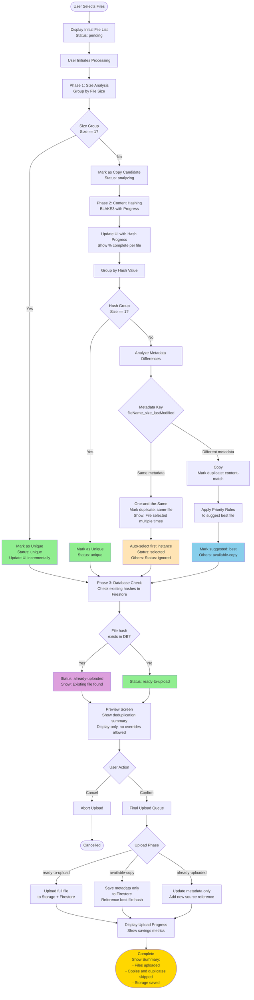

# Client-Side Deduplication Analysis
## Terminology

This document uses precise terminology for file deduplication:

- **duplicate** or **duplicates**: Files with the same hash value AND same modified date
- **copy** or **copies**: Files with the same hash value but different file metadata
- **file metadata**: Filesystem metadata (name, size, modified date, path) that does not affect hash value
- **one-and-the-same**: The exact same file (same hash, same metadata, same folder location)


## Current Implementation (Old Upload Page)

### Overview
The old upload page at `/upload` implements a sophisticated client-side deduplication strategy that distinguishes between:
1. **Unique files** - Files with no duplicates
2. **One-and-the-same files** - The exact same file selected multiple times (silently filtered)
3. **Copies** - Files with same hash but different file metadata (marked, only one uploaded)

### Current Workflow - Mermaid Diagram


### Priority Rules for Choosing Best File

When multiple files have same hash but different file metadata (copies):

1. **Earliest modification date** - Older file wins
2. **Longest folder path** - Deeper nested file wins
3. **Shortest filename** - More concise name wins
4. **Alphanumeric filename sort** - Alphabetically first wins
5. **Original selection order** - Earlier selected wins

### Key Components

#### File Locations
- **Worker**: `src/features/upload/workers/fileHashWorker.js`
- **Composables**:
  - `src/features/upload/composables/useQueueDeduplication.js`
  - `src/features/upload/composables/useQueueCore.js`
  - `src/features/upload/composables/useFileProcessor.js`
- **Main View**: `src/features/upload/FileUpload.vue`

#### Hash Algorithm
- **BLAKE3** with 128-bit output (32 hex characters)
- Used as document ID in Firestore for automatic database-level deduplication

#### Processing Paths
1. **Web Worker Path** (preferred) - Uses `fileHashWorker.js` for non-blocking hashing
2. **Main Thread Fallback** - Uses `useQueueCore.js` if worker fails

---

## Proposed Improved Workflow

### Claimed Improvements
1. **Simplified Status System** - Use clearer status names
2. **User Visibility** - Show deduplication results to user before upload
3. **Performance Metrics** - Track and display deduplication savings
4. **Incremental Hashing** - Hash files incrementally for better progress feedback
5. **Early Database Check** - Check Firestore for existing files before full processing

### ⚠️ CRITICAL ARCHITECTURAL FLAW

**The "improved" workflow fundamentally breaks the original design's performance optimization.**

#### Original Design (Smart):
- **Phase 1 (Client-Side Only)**: Size grouping and deduplication - NO database queries
- **Phase 2 (During Upload)**: Hashing and database queries happen ONLY when actually uploading
- **Key Benefit**: Database query time is HIDDEN behind the much longer file upload time
- **Result**: User sees fast client-side deduplication, database load minimized

#### "Improved" Design (Broken):
- **Phase 1 (Client-Side)**: Size grouping
- **Phase 2 (Client-Side)**: Hash ALL files before upload
- **Phase 3 (Database Check)**: Query Firestore BEFORE user even clicks upload
- **Key Problem**: Database queries add VISIBLE latency before upload starts
- **Result**: User waits for database queries, increased Firestore load, no benefit

**Verdict**: The "improved" design sacrifices the original's smart performance optimization for no gain. Database queries should remain in the upload phase where their cost is hidden.

### Improved Workflow - Mermaid Diagram



### Key Improvements Explained

#### 1. Enhanced User Experience
- **Incremental UI Updates**: Show progress as each file is analyzed
- **Clear Status Indicators**: Use intuitive status names like "unique", "analyzing", "already-uploaded"
- **Preview Screen**: Let users review deduplication results before committing

#### 2. Better Copy and Duplicate Handling
- **Three File Types**:
  - `same-file`: Exact same file selected multiple times (silently filter)
  - `content-match`: Different files with same hash (ALL metadata saved, one file uploaded)
  - `already-uploaded`: File already exists in database (update metadata only)

**IMPORTANT**: Since files with identical hashes are identical content, the choice of which copy to upload is irrelevant. ALL metadata from ALL copies must be saved for litigation discovery purposes. The "best file" selection only determines which metadata is displayed as primary in the UI.

#### 3. Performance Enhancements (⚠️ Actually Performance Degradation)
- **Incremental Hashing**: Hash files one at a time with progress feedback
- **Early Database Check**: ⚠️ Query Firestore BEFORE upload (adds visible latency)
- **Smart Batching**: Process files in optimal batch sizes

#### 4. User Visibility (Not Control)
- **Metadata Preview**: Show why files are considered duplicates
- **Upload Preview**: Display what will be uploaded before starting
- **No Override Capability**: Users cannot override deduplication or suppress metadata discovery

#### 5. Error Handling
- **Hashing Failure**: File gets `status: error` with red dot indicator
- **Disabled Upload**: Checkbox disabled (like .lnk and .tmp files)
- **User Notification**: Clear error message explaining why file cannot be uploaded

#### 6. Metrics & Feedback
- **Deduplication Summary**:
  - Number of unique files
  - Number of duplicates detected
  - Estimated storage saved (MB/GB)
  - Time saved by skipping duplicates
- **Real-time Progress**: Show current operation and file being processed

### Status Flow Comparison

#### Current System
```
pending → ready → uploading → completed
pending → ready → uploadMetadataOnly → completed
```

#### Improved System
```
pending → analyzing → unique → ready-to-upload → uploading → completed
pending → analyzing → content-match → available-copy → metadata-only → completed
pending → analyzing → same-file → ignored
pending → analyzing → unique → already-uploaded → metadata-updated → completed
```

### Implementation Considerations

1. **Backward Compatibility**: New page can coexist with old page during development
2. **Progressive Enhancement**: Start with basic improvements, add advanced features iteratively
3. **Error Handling**: Better error messages for hash failures or network issues
4. **Cancellation**: Allow users to cancel analysis at any stage
5. **Memory Management**: Handle large file sets efficiently

---

## Conclusion: Is This Actually Improved?

### Core Algorithm
✅ **IDENTICAL** - The deduplication logic is unchanged (good - don't break what works)

### Genuine UX Improvements
✅ **Status Names** - More descriptive than `ready` and `uploadMetadataOnly`
✅ **Progress Feedback** - Show hashing progress to users
✅ **Preview Screen** - Let users see what will happen before upload
✅ **Metrics Display** - Show deduplication savings

### Critical Problems
❌ **Database Query Timing** - Moving database checks BEFORE upload adds visible latency and increases Firestore load. Original design was smarter.
❌ **User Override Features** - Proposed override capabilities violate litigation discovery requirements and are technically impossible (can't upload multiple files with same hash to same document ID)
❌ **Hashing Timing** - Original design hashes during upload (hidden cost), "improved" design hashes before upload (visible wait)

### Recommendation
**DO NOT IMPLEMENT** the "improved" workflow as designed. Instead:
1. Keep the original client-side deduplication exactly as-is
2. Add ONLY the UX improvements (status names, progress feedback, metrics)
3. Keep database queries DURING upload phase, not before
4. Do NOT add user override capabilities
5. Add error handling improvements for hash failures

The original design is architecturally superior. The "improved" version sacrifices performance for features that either aren't needed or violate requirements.
