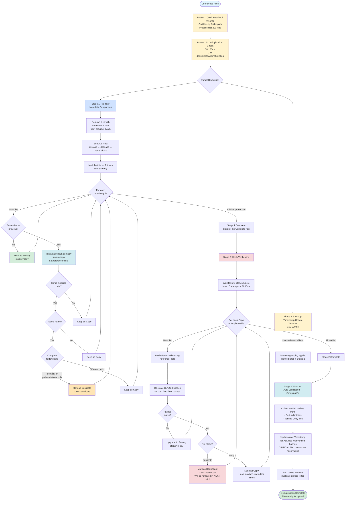
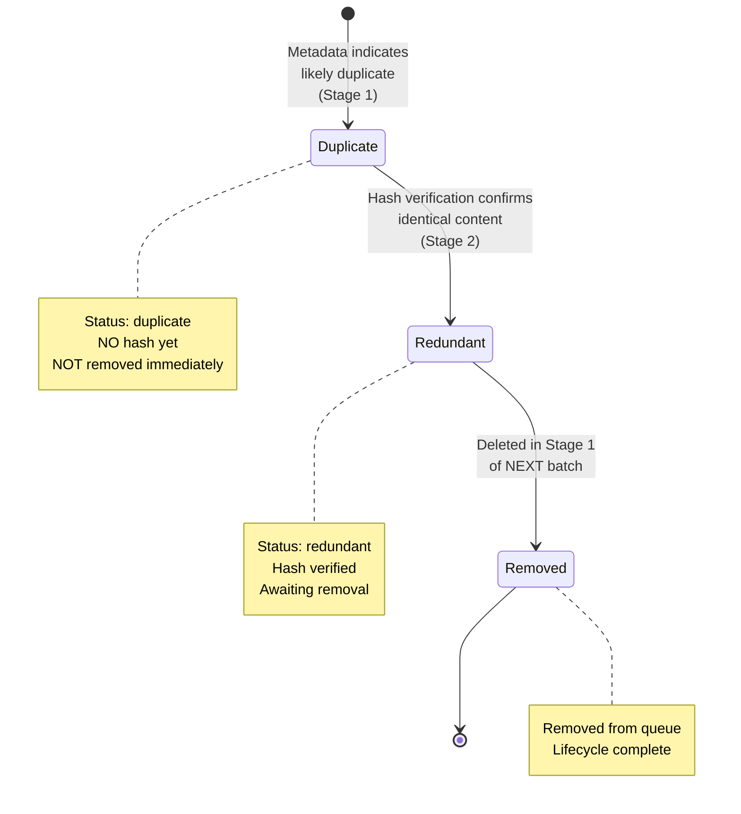
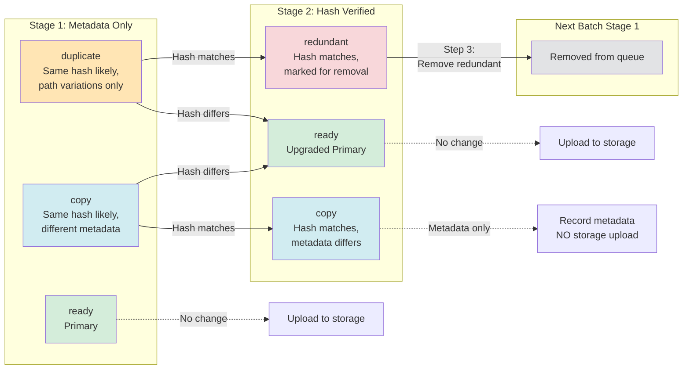
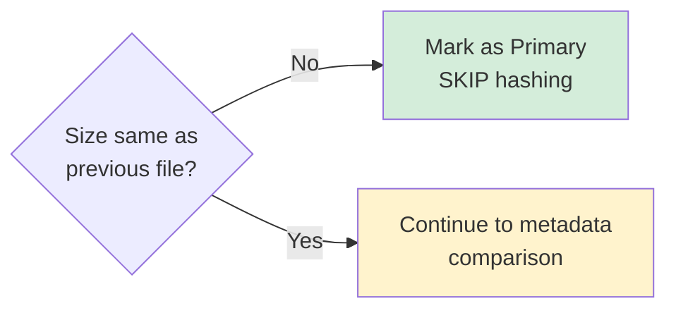
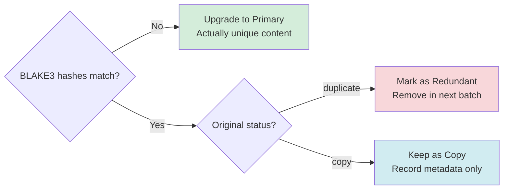
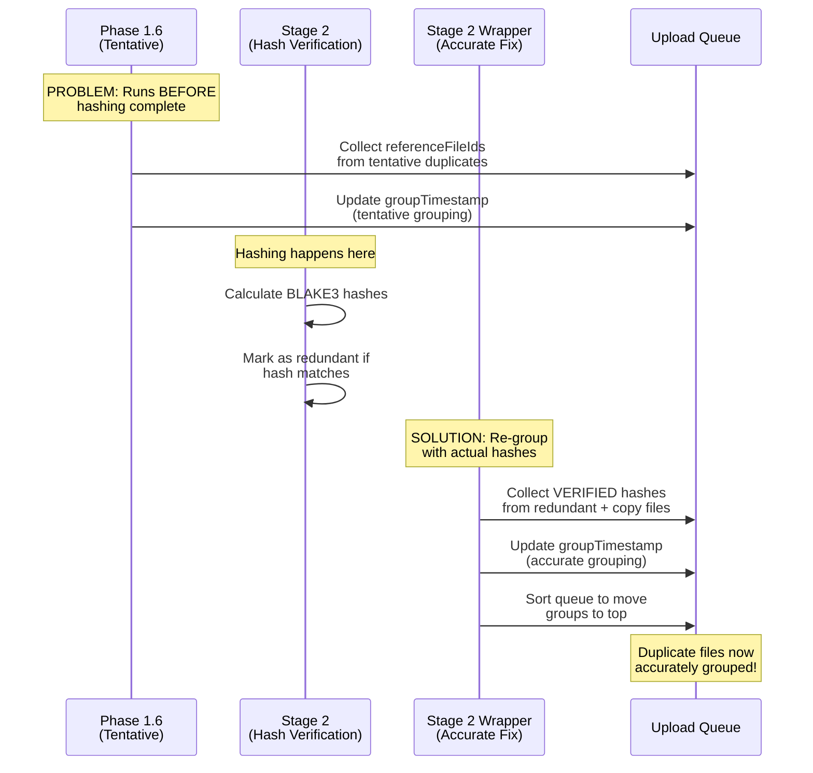
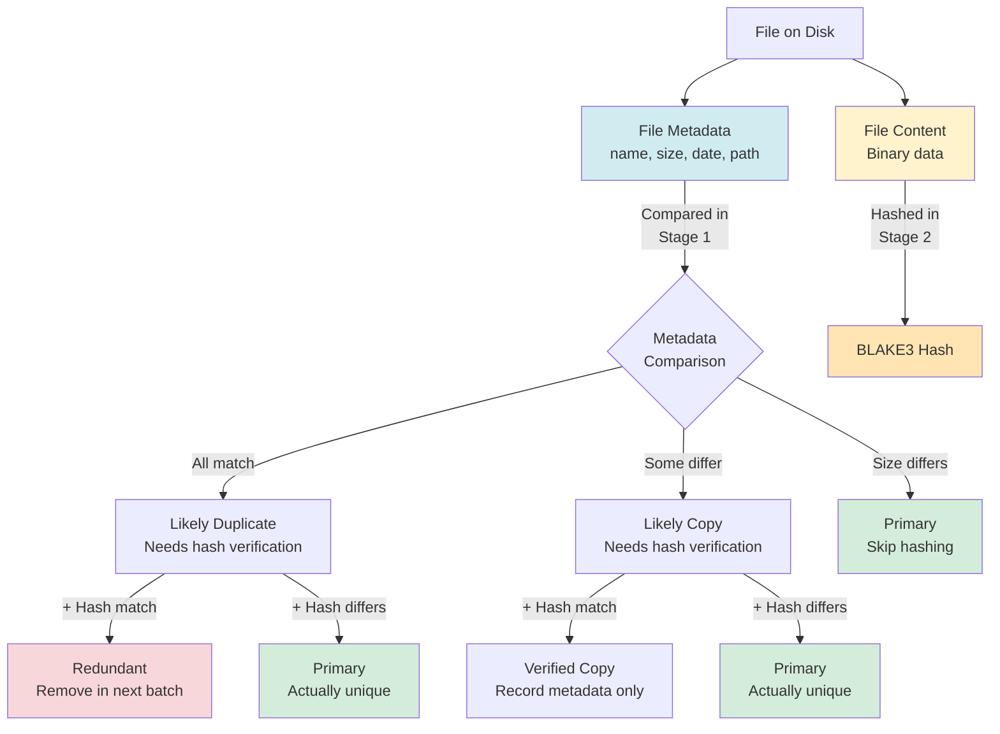

# Client-Side Deduplication Workflow Diagram

**Date:** 2025-11-16
**Source:** `docs/dedupe/2025-11-16-ClientDeDupeLogic.md`
**Status:** Production

---

## Overview

This diagram visualizes the **two-stage, six-phase** client-side deduplication workflow that efficiently identifies and handles duplicate files before upload.

---

## Main Workflow

---

## Two-Phase Cleanup Lifecycle

---

## File Status Transitions

---

## Timing and Thread Execution

```mermaid
gantt
    title Client Deduplication Timeline
    dateFormat SSS
    axisFormat %L ms

    section Main Thread
    Phase 1 Quick Feedback           :p1, 000, 50ms
    Phase 1.5 Deduplication Check    :p1_5, 050, 100ms
    Phase 1.6 Group Timestamp (Tentative) :p1_6, 150, 50ms

    section Stage 1
    Stage 1 Pre-filter (Metadata)    :s1, 050, 150ms
    Set preFilterComplete flag       :milestone, s1_done, 200, 0ms

    section Stage 2
    Wait for preFilterComplete       :s2_wait, 200, 100ms
    Stage 2 Hash Verification        :s2, 300, 500ms

    section Stage 2 Wrapper
    Stage 2 Wrapper Auto-trigger     :s2w, 800, 200ms
    Update groupTimestamp (Accurate) :s2w_group, 800, 100ms
    Sort queue by groupTimestamp     :s2w_sort, 900, 100ms
```

---

## Key Decision Points

### Size Comparison (Stage 1 Step 4)

**Optimization:** Only 10-20% of files reach Stage 2 hashing because unique sizes are eliminated early.

---

### Hash Comparison (Stage 2 Step 15)

---

## Group Timestamp Management (Two-Step Fix)

---

## File Metadata vs Hash Content

---

## Implementation Files Reference

### Core Composables
- **Phase 1, 1.5, 1.6:** `src/features/upload/composables/useUploadTable-addition.js:48-114`
- **Stage 1 & 2 Algorithms:** `src/features/upload/composables/useSequentialPrefilter.js:1-392`
- **Stage 2 Wrapper:** `src/features/upload/composables/useSequentialVerification.js:102-211`
- **Orchestrator:** `src/features/upload/composables/useUploadTableDeduplicationSequential.js:1-107`

### Key Logic Locations
- **Remove redundant (Step 3):** `useSequentialPrefilter.js:95-111`
- **Sequential comparison (Steps 4-9):** `useSequentialPrefilter.js:126-208`
- **Folder path comparison (Step 8):** `useSequentialPrefilter.js:164-205`
- **Hash verification (Steps 14-16):** `useSequentialPrefilter.js:285-368`
- **Phase 1.6 tentative grouping:** `useUploadTable-addition.js:88-114`
- **Stage 2 wrapper grouping fix:** `useSequentialVerification.js:146-188`

---

## Terminology Quick Reference

| Term | Upload to Storage? | Record Metadata? | Description |
|------|-------------------|------------------|-------------|
| **Primary** | ✅ Yes | ✅ Yes | Unique content or best version in group |
| **Copy** | ❌ No | ✅ Yes | Same hash, different meaningful metadata |
| **Duplicate** | ❌ No | ❌ No | Same hash, path variations only (no info value) |
| **Redundant** | ❌ No | ❌ No | Hash-verified duplicate awaiting removal |

---

## Notes

- **Efficiency:** Only 10-20% of files require BLAKE3 hashing due to Stage 1 metadata filtering
- **Race Condition Prevention:** Two-phase cleanup lifecycle prevents issues with rapid batch uploads
- **UI Grouping:** Two-step groupTimestamp approach (tentative + accurate) ensures proper visual grouping
- **Flexibility:** `referenceFileId` pattern allows future optimizations beyond sequential comparison
