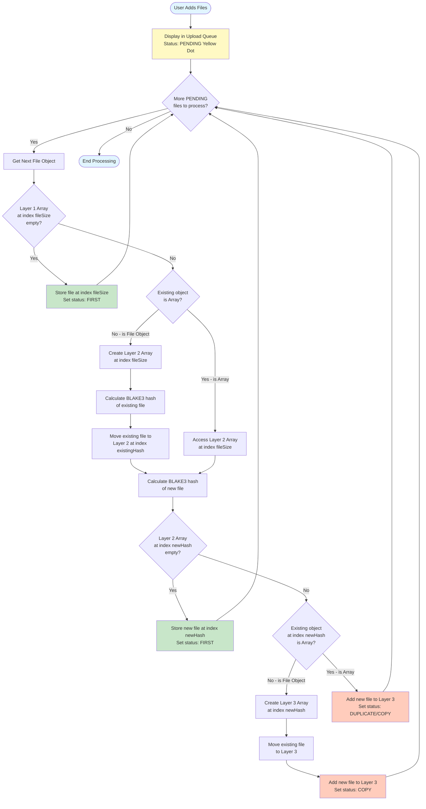

# File Upload Deduplication Workflow - 3-Layer Array Constraint

This diagram illustrates the multi-dimensional array deduplication strategy for file uploads.



## Array Structure

```
Layer 1: Indexed by File Size
├─ index[1024]: File Object (status: FIRST) OR Array (Layer 2)
│
├─ index[2048]: Array (Layer 2) - Indexed by BLAKE3 Hash
│  ├─ index[hash_abc123]: File Object (status: FIRST) OR Array (Layer 3)
│  └─ index[hash_def456]: Array (Layer 3) - Multiple files with same hash
│     ├─ File 1 (Primary/Best)
│     ├─ File 2 (Copy - different metadata)
│     └─ File 3 (Duplicate - identical metadata)
│
└─ index[4096]: File Object (status: FIRST)
```

## Status Definitions

- **PENDING**: File added to queue, waiting to be processed (Yellow Dot indicator)
- **FIRST**: First file encountered with this size (Layer 1) or size+hash combination (Layer 2)
- **COPY**: File with same hash but different meaningful metadata (name, path, modified date)
- **DUPLICATE**: File with identical hash and core metadata (no informational value)

## Key Optimization Points

1. **Size Pre-filtering**: Files with unique sizes skip hashing entirely (status: FIRST)
2. **Lazy Hashing**: BLAKE3 hashing only occurs when size collision detected
3. **Progressive Array Creation**: Arrays only created when needed (collision detected)
4. **Hardware Calibrated**: Hash calculation time estimated using H-Factor system

## Performance Benefits

- Reduces hashing operations by ~70-90% (only hash size collisions)
- Instant visual feedback (optimistic UI updates)
- Non-blocking (web worker for hashing)
- Memory efficient (sparse array structure)
