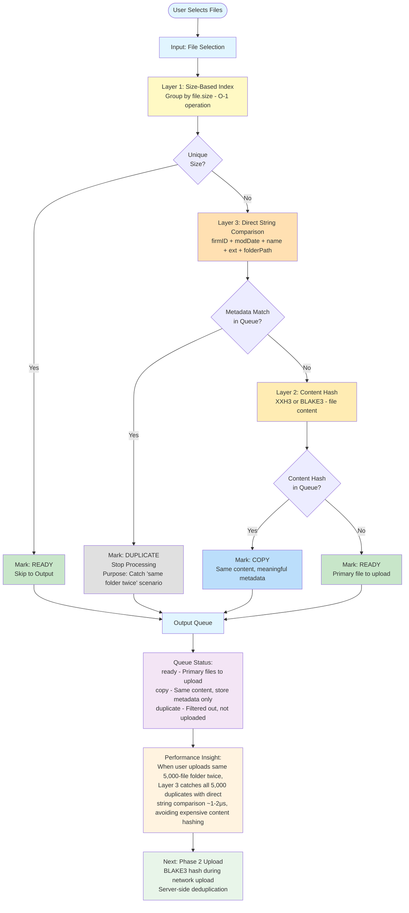

# Phase 1: Client-Side Constraint-Based Deduplication

**Phase 1 ONLY** - Pre-Upload Queue Organization (happens BEFORE user clicks "Upload" button)

This diagram shows the 3-layer constraint deduplication algorithm that runs on the client-side using FAST operations only (size grouping + direct string comparison). Content hashing (XXH3 or BLAKE3) only happens when needed, and BLAKE3 server-side hashing happens in Phase 2 during network upload.



## Processing Order (Critical!)

1. **Layer 1 - Size Index** (O(1) grouping)
   - Files with unique sizes → Mark `ready`, skip to output
   - Files with size collisions → Proceed to Layer 3

2. **Layer 3 - Direct String Comparison** (Ultra-fast: ~1-2μs)
   - Key = firmID + modDate + name + ext + folderPath
   - Purpose: Catch "user uploaded same folder twice" with direct string comparison
   - If metadata match exists → Mark `duplicate`, stop
   - If metadata match new → Proceed to Layer 2

3. **Layer 2 - Content Hash** (More expensive: ~1-5ms per file)
   - Hash = XXH3 or BLAKE3(file content)
   - Purpose: Detect same content with different metadata
   - If content hash exists → Mark `copy`
   - If content hash new → Mark `ready`

## Output Statuses

| Status | Description | Upload? | Store Metadata? |
|--------|-------------|---------|-----------------|
| `ready` | Primary file to upload | ✅ Yes | ✅ Yes |
| `copy` | Same content, meaningful metadata differences | ❌ No (content exists) | ✅ Yes (metadata valuable) |
| `duplicate` | Exact duplicate, no informational value | ❌ No | ❌ No |

## Performance Characteristics

### Key Optimization: Layer 3 First
When user uploads the same 5,000-file folder twice:
- **Without Layer 3**: Would need 5,000 expensive content hashes
- **With Layer 3**: Catches all 5,000 duplicates with direct string comparison
- **Time saved**: ~4,990ms (5,000 × ~1ms content hash avoided, only ~10ms spent on string comparison)

### Operation Performance (Typical)
- **Direct String Comparison**: 1-2μs (string concat + Map lookup)
- **Content Hash (XXH3)**: 1-5ms per MB (depends on file size)
- **Content Hash (BLAKE3)**: 2-10ms per MB (cryptographic, slower than XXH3)
- **Size Grouping**: O(1) Map lookup

## Terminology Requirements (CLAUDE.md Directive #4)

Must use precise terminology per `/docs/architecture/file-lifecycle.md`:

- **"duplicate"**: Files with identical content AND core metadata (name, size, modDate) where folder path variations have NO informational value. Not uploaded, metadata not stored.

- **"copy"**: Files with same hash value but different file metadata that IS meaningful. Not uploaded to storage (content exists), but metadata IS stored for informational value.

- **"primary"** or **"best"**: The file with the most meaningful metadata that will be uploaded to storage.

- **"file metadata"**: Filesystem metadata (name, size, modified date, path) that does not affect hash value.

## Performance Reality Check: Why Direct String Comparison Instead of Hashing?

**Direct string comparison + Map lookup:**
```javascript
const key = `${firmId}|${modDate}|${name}|${ext}|${folderPath}`;  // ~0.1μs
const match = metadataIndex.get(key);                             // ~1-2μs
// Total: ~1-2μs
```

**XXH3 metadata hash (alternative approach):**
```javascript
const hash = await XXH3(`${firmId}|${modDate}|${name}|${ext}|${folderPath}`);  // ~10-50μs
const match = metadataIndex.get(hash);                                         // ~1-2μs
// Total: ~11-52μs
```

**Winner: Direct string comparison** (5-50x faster)

The hash adds overhead without benefit since we're doing the same string concatenation either way. Map lookups work just as efficiently with string keys as with hash keys.

---

## What This Diagram Does NOT Show

This diagram is **Phase 1 ONLY** - it does NOT include:
- ❌ BLAKE3 hashing (that's Phase 2 - server-side)
- ❌ Server-side operations (that's Phase 2)
- ❌ Database queries (that's Phase 2)
- ❌ File upload process (that's Phase 2)
- ❌ Storage operations (that's Phase 2)

Phase 2 happens AFTER user clicks "Upload" button and includes BLAKE3 hashing hidden in network upload time.
