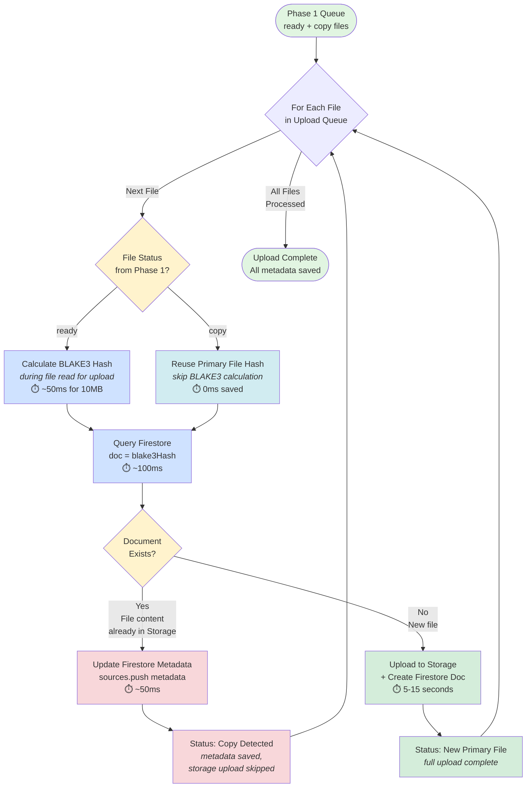

# Phase 2: Server-Side Deduplication During Upload

**Status:** Architecture Documentation
**Created:** 2025-11-15
**Phase:** Phase 2 ONLY (Server-Side Upload Processing)
**Related:** See `2025-11-15-Phase1-Deduplication-Diagram.md` for client-side pre-upload queue organization

---

## Overview

This diagram shows **Phase 2** of the two-phase deduplication system: server-side processing that happens **DURING** the network upload after the user clicks "Upload".

### What Phase 2 Is

- **Timing:** Happens DURING network upload (after user clicks "Upload" button)
- **Input:** Only files marked `ready` or `copy` from Phase 1 (duplicates already filtered)
- **Algorithm:** BLAKE3 hash → Firestore query → Upload decision
- **Key Optimization:** Hash + database query latency (~150ms) is HIDDEN behind network upload time (~5-15 seconds)
- **Purpose:** Database-level deduplication using BLAKE3 hash as Firestore document ID

### What Phase 2 Is NOT

- ❌ Pre-upload analysis (that's Phase 1)
- ❌ XXH3 hashing (that's Phase 1, discarded before Phase 2)
- ❌ Processing files marked `duplicate` (filtered out in Phase 1, never reach Phase 2)
- ❌ Visible latency to user (happens during unavoidable network upload wait time)

---

## Architecture Rationale

**Critical Performance Insight:**

Upload time is ~100x longer than hash + query time:
- BLAKE3 hashing (10MB file): ~50ms
- Firestore query: ~100ms
- Network upload (10MB file): ~5-15 seconds

By performing hash + query **DURING** the file upload loop, the ~150ms overhead is completely invisible to users because it's dwarfed by the 5-15 second upload time.

**Why NOT Pre-Upload Analysis:**
- Would add visible ~150ms × N files latency BEFORE any upload starts
- Would query database for files user might cancel
- Would increase Firestore load unnecessarily
- Users would perceive slower performance

---

## Phase 2 Deduplication Flow



---

## Flow Explanation

### 1. Input: Phase 1 Queue (ready + copy files only)

- **Source:** Upload queue from Phase 1 client-side deduplication
- **Statuses Processed:**
  - `ready`: Files to upload (unique or best file from copy group)
  - `copy`: Files with same content as a `ready` file in the same batch
- **Statuses NOT Processed:**
  - `duplicate`: Filtered out in Phase 1, never reach Phase 2

### 2. Upload Loop (For Each File)

**Important:** This is an upload loop, NOT a pre-upload analysis step.

Each iteration processes one file's upload:

#### Step 2a: Check Phase 1 Status

- **If file is `ready`:**
  - Calculate BLAKE3 hash (128-bit)
  - This happens DURING the file read for network upload
  - Hash becomes the Firestore document ID

- **If file is `copy`:**
  - Skip BLAKE3 calculation (optimization)
  - Reuse the hash from the primary file in the same batch
  - Only need to update metadata

#### Step 2b: Query Firestore

```javascript
const docRef = doc(db, 'documents', blake3Hash);
const docSnap = await getDoc(docRef);
```

**Performance Note:** This ~100ms query happens while the file is being uploaded to Storage, so the latency is hidden.

#### Step 2c: Branch on Document Existence

**If Document EXISTS (file content already in database):**

```javascript
// Update metadata only (don't re-upload file content)
await updateDoc(docRef, {
  sources: arrayUnion({
    fileName: file.metadata.sourceFileName,
    path: file.path,
    lastModified: file.metadata.lastModified,
    uploadedAt: serverTimestamp(),
  })
});
```

- **Result:** Copy detected (same content, different metadata)
- **Storage:** Skip upload (content already exists)
- **Firestore:** Append new source metadata to `sources` array
- **Litigation Compliance:** All metadata preserved

**If Document DOES NOT EXIST (new file):**

```javascript
// Upload file content to Storage
await uploadBytes(storageRef, file.file);

// Create new Firestore document
await setDoc(docRef, {
  hash: blake3Hash,
  size: file.metadata.sourceFileSize,
  type: file.metadata.sourceFileType,
  sources: [{
    fileName: file.metadata.sourceFileName,
    path: file.path,
    lastModified: file.metadata.lastModified,
    uploadedAt: serverTimestamp(),
  }]
});
```

- **Result:** New primary file
- **Storage:** Upload file content
- **Firestore:** Create new document with hash as ID
- **Database-Level Deduplication:** Hash as ID means Firestore prevents duplicate documents automatically

### 3. Loop Continues

Process next file in upload queue until all `ready` and `copy` files are processed.

### 4. Output: Upload Complete

- All file content uploaded (except copies)
- All metadata saved (including copies)
- All sources recorded in Firestore for litigation discovery

---

## Firestore Document Structure

```javascript
{
  id: "e3b0c44298fc1c14...",  // BLAKE3 hash (document ID)
  hash: "e3b0c44298fc1c14...", // Redundant but explicit
  size: 1048576,               // File size in bytes
  type: "application/pdf",     // MIME type
  sources: [                   // Array of ALL copies/sources
    {
      fileName: "invoice.pdf",
      path: "/2024/invoices/invoice.pdf",
      lastModified: 1699000000,
      uploadedAt: Timestamp(2025-11-15T10:30:00Z)
    },
    {
      fileName: "invoice_copy.pdf",  // Copy with different metadata
      path: "/backup/invoice_copy.pdf",
      lastModified: 1699000001,
      uploadedAt: Timestamp(2025-11-15T10:30:05Z)
    }
  ]
}
```

**Key Points:**

- **Document ID = BLAKE3 hash:** Database-level deduplication (can't create duplicate documents)
- **sources array:** Preserves ALL metadata from ALL copies for litigation discovery
- **Non-negotiable:** All source metadata MUST be saved (legal compliance requirement)

---

## Performance Characteristics

### Latency Breakdown (10MB file example)

| Operation | Time | Hidden? |
|-----------|------|---------|
| BLAKE3 hash | ~50ms | ✅ Yes (during file read) |
| Firestore query | ~100ms | ✅ Yes (during upload prep) |
| Network upload | ~5-15s | ❌ No (unavoidable) |
| **Total User Wait** | **~5-15s** | File upload time only |

**Result:** Users experience zero additional latency from deduplication.

### Optimization: Copy Files

Files marked `copy` in Phase 1 (same content as another file in the batch):

- **Skip:** BLAKE3 hashing (reuse primary hash)
- **Skip:** Storage upload (content already uploaded)
- **Do:** Firestore metadata update only
- **Savings:** ~5-15 seconds per copy file

---

## Terminology (Per CLAUDE.md Directive #4)

**Source:** `@docs/architecture/file-lifecycle.md`

- **"copy"** or **"copies"**: Files with same hash but different meaningful metadata. Metadata IS stored, file content NOT uploaded.

- **"duplicate"** or **"duplicates"**: Files with same hash AND same metadata. Not uploaded, metadata NOT stored. These are filtered in Phase 1 and never reach Phase 2.

- **"primary"** or **"best"**: The file that gets uploaded to Storage (chosen in Phase 1).

- **"file metadata"**: Filesystem metadata (name, size, modified date, path) that doesn't affect hash value.

---

## Related Documentation

- **Phase 1 Diagram:** `planning/1. Ideas/2025-11-15-Phase1-Deduplication-Diagram.md`
- **Architecture Rationale:** `@docs/architecture/client-deduplication-logic.md` (lines 39-89)
- **File Terminology:** `@docs/architecture/file-lifecycle.md`
- **Implementation Guide:** `@docs/architecture/client-deduplication-logic.md` (lines 269-330)

---

## Non-Negotiable Requirements

Per `@docs/architecture/client-deduplication-logic.md`:

1. ✅ **ALL metadata from ALL copies MUST be saved** - Litigation discovery requirement
2. ✅ **Hash + query DURING upload** - Performance requirement (hidden latency)
3. ✅ **BLAKE3 hash as document ID** - Database-level deduplication
4. ✅ **No user override** - Legal compliance (can't suppress metadata)
5. ✅ **Process ready/copy only** - Duplicates filtered in Phase 1

---

## Success Criteria

- [x] Diagram shows upload loop (not pre-upload analysis)
- [x] Clear flow: BLAKE3 hash → Firestore query → Upload decision
- [x] Performance rationale annotated (hidden latency)
- [x] Shows difference between `ready` files (new) vs `copy` files (metadata-only)
- [x] Follows terminology requirements precisely
- [x] Clearly states what Phase 2 is and isn't
- [x] Emphasizes database-level deduplication via hash as ID
- [x] Highlights litigation compliance (all metadata saved)

---

## Implementation Notes

### Code Location

Phase 2 upload logic should be in:
- **Upload Handler:** Where files are processed for upload
- **Firestore Service:** Database operations
- **Storage Service:** File upload operations

### Key Functions

```javascript
// Phase 2 upload function (pseudocode)
async function uploadFileWithDeduplication(file, phase1Status) {
  let blake3Hash;

  // Step 1: Hash or reuse
  if (phase1Status === 'copy') {
    blake3Hash = file.primaryHash; // Reuse from Phase 1 primary
  } else {
    blake3Hash = await calculateBLAKE3(file); // During file read
  }

  // Step 2: Query Firestore
  const docRef = doc(db, 'documents', blake3Hash);
  const docSnap = await getDoc(docRef);

  // Step 3: Upload or update
  if (docSnap.exists()) {
    // Copy detected - metadata only
    await updateDoc(docRef, {
      sources: arrayUnion(file.metadata)
    });
    return { status: 'copy', saved: 'metadata' };
  } else {
    // New file - full upload
    await uploadBytes(storageRef, file.file);
    await setDoc(docRef, {
      hash: blake3Hash,
      size: file.size,
      type: file.type,
      sources: [file.metadata]
    });
    return { status: 'primary', saved: 'full' };
  }
}
```

### Error Handling

- **Hash failure:** Should be caught in Phase 1 (files marked `read error`)
- **Firestore query failure:** Retry with exponential backoff
- **Storage upload failure:** Mark as `failed`, allow retry
- **Network interruption:** Implement resume capability

---

## Future Enhancements

- **Parallel uploads:** Process multiple files concurrently (with queue limit)
- **Progress streaming:** Real-time progress updates during hash + upload
- **Bandwidth optimization:** Adaptive chunk sizes based on connection speed
- **Resume capability:** Handle interrupted uploads gracefully
