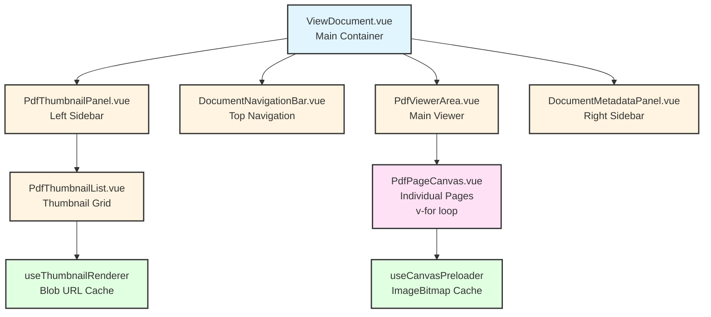
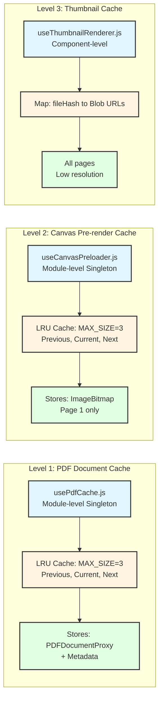
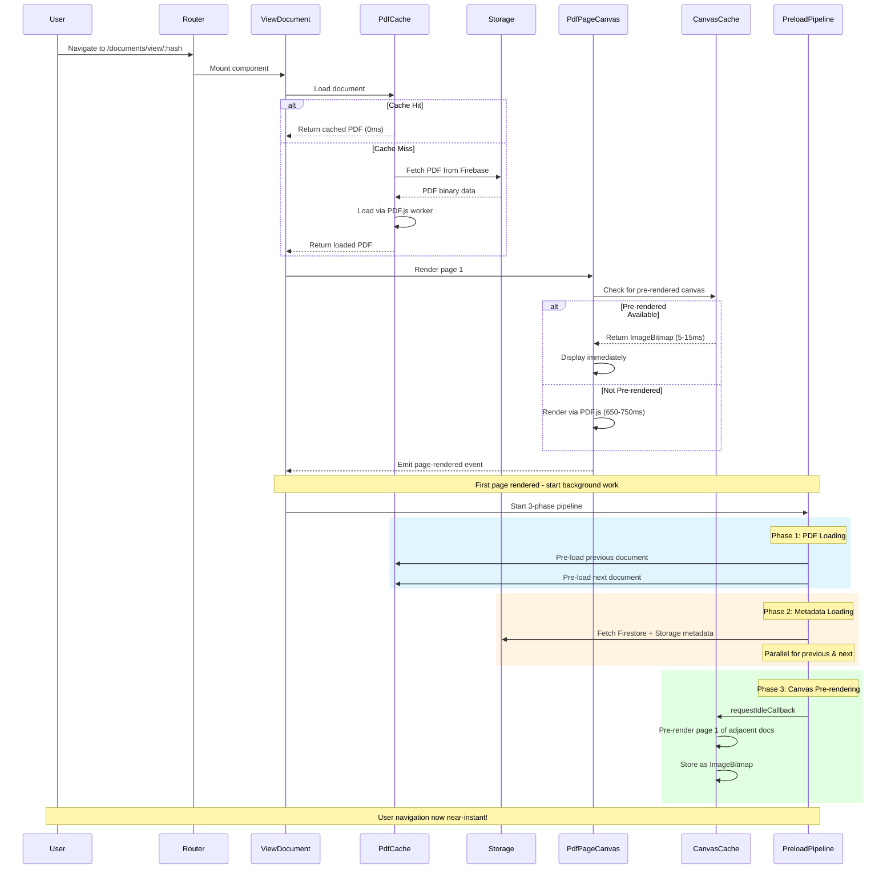
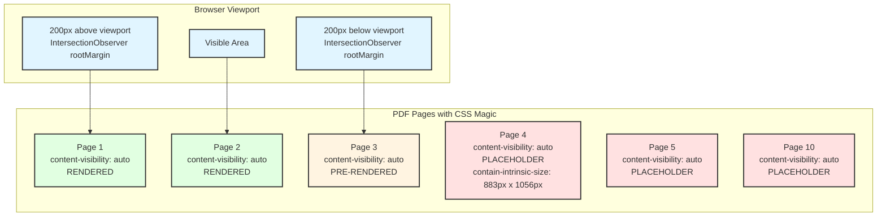
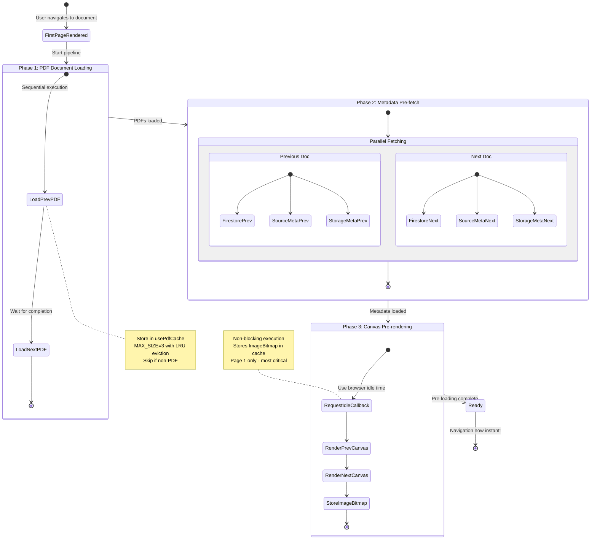
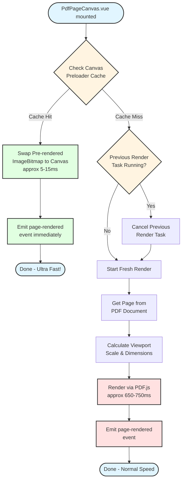

# PDF Document Viewer Performance Optimization

This document explains the multi-layered performance optimization strategy used in the Bookkeeper document viewer.

**Route:** `/matters/:matterId/documents/view/:fileHash`
**Main Component:** `src/features/organizer/views/ViewDocument.vue`

---

## 1. Component Hierarchy

The document viewer is composed of several specialized components working together:



**Key Files:**
- `src/features/organizer/views/ViewDocument.vue` - Main container
- `src/components/document/PdfViewerArea.vue` - Implements CSS virtualization
- `src/features/organizer/components/PdfPageCanvas.vue` - Individual page rendering
- `src/features/organizer/composables/useCanvasPreloader.js` - Pre-render cache
- `src/features/organizer/composables/useThumbnailRenderer.js` - Thumbnail cache

---

## 2. Three-Level Caching System

The viewer implements a sophisticated 3-level caching strategy:



**Cache Benefits:**

| Cache | Purpose | Hit Performance | Memory Efficiency |
|-------|---------|----------------|-------------------|
| PDF Document | Instant PDF access | 0ms (no network) | Stores 3 full PDFs |
| Canvas Pre-render | Skip page 1 render | 5-15ms (vs 650-750ms) | ImageBitmap (optimal) |
| Thumbnail | Sidebar thumbnails | Instant display | Blob URLs (2x better than data URLs) |

**Key Files:**
- `src/features/organizer/composables/usePdfCache.js` - PDF document cache
- `src/features/organizer/composables/useCanvasPreloader.js` - Canvas cache
- `src/features/organizer/composables/useThumbnailRenderer.js` - Thumbnail cache

---

## 3. Complete Data Flow

This sequence diagram shows the entire flow from navigation to display:



**Performance Impact:**
- **Cold start:** 650-750ms for first page
- **Subsequent navigation:** 5-15ms (pre-rendered) + 0ms (cached PDF) = **~43-150x faster**

---

## 4. CSS Virtualization Strategy

The **primary** optimization is browser-native lazy rendering using modern CSS:



**Implementation** (`PdfViewerArea.vue` lines 151-153):

```css
.pdf-page {
  /* Modern CSS lazy rendering - 40% performance boost, zero dependencies */
  content-visibility: auto;
  contain-intrinsic-size: 883.2px 1056px; /* 9.2in x 11in at 96 DPI */
}
```

**How It Works:**
1. Browser **skips rendering** pages outside viewport entirely
2. Off-screen pages get **placeholder size** (883.2px x 1056px)
3. IntersectionObserver with **200px rootMargin** triggers loading slightly before visible
4. **Zero JavaScript** virtualization libraries needed
5. **40% performance boost** according to code comments

**Benefits:**
- Zero dependencies
- Automatic browser optimization
- Minimal memory footprint
- Smooth scrolling
- Works with native scrolling

---

## 5. Background Pre-loading Pipeline

After the first page renders, a sophisticated 3-phase pipeline runs in the background:



**Critical Timing:**
- Pipeline starts **AFTER** first page renders to prioritize user-visible content
- Each phase waits for previous phase to complete (sequential)
- Phase 2 internally uses parallel fetching for efficiency
- Phase 3 uses `requestIdleCallback` to avoid blocking user interaction

**Key File:** `src/features/organizer/composables/useDocumentPreloader.js`

---

## 6. Render Lifecycle Decision Tree

How each PDF page decides whether to use pre-rendered cache or render fresh:



**Key Optimizations:**
1. **Cache check first** - fastest path if pre-rendered
2. **Render cancellation** - prevents "cannot use same canvas" errors
3. **Mount state tracking** - prevents race conditions on unmount
4. **Immediate event emission** - UI updates instantly on cache hit

**Performance Difference:**
- **Pre-rendered (cache hit):** 5-15ms (fast)
- **Fresh render (cache miss):** 650-750ms (slow)
- **Speedup:** ~43-150x faster

**Key File:** `src/features/organizer/components/PdfPageCanvas.vue`

---

## 7. Performance Metrics Comparison

Visual comparison of different rendering scenarios:

```mermaid
gantt
    title PDF Page Rendering Performance Comparison
    dateFormat X
    axisFormat %Lms

    section Cache Hit (Optimal)
    Pre-rendered ImageBitmap Swap :active, 0, 15
    Display Complete :milestone, 15, 0

    section Cache Hit (Good)
    Pre-rendered ImageBitmap Swap :active, 0, 50
    Display Complete :milestone, 50, 0

    section Cold Start (Optimal)
    Fresh PDF.js Render :crit, 0, 100
    Display Complete :milestone, 100, 0

    section Cold Start (Good)
    Fresh PDF.js Render :crit, 0, 250
    Display Complete :milestone, 250, 0

    section Typical Fresh Render
    Fresh PDF.js Render :crit, 0, 700
    Display Complete :milestone, 700, 0
```



**Performance Thresholds** (from code):

| Scenario | Optimal | Good | Typical |
|----------|---------|------|---------|
| **First Render (Cache Hit)** | <20ms | <50ms | - |
| **First Render (Cold Start)** | <100ms | <250ms | 650-750ms |
| **Canvas Swap** | 5-15ms | - | - |

**Real-World Impact:**
- **Initial load:** User waits 650-750ms for first document
- **Navigation to adjacent docs:** User waits only 5-15ms (pre-rendered + cached)
- **Navigation to any cached doc:** User waits 0ms (no network) + 5-15ms (pre-rendered)
- **Overall speedup:** ~43-150x faster for subsequent navigation

---

## 8. Memory Management Strategy

All caches implement proper cleanup to prevent memory leaks:

```mermaid
graph TD
    subgraph "PDF Document Cache Cleanup"
        A1[LRU Eviction Triggered] --> A2[Get Oldest Document]
        A2 --> A3[loadingTask.destroy]
        A3 --> A4[Remove from Cache Map]
    end

    subgraph "Canvas Preloader Cleanup"
        B1[LRU Eviction Triggered] --> B2[Get Oldest ImageBitmap]
        B2 --> B3[bitmap.close]
        B3 --> B4[Release GPU Memory]
        B4 --> B5[Remove from Cache Map]
    end

    subgraph "Thumbnail Cache Cleanup"
        C1[Component Unmount] --> C2[Iterate All Blob URLs]
        C2 --> C3[URL.revokeObjectURL]
        C3 --> C4[Release Memory]
        C4 --> C5[Clear Cache Map]
    end

    classDef destructiveAction fill:#ffe1e1,stroke:#333,stroke-width:2px
    classDef completeAction fill:#e1ffe1,stroke:#333,stroke-width:2px
    classDef processStep fill:#fff4e1,stroke:#333,stroke-width:2px

    class A3,B3,C3 destructiveAction
    class A4,B5,C5 completeAction
    class A1,A2,B1,B2,B4,C1,C2,C4 processStep
```



**Key Principles:**
1. **LRU Eviction:** Both PDF and canvas caches use Least Recently Used eviction with MAX_SIZE=3
2. **Proper Disposal:** Each cache type has specific cleanup methods
   - PDF.js: `loadingTask.destroy()` to release workers
   - ImageBitmap: `bitmap.close()` to free GPU memory
   - Blob URLs: `URL.revokeObjectURL()` to prevent memory leaks
3. **Component Lifecycle:** Thumbnail cache cleans up on component unmount
4. **Memory Efficiency:** ImageBitmap and Blob URLs are more efficient than alternatives

---

## 9. PDF.js Configuration

The viewer uses Mozilla's PDF.js library with performance-optimized settings:

**Key Configuration** (`src/config/pdfWorker.js`):

```javascript
{
  // Worker thread for non-blocking PDF processing
  workerSrc: '/pdf.worker.min.mjs',

  // GPU acceleration for faster rendering
  enableHWA: true,

  // Progressive loading for faster perceived performance
  disableStream: false,

  // WASM decoders for JPEG2000/JPX images
  standardFontDataUrl: '/standard_fonts/',

  // Image decoders
  imageResourcesPath: '/image_decoders/'
}
```

**Benefits:**
- **Web Worker:** PDF parsing doesn't block main thread
- **Hardware Acceleration:** Uses GPU for rendering (when available)
- **Streaming:** Start displaying pages before full PDF loads
- **WASM Decoders:** Faster image decoding than JavaScript

---

## 10. Viewport Tracking

IntersectionObserver tracks which pages are visible for navigation UI updates:

**Configuration** (`usePageVisibility.js`):
```javascript
{
  root: null,                    // Viewport as root
  rootMargin: '200px',           // Load 200px before visible
  threshold: [0, 0.1, 0.5, 1.0]  // Track visibility levels
}
```

**Benefits:**
- **Single Observer:** Shared across all pages (efficient)
- **Pre-loading:** 200px margin starts loading before user sees page
- **Visibility Tracking:** Knows which page is "most visible" for UI
- **Efficient:** Modern browser API, much faster than scroll listeners

---

## Summary: Key Optimizations

| Optimization | Technology | Performance Impact | Code Location |
|--------------|------------|-------------------|---------------|
| **CSS Virtualization** | `content-visibility: auto` | 40% boost | `PdfViewerArea.vue:151-153` |
| **PDF Document Cache** | Module-level LRU cache | 0ms network time | `usePdfCache.js` |
| **Canvas Pre-render** | ImageBitmap cache | 43-150x faster | `useCanvasPreloader.js` |
| **Thumbnail Cache** | Blob URLs | 2x memory efficiency | `useThumbnailRenderer.js` |
| **Background Pipeline** | 3-phase pre-loading | Instant navigation | `useDocumentPreloader.js` |
| **Viewport Tracking** | IntersectionObserver | Efficient visibility | `usePageVisibility.js` |
| **Worker Threading** | PDF.js Web Worker | Non-blocking parsing | `pdfWorker.js` |
| **GPU Acceleration** | PDF.js HWA | Faster rendering | `pdfWorker.js` |

**Overall Result:**
- First document load: 650-750ms (unavoidable - need to fetch & parse PDF)
- Subsequent navigation: 5-15ms (43-150x faster)
- Large PDFs: Only visible pages rendered (40% performance boost)
- Memory efficient: 3-document sliding window + proper cleanup

This multi-layered optimization strategy combines modern web APIs, intelligent caching, and background pre-loading to deliver near-instant document navigation after the initial load.
