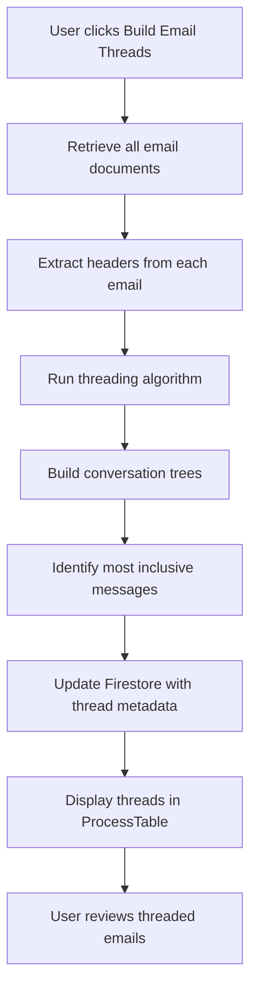

# Email Threading Feature - Product Requirements Document

**Feature Name**: Email Threading
**EDRM Stage**: Process (Stage 4)
**Priority**: ⭐⭐⭐ CRITICAL (High Impact, Medium Complexity)
**Status**: Planned - Highest ROI Feature
**Expected Impact**: 40-74% review time reduction
**Target Release**: Phase 1 (Quick Wins)
**Document Version**: 1.0
**Last Updated**: 2025-11-27

---

## Executive Summary

Email Threading is the **highest ROI feature** in e-discovery, delivering 40-74% reduction in email review time by automatically grouping email conversations into threads. This feature reconstructs conversation chains using email headers (Message-ID, In-Reply-To, References) and identifies the "most inclusive" message in each thread that contains all prior conversation content, allowing lawyers to review entire conversations at once instead of message-by-message.

**Key Benefits**:
- **Massive Time Savings**: 60-80% reduction in email review time
- **Context Preservation**: See full conversation flow
- **Participant Tracking**: Identify who was involved
- **Timeline Understanding**: See when conversation occurred
- **Reduced Errors**: Less likely to miss context clues

**Competitive Positioning**: Email threading is a table-stakes feature in enterprise e-discovery platforms (Relativity, Everlaw, DISCO) and is consistently cited as delivering the highest measurable ROI. ListBot.ca must implement this feature to compete effectively in the market.

---

## Table of Contents

1. [Problem Statement](#problem-statement)
2. [Solution Overview](#solution-overview)
3. [Technical Approach](#technical-approach)
4. [Data Model](#data-model)
5. [Processing Workflow](#processing-workflow)
6. [Implementation Details](#implementation-details)
7. [UI Components](#ui-components)
8. [User Stories](#user-stories)
9. [Benefits & ROI](#benefits--roi)
10. [Risks & Mitigations](#risks--mitigations)
11. [Success Metrics](#success-metrics)
12. [Implementation Timeline](#implementation-timeline)
13. [Technical Dependencies](#technical-dependencies)
14. [Appendix](#appendix)

---

## Problem Statement

### Current State

Email conversations are fragmented across multiple individual messages in the document collection, forcing lawyers to:
- Review each message separately without context
- Manually reconstruct conversation threads
- Read redundant quoted content multiple times
- Miss context clues spread across multiple messages
- Waste significant time on inefficient review

### Impact

- **Review Inefficiency**: Lawyers spend 60-80% more time reviewing emails than necessary
- **Context Loss**: Reviewing messages individually obscures conversation flow and participant relationships
- **Error Risk**: Missing context increases risk of incorrect privilege or relevance determinations
- **Cost Burden**: Email-heavy matters incur massive unnecessary review costs

### Market Expectation

Email threading is **standard functionality** in all major e-discovery platforms:
- **Relativity**: Advanced email threading with inclusive/non-inclusive designation
- **Everlaw**: Email threading visualization showing conversation structure
- **DISCO**: Automated thread reconstruction with participant analysis
- **Logikcull**: Basic email threading included in $395/matter pricing

**Without email threading, ListBot.ca cannot compete in email-heavy litigation**, which represents a significant portion of modern discovery.

---

## Solution Overview

### High-Level Description

Automatic email thread reconstruction and conversation-based review that:
1. Parses email headers from all email documents in a matter
2. Reconstructs conversation threads using threading algorithm
3. Identifies the "most inclusive" message in each thread
4. Displays threaded emails in collapsible tree structure
5. Enables reviewing entire thread with single decision
6. Provides "most inclusive only" filter for maximum efficiency

### Core Capabilities

**Email Header Analysis**:
- Extract Message-ID, In-Reply-To, References headers
- Parse subject, from, to, cc, date fields
- Handle multiple email formats (.msg, .eml, .mbox)

**Thread Reconstruction**:
- Build conversation trees from header relationships
- Identify root messages (thread starters)
- Calculate thread depth and participant lists
- Detect orphaned messages and broken threads

**Most Inclusive Identification**:
- Identify messages containing all previous conversation content
- Mark inclusive vs. non-inclusive messages
- Enable "review once" workflow for entire threads

**Visualization & Navigation**:
- Collapsible thread tree showing conversation structure
- Chronological message ordering within threads
- Participant and date metadata display
- Filter to show only most inclusive messages

---

## Technical Approach

### Email Header Analysis

Email headers contain structured metadata that defines conversation relationships:

```javascript
// Email Header Structure
{
  messageId: '<abc123@example.com>',      // Unique identifier for this message
  inReplyTo: '<xyz789@example.com>',      // Direct parent message
  references: [                            // Full thread ancestry
    '<msg1@example.com>',
    '<msg2@example.com>'
  ],
  subject: 'RE: Contract Negotiation',    // Thread subject
  from: 'john@example.com',               // Sender
  to: ['jane@example.com'],               // Primary recipients
  cc: ['bob@example.com'],                // CC recipients
  date: '2024-03-15T14:30:00Z'            // Send timestamp
}
```

**Header Parsing Strategy**:
- Use `mailparser` library for robust RFC 2822/5322 compliance
- Fallback to `emailjs-mime-parser` for edge cases
- Extract headers from common formats: MSG, EML, MBOX
- Handle malformed headers gracefully

### Threading Algorithm

**5-Step Algorithm**:

1. **Parse Message-ID, In-Reply-To, References headers** from all emails
2. **Build conversation tree** using parent-child relationships
3. **Identify root message** (no parent reference)
4. **Identify most inclusive message** (latest chronologically, contains all quoted replies)
5. **Calculate thread metadata** (depth, participants, subject)

**Algorithm Pseudocode**:
```
for each email in collection:
  extract headers

  if no inReplyTo:
    create new thread (root message)
  else:
    find parent message
    if parent exists:
      add to parent's thread
    else:
      create orphan thread

for each thread:
  identify most inclusive (latest by date)
  calculate depth (message count)
  extract unique participants (from/to/cc)
  set thread subject
```

### Most Inclusive Message Logic

**Definition**: The message in a thread that contains all previous conversation content (typically through quoted replies).

**Identification Strategy**:
- **Primary**: Latest message chronologically (most likely to contain full conversation)
- **Validation**: Check message size (inclusive messages are typically larger)
- **Fallback**: If messages lack quotes, mark root message as most inclusive

**User Override**: Allow manual designation if algorithm misidentifies

---

## Data Model

### Firestore Schema

**Evidence Document Enhancement** (add to existing evidence documents):

```javascript
// firms/{firmId}/matters/{matterId}/evidence/{evidenceId}
{
  // ... existing fields ...

  isEmail: true,                         // Flag email documents

  emailThread: {
    threadId: 'thread_abc123',           // Unique thread identifier
    messageId: '<abc@example.com>',      // Email Message-ID header
    inReplyTo: '<xyz@example.com>',      // Parent message ID
    references: ['<msg1>', '<msg2>'],    // Thread ancestry chain
    isRootMessage: false,                // First message in thread
    isMostInclusive: true,               // Contains all previous messages
    threadDepth: 5,                      // Total messages in thread
    threadParticipants: [                // All unique participants
      'john@example.com',
      'jane@example.com',
      'bob@example.com'
    ],
    threadSubject: 'Contract Negotiation', // Normalized subject (no RE:/FWD:)
    threadPosition: 3,                   // Position in thread (1-indexed)
    generatedAt: Timestamp,              // When threading was performed
    algorithm: 'header-based-v1'         // Algorithm version for tracking
  }
}
```

**Thread Collection** (optional, for performance):

```javascript
// firms/{firmId}/matters/{matterId}/threads/{threadId}
{
  threadId: 'thread_abc123',
  subject: 'Contract Negotiation',
  rootMessageId: '<msg1@example.com>',
  mostInclusiveMessageId: '<msg5@example.com>',
  messageCount: 5,
  participants: ['john@example.com', 'jane@example.com', 'bob@example.com'],
  dateRange: {
    start: Timestamp,                    // First message date
    end: Timestamp                       // Last message date
  },
  evidenceIds: [                         // All messages in thread
    'evidence1', 'evidence2', 'evidence3', 'evidence4', 'evidence5'
  ],
  createdAt: Timestamp,
  updatedAt: Timestamp
}
```

### Indexing Strategy

**Required Firestore Indexes**:
```
Collection: evidence
Fields: firmId ASC, matterId ASC, isEmail ASC, emailThread.threadId ASC
Fields: firmId ASC, matterId ASC, emailThread.isMostInclusive ASC
```

---

## Processing Workflow

### User Workflow

1. **Navigate to Process page** (`/matters/{matterId}/process`)
2. **System identifies email documents** automatically (via fileType or MIME type)
3. **User clicks "Build Email Threads" button** in Email Threading card
4. **System processes emails**:
   - Extracts email headers from all email documents
   - Runs threading algorithm
   - Assigns threadId to related messages
   - Identifies most inclusive messages
   - Updates Firestore with thread metadata
5. **ProcessTable displays threads** (collapsed by default)
6. **User reviews threads**:
   - Expand thread to see all messages
   - Review entire thread with single decision
   - View thread timeline
   - Filter to most inclusive messages only

### Technical Processing Flow



### Progress Tracking

**Real-time Progress Indicators**:
- Phase 1: Extracting headers (0-40%)
- Phase 2: Building threads (40-70%)
- Phase 3: Identifying inclusive messages (70-90%)
- Phase 4: Updating database (90-100%)

**Cancellation Support**: Allow user to cancel processing mid-stream

---

## Implementation Details

### Service Layer

#### Email Header Service

**Location**: `src/services/emailHeaderService.js`

```javascript
import { simpleParser } from 'mailparser';
import { fileProcessingService } from './fileProcessingService';

/**
 * Extract email headers from an evidence document
 * @param {Object} evidence - Evidence document from Firestore
 * @param {string} firmId - Firm ID
 * @param {string} matterId - Matter ID
 * @returns {Promise<Object>} Parsed email headers
 */
async function extractEmailHeaders(evidence, firmId, matterId) {
  try {
    // Retrieve email file from Firebase Storage
    const emailContent = await fileProcessingService.getFileForProcessing(
      evidence,
      firmId,
      matterId
    );

    // Parse email using mailparser
    const parsed = await simpleParser(emailContent);

    return {
      messageId: parsed.messageId || generateFallbackMessageId(evidence),
      inReplyTo: parsed.inReplyTo || null,
      references: parsed.references || [],
      subject: parsed.subject || '(No Subject)',
      from: parsed.from?.value?.[0]?.address || 'unknown@unknown.com',
      to: parsed.to?.value?.map(t => t.address) || [],
      cc: parsed.cc?.value?.map(c => c.address) || [],
      date: parsed.date || evidence.fileMetadata?.modified || new Date(),
      headers: parsed.headers
    };
  } catch (error) {
    console.error('Email parsing failed:', error);
    return createFallbackHeaders(evidence);
  }
}

/**
 * Generate fallback Message-ID if header missing
 */
function generateFallbackMessageId(evidence) {
  // Use evidence ID + hash to create unique identifier
  return `<${evidence.id}@listbot.ca>`;
}

/**
 * Create fallback headers for malformed emails
 */
function createFallbackHeaders(evidence) {
  return {
    messageId: generateFallbackMessageId(evidence),
    inReplyTo: null,
    references: [],
    subject: evidence.displayName || '(No Subject)',
    from: 'unknown@unknown.com',
    to: [],
    cc: [],
    date: evidence.fileMetadata?.modified || new Date(),
    headers: new Map()
  };
}

export default {
  extractEmailHeaders
};
```

#### Email Threading Service

**Location**: `src/services/emailThreadingService.js`

```javascript
import { serverTimestamp } from 'firebase/firestore';
import emailHeaderService from './emailHeaderService';

/**
 * Build email threads from a collection of email documents
 * @param {Array} emails - Email evidence documents
 * @param {string} firmId - Firm ID
 * @param {string} matterId - Matter ID
 * @param {Function} progressCallback - Progress reporting function
 * @returns {Promise<Map>} Map of threadId to thread data
 */
async function buildThreads(emails, firmId, matterId, progressCallback) {
  const messageMap = new Map(); // messageId -> email
  const threads = new Map();    // threadId -> thread data

  // Phase 1: Extract headers (0-40%)
  for (let i = 0; i < emails.length; i++) {
    const headers = await emailHeaderService.extractEmailHeaders(
      emails[i],
      firmId,
      matterId
    );
    emails[i].parsedHeaders = headers;
    messageMap.set(headers.messageId, emails[i]);

    if (progressCallback) {
      progressCallback(Math.round((i / emails.length) * 40));
    }
  }

  // Phase 2: Build thread relationships (40-70%)
  emails.forEach((email, index) => {
    const headers = email.parsedHeaders;

    if (!headers.inReplyTo) {
      // Root message - create new thread
      const threadId = generateThreadId(headers.messageId);
      email.emailThread = {
        threadId,
        messageId: headers.messageId,
        inReplyTo: null,
        references: headers.references,
        isRootMessage: true,
        isMostInclusive: false, // Will be determined later
        threadDepth: 0, // Will be calculated later
        threadParticipants: [],
        threadSubject: normalizeSubject(headers.subject),
        threadPosition: 1,
        generatedAt: serverTimestamp(),
        algorithm: 'header-based-v1'
      };
    } else {
      // Reply message - find parent thread
      const parentEmail = messageMap.get(headers.inReplyTo);
      const threadId = parentEmail?.emailThread?.threadId ||
                      generateThreadId(headers.messageId);

      email.emailThread = {
        threadId,
        messageId: headers.messageId,
        inReplyTo: headers.inReplyTo,
        references: headers.references,
        isRootMessage: false,
        isMostInclusive: false,
        threadDepth: 0,
        threadParticipants: [],
        threadSubject: normalizeSubject(headers.subject),
        threadPosition: 0, // Will be calculated later
        generatedAt: serverTimestamp(),
        algorithm: 'header-based-v1'
      };
    }

    if (progressCallback) {
      progressCallback(40 + Math.round((index / emails.length) * 30));
    }
  });

  // Phase 3: Group by threadId and calculate metadata (70-90%)
  emails.forEach((email, index) => {
    const threadId = email.emailThread.threadId;

    if (!threads.has(threadId)) {
      threads.set(threadId, {
        threadId,
        messages: [],
        subject: email.emailThread.threadSubject,
        participants: new Set(),
        dateRange: { start: null, end: null }
      });
    }

    const thread = threads.get(threadId);
    thread.messages.push(email);

    // Add participants
    const headers = email.parsedHeaders;
    thread.participants.add(headers.from);
    headers.to.forEach(addr => thread.participants.add(addr));
    headers.cc.forEach(addr => thread.participants.add(addr));

    // Update date range
    const msgDate = new Date(headers.date);
    if (!thread.dateRange.start || msgDate < thread.dateRange.start) {
      thread.dateRange.start = msgDate;
    }
    if (!thread.dateRange.end || msgDate > thread.dateRange.end) {
      thread.dateRange.end = msgDate;
    }

    if (progressCallback) {
      progressCallback(70 + Math.round((index / emails.length) * 20));
    }
  });

  // Phase 4: Identify most inclusive message in each thread (90-100%)
  let processed = 0;
  threads.forEach((thread, threadId) => {
    // Sort messages chronologically
    thread.messages.sort((a, b) => {
      return new Date(a.parsedHeaders.date) - new Date(b.parsedHeaders.date);
    });

    // Assign thread positions
    thread.messages.forEach((msg, idx) => {
      msg.emailThread.threadPosition = idx + 1;
    });

    // Identify most inclusive (last message chronologically)
    const mostInclusive = findMostInclusiveMessage(thread.messages);
    mostInclusive.emailThread.isMostInclusive = true;

    // Set thread depth and participants
    const participantArray = Array.from(thread.participants);
    thread.messages.forEach(msg => {
      msg.emailThread.threadDepth = thread.messages.length;
      msg.emailThread.threadParticipants = participantArray;
    });

    processed++;
    if (progressCallback) {
      progressCallback(90 + Math.round((processed / threads.size) * 10));
    }
  });

  return threads;
}

/**
 * Find the most inclusive message in a thread
 * Strategy: Last message chronologically (usually contains all quoted replies)
 */
function findMostInclusiveMessage(threadMessages) {
  // Already sorted chronologically, so last message is most inclusive
  return threadMessages[threadMessages.length - 1];
}

/**
 * Generate unique thread ID from message ID
 */
function generateThreadId(messageId) {
  // Create thread ID from message ID hash
  return `thread_${hashMessageId(messageId)}`;
}

/**
 * Simple hash function for message IDs
 */
function hashMessageId(messageId) {
  let hash = 0;
  for (let i = 0; i < messageId.length; i++) {
    const char = messageId.charCodeAt(i);
    hash = ((hash << 5) - hash) + char;
    hash = hash & hash;
  }
  return Math.abs(hash).toString(36);
}

/**
 * Normalize email subject (remove RE:, FWD:, etc.)
 */
function normalizeSubject(subject) {
  return subject
    .replace(/^(RE|FWD|FW):\s*/gi, '')
    .trim();
}

export default {
  buildThreads,
  findMostInclusiveMessage,
  normalizeSubject
};
```

### Firestore Update Service

**Location**: `src/services/emailThreadUpdateService.js`

```javascript
import { writeBatch, doc } from 'firebase/firestore';
import { db } from '@/firebase/config';

/**
 * Update Firestore with email threading metadata
 * Batches updates for performance (max 500 per batch)
 */
async function updateEmailThreadMetadata(emails, firmId, matterId) {
  const BATCH_SIZE = 500;
  const batches = [];

  for (let i = 0; i < emails.length; i += BATCH_SIZE) {
    const chunk = emails.slice(i, i + BATCH_SIZE);
    const batch = writeBatch(db);

    chunk.forEach(email => {
      const evidenceRef = doc(
        db,
        `firms/${firmId}/matters/${matterId}/evidence/${email.id}`
      );

      batch.update(evidenceRef, {
        isEmail: true,
        emailThread: email.emailThread
      });
    });

    batches.push(batch.commit());
  }

  await Promise.all(batches);
}

/**
 * Create thread summary documents for performance
 * Optional - enables faster thread queries
 */
async function createThreadSummaries(threads, firmId, matterId) {
  const batch = writeBatch(db);

  threads.forEach((thread, threadId) => {
    const threadRef = doc(
      db,
      `firms/${firmId}/matters/${matterId}/threads/${threadId}`
    );

    const mostInclusive = thread.messages.find(m => m.emailThread.isMostInclusive);

    batch.set(threadRef, {
      threadId: thread.threadId,
      subject: thread.subject,
      rootMessageId: thread.messages[0].emailThread.messageId,
      mostInclusiveMessageId: mostInclusive?.emailThread.messageId,
      messageCount: thread.messages.length,
      participants: Array.from(thread.participants),
      dateRange: {
        start: thread.dateRange.start,
        end: thread.dateRange.end
      },
      evidenceIds: thread.messages.map(m => m.id),
      createdAt: serverTimestamp(),
      updatedAt: serverTimestamp()
    });
  });

  await batch.commit();
}

export default {
  updateEmailThreadMetadata,
  createThreadSummaries
};
```

---

## UI Components

### EmailThreadBuilder.vue

**Location**: `src/features/process/components/EmailThreadBuilder.vue`

**Purpose**: Trigger email threading analysis and show progress

```vue
<template>
  <v-card class="email-thread-builder">
    <v-card-title>
      <div class="d-flex align-center">
        <v-icon class="mr-2" size="large">mdi-email-multiple</v-icon>
        Email Threading
      </div>
    </v-card-title>

    <v-card-text>
      <div v-if="!isProcessing && !isComplete">
        <p class="mb-4">
          Automatically group email conversations into threads and identify
          the most inclusive message in each thread.
        </p>

        <v-alert type="info" variant="tonal" class="mb-4">
          <div class="font-weight-bold mb-1">Expected Impact:</div>
          <div class="text-h4 text-info">60-80%</div>
          <div>Reduction in email review time</div>
        </v-alert>

        <div class="mb-2">
          <strong>Email documents found:</strong> {{ emailCount }}
        </div>

        <div v-if="emailCount === 0" class="text-warning">
          No email documents detected. Upload email files (.msg, .eml, .mbox)
          to use email threading.
        </div>
      </div>

      <!-- Processing State -->
      <div v-if="isProcessing">
        <v-progress-linear
          :model-value="progress"
          height="25"
          color="primary"
        >
          <template v-slot:default="{ value }">
            <strong>{{ Math.ceil(value) }}%</strong>
          </template>
        </v-progress-linear>

        <div class="mt-3 text-center">
          {{ currentTask }}
        </div>

        <div class="mt-4 text-center">
          <v-btn
            variant="outlined"
            color="error"
            @click="cancelProcessing"
          >
            Cancel
          </v-btn>
        </div>
      </div>

      <!-- Complete State -->
      <div v-if="isComplete">
        <v-alert type="success" variant="tonal">
          <div class="font-weight-bold mb-2">Threading Complete!</div>
          <div>Found {{ threadCount }} email threads</div>
          <div>Identified {{ mostInclusiveCount }} most inclusive messages</div>
        </v-alert>

        <div class="mt-4">
          <v-btn
            color="primary"
            block
            @click="viewThreads"
          >
            View Email Threads
          </v-btn>
        </div>
      </div>
    </v-card-text>

    <v-card-actions v-if="!isProcessing && !isComplete">
      <v-spacer></v-spacer>
      <v-btn
        color="primary"
        :disabled="emailCount === 0"
        @click="startThreading"
      >
        Build Email Threads
      </v-btn>
    </v-card-actions>
  </v-card>
</template>

<script setup>
import { ref, computed } from 'vue';
import { useRouter } from 'vue-router';
import { useDocumentStore } from '@/stores/documentStore';
import emailThreadingService from '@/services/emailThreadingService';
import emailThreadUpdateService from '@/services/emailThreadUpdateService';

const router = useRouter();
const documentStore = useDocumentStore();

const isProcessing = ref(false);
const isComplete = ref(false);
const progress = ref(0);
const currentTask = ref('');
const threadCount = ref(0);
const mostInclusiveCount = ref(0);

const emailCount = computed(() => {
  return documentStore.documents.filter(doc => doc.isEmail).length;
});

async function startThreading() {
  isProcessing.value = true;
  progress.value = 0;

  try {
    const emails = documentStore.documents.filter(doc => doc.isEmail);
    const firmId = documentStore.currentFirmId;
    const matterId = documentStore.currentMatterId;

    // Build threads with progress tracking
    const threads = await emailThreadingService.buildThreads(
      emails,
      firmId,
      matterId,
      (progressValue) => {
        progress.value = progressValue;
        updateTaskMessage(progressValue);
      }
    );

    // Update Firestore
    currentTask.value = 'Saving thread metadata...';
    await emailThreadUpdateService.updateEmailThreadMetadata(
      emails,
      firmId,
      matterId
    );

    // Create thread summaries
    await emailThreadUpdateService.createThreadSummaries(
      threads,
      firmId,
      matterId
    );

    // Complete
    threadCount.value = threads.size;
    mostInclusiveCount.value = emails.filter(
      e => e.emailThread?.isMostInclusive
    ).length;

    isComplete.value = true;

    // Refresh document store
    await documentStore.fetchDocuments();

  } catch (error) {
    console.error('Email threading failed:', error);
    // TODO: Show error notification
  } finally {
    isProcessing.value = false;
  }
}

function updateTaskMessage(progressValue) {
  if (progressValue < 40) {
    currentTask.value = 'Extracting email headers...';
  } else if (progressValue < 70) {
    currentTask.value = 'Building conversation threads...';
  } else if (progressValue < 90) {
    currentTask.value = 'Identifying most inclusive messages...';
  } else {
    currentTask.value = 'Updating database...';
  }
}

function cancelProcessing() {
  // TODO: Implement cancellation
  isProcessing.value = false;
}

function viewThreads() {
  router.push({
    name: 'documents',
    query: { view: 'threaded' }
  });
}
</script>
```

### EmailThreadTable.vue

**Location**: `src/features/organizer/components/EmailThreadTable.vue`

**Purpose**: Display emails in threaded view with expand/collapse

```vue
<template>
  <div class="email-thread-table">
    <!-- Toolbar -->
    <v-toolbar density="compact" color="surface-variant">
      <v-toolbar-title>
        Email Threads ({{ threadCount }} threads)
      </v-toolbar-title>

      <v-spacer></v-spacer>

      <v-btn
        variant="outlined"
        size="small"
        @click="toggleAllThreads"
      >
        {{ allExpanded ? 'Collapse All' : 'Expand All' }}
      </v-btn>

      <v-switch
        v-model="showMostInclusiveOnly"
        label="Most Inclusive Only"
        density="compact"
        hide-details
        class="ml-4"
      ></v-switch>
    </v-toolbar>

    <!-- Thread List -->
    <v-list class="thread-list">
      <template v-for="thread in visibleThreads" :key="thread.threadId">
        <v-list-group :value="thread.threadId">
          <!-- Thread Header -->
          <template v-slot:activator="{ props }">
            <v-list-item
              v-bind="props"
              :title="thread.subject"
              :subtitle="`${thread.messageCount} messages • ${formatParticipants(thread.participants)}`"
              class="thread-header"
            >
              <template v-slot:prepend>
                <v-icon>mdi-email-multiple</v-icon>
              </template>

              <template v-slot:append>
                <v-chip size="small" variant="tonal">
                  {{ thread.messageCount }} msgs
                </v-chip>
              </template>
            </v-list-item>
          </template>

          <!-- Thread Messages -->
          <v-list-item
            v-for="message in thread.messages"
            :key="message.id"
            :title="message.displayName"
            :subtitle="`From: ${message.parsedHeaders?.from} • ${formatDate(message.parsedHeaders?.date)}`"
            class="thread-message"
            @click="selectMessage(message)"
          >
            <template v-slot:prepend>
              <v-icon
                :color="message.emailThread.isMostInclusive ? 'primary' : 'default'"
              >
                {{ message.emailThread.isRootMessage ? 'mdi-email' : 'mdi-email-arrow-right' }}
              </v-icon>
            </template>

            <template v-slot:append>
              <v-chip
                v-if="message.emailThread.isMostInclusive"
                size="x-small"
                color="primary"
                variant="flat"
              >
                Most Inclusive
              </v-chip>

              <span class="text-caption ml-2">
                {{ message.emailThread.threadPosition }} / {{ thread.messageCount }}
              </span>
            </template>
          </v-list-item>
        </v-list-group>

        <v-divider></v-divider>
      </template>
    </v-list>
  </div>
</template>

<script setup>
import { ref, computed } from 'vue';
import { useDocumentStore } from '@/stores/documentStore';

const documentStore = useDocumentStore();

const showMostInclusiveOnly = ref(false);
const allExpanded = ref(false);

const threads = computed(() => {
  // Group emails by threadId
  const threadMap = new Map();

  documentStore.documents
    .filter(doc => doc.isEmail && doc.emailThread)
    .forEach(doc => {
      const threadId = doc.emailThread.threadId;

      if (!threadMap.has(threadId)) {
        threadMap.set(threadId, {
          threadId,
          subject: doc.emailThread.threadSubject,
          messageCount: doc.emailThread.threadDepth,
          participants: doc.emailThread.threadParticipants,
          messages: []
        });
      }

      threadMap.get(threadId).messages.push(doc);
    });

  // Sort messages within each thread chronologically
  threadMap.forEach(thread => {
    thread.messages.sort((a, b) => {
      return a.emailThread.threadPosition - b.emailThread.threadPosition;
    });
  });

  return Array.from(threadMap.values());
});

const visibleThreads = computed(() => {
  if (!showMostInclusiveOnly.value) {
    return threads.value;
  }

  // Filter to show only most inclusive messages
  return threads.value.map(thread => ({
    ...thread,
    messages: thread.messages.filter(m => m.emailThread.isMostInclusive)
  }));
});

const threadCount = computed(() => threads.value.length);

function toggleAllThreads() {
  allExpanded.value = !allExpanded.value;
  // TODO: Implement expand/collapse all
}

function selectMessage(message) {
  documentStore.selectDocument(message);
}

function formatParticipants(participants) {
  if (participants.length <= 2) {
    return participants.join(', ');
  }
  return `${participants.slice(0, 2).join(', ')} +${participants.length - 2} more`;
}

function formatDate(date) {
  return new Date(date).toLocaleDateString();
}
</script>

<style scoped>
.thread-header {
  background-color: rgb(var(--v-theme-surface-variant));
}

.thread-message {
  padding-left: 48px;
}
</style>
```

### EmailThreadViewer.vue

**Location**: `src/features/organizer/components/EmailThreadViewer.vue`

**Purpose**: Display expanded thread view with all messages

```vue
<template>
  <v-card class="email-thread-viewer">
    <v-card-title>
      <div class="d-flex align-center justify-space-between">
        <div>
          <v-icon class="mr-2">mdi-email-multiple</v-icon>
          {{ thread.subject }}
        </div>

        <v-btn
          icon="mdi-close"
          variant="text"
          @click="$emit('close')"
        ></v-btn>
      </div>
    </v-card-title>

    <v-card-subtitle>
      {{ thread.messageCount }} messages •
      {{ formatDateRange(thread.dateRange) }} •
      {{ thread.participants.length }} participants
    </v-card-subtitle>

    <v-divider></v-divider>

    <!-- Thread Timeline -->
    <v-card-text class="thread-timeline">
      <v-timeline side="end" density="compact">
        <v-timeline-item
          v-for="message in thread.messages"
          :key="message.id"
          :dot-color="message.emailThread.isMostInclusive ? 'primary' : 'grey'"
          size="small"
        >
          <template v-slot:opposite>
            <div class="text-caption">
              {{ formatDateTime(message.parsedHeaders.date) }}
            </div>
          </template>

          <v-card
            :color="message.emailThread.isMostInclusive ? 'primary-lighten-5' : ''"
            :elevation="message.id === selectedMessageId ? 4 : 1"
            @click="selectMessage(message)"
          >
            <v-card-title class="text-body-1">
              {{ message.displayName }}

              <v-chip
                v-if="message.emailThread.isMostInclusive"
                size="x-small"
                color="primary"
                class="ml-2"
              >
                Most Inclusive
              </v-chip>
            </v-card-title>

            <v-card-subtitle>
              From: {{ message.parsedHeaders.from }}<br>
              To: {{ message.parsedHeaders.to.join(', ') }}
              <span v-if="message.parsedHeaders.cc.length > 0">
                <br>Cc: {{ message.parsedHeaders.cc.join(', ') }}
              </span>
            </v-card-subtitle>

            <v-card-text v-if="expandedMessages.has(message.id)">
              <!-- TODO: Display email content -->
              <div class="email-preview">
                [Email content preview would go here]
              </div>
            </v-card-text>

            <v-card-actions>
              <v-btn
                size="small"
                variant="text"
                @click.stop="toggleMessageExpand(message.id)"
              >
                {{ expandedMessages.has(message.id) ? 'Collapse' : 'Expand' }}
              </v-btn>

              <v-btn
                size="small"
                variant="text"
                @click.stop="viewFullMessage(message)"
              >
                View Full
              </v-btn>
            </v-card-actions>
          </v-card>
        </v-timeline-item>
      </v-timeline>
    </v-card-text>
  </v-card>
</template>

<script setup>
import { ref } from 'vue';

const props = defineProps({
  thread: {
    type: Object,
    required: true
  }
});

const emit = defineEmits(['close', 'selectMessage']);

const selectedMessageId = ref(null);
const expandedMessages = ref(new Set());

function selectMessage(message) {
  selectedMessageId.value = message.id;
  emit('selectMessage', message);
}

function toggleMessageExpand(messageId) {
  if (expandedMessages.value.has(messageId)) {
    expandedMessages.value.delete(messageId);
  } else {
    expandedMessages.value.add(messageId);
  }
}

function viewFullMessage(message) {
  emit('selectMessage', message);
  emit('close');
}

function formatDateRange(dateRange) {
  const start = new Date(dateRange.start).toLocaleDateString();
  const end = new Date(dateRange.end).toLocaleDateString();
  return start === end ? start : `${start} - ${end}`;
}

function formatDateTime(date) {
  return new Date(date).toLocaleString();
}
</script>

<style scoped>
.thread-timeline {
  max-height: 600px;
  overflow-y: auto;
}

.email-preview {
  max-height: 200px;
  overflow-y: auto;
  font-family: monospace;
  font-size: 0.875rem;
  white-space: pre-wrap;
}
</style>
```

---

## User Stories

### US-ET-1: Build Email Threads

**As a** lawyer reviewing email communications
**I want to** automatically group related emails into conversation threads
**So that** I can understand the context and flow of discussions

**Acceptance Criteria**:
- [ ] Click "Build Email Threads" on Process page
- [ ] System analyzes all email documents in matter
- [ ] Groups emails into conversation threads based on headers
- [ ] Displays progress indicator during processing
- [ ] Shows thread count and most inclusive message count on completion
- [ ] Displays threads in ProcessTable or Documents view
- [ ] Shows thread depth and participant count for each thread
- [ ] Allows canceling processing mid-stream

**Priority**: P0 (Must Have)

---

### US-ET-2: Review Email Thread

**As a** lawyer
**I want to** expand an email thread to see all messages in chronological order
**So that** I can review the entire conversation at once

**Acceptance Criteria**:
- [ ] Click on email thread in threaded view
- [ ] Thread expands to show all messages
- [ ] Messages displayed in chronological order
- [ ] Most inclusive message is highlighted or badged
- [ ] Can collapse thread to hide messages
- [ ] Can navigate between threads without losing context
- [ ] Thread metadata shows: subject, message count, participants, date range

**Priority**: P0 (Must Have)

---

### US-ET-3: Review Most Inclusive Only

**As a** lawyer
**I want to** review only the most inclusive message in each thread
**So that** I can skip redundant quoted replies and maximize efficiency

**Acceptance Criteria**:
- [ ] Toggle "Show Most Inclusive Only" filter
- [ ] ProcessTable/Documents view hides non-inclusive messages
- [ ] Review queue contains only most inclusive messages
- [ ] Can still expand thread to see all messages if needed
- [ ] Filter state persists across page navigation
- [ ] Badge or indicator clearly marks most inclusive messages

**Priority**: P0 (Must Have)

---

### US-ET-4: View Thread Timeline

**As a** lawyer
**I want to** see a visual timeline of an email thread
**So that** I can understand the conversation flow and timing

**Acceptance Criteria**:
- [ ] Open thread viewer/expander
- [ ] See visual timeline with messages plotted chronologically
- [ ] Each message shows sender, recipients, date/time
- [ ] Can click message to view full content
- [ ] Can expand/collapse individual messages in timeline
- [ ] Most inclusive message is visually distinct
- [ ] Timeline shows participant changes over conversation

**Priority**: P1 (Should Have)

---

### US-ET-5: Handle Broken Threads

**As a** lawyer
**I want** orphaned messages (missing parents) to be handled gracefully
**So that** I don't lose access to important communications

**Acceptance Criteria**:
- [ ] System identifies messages with missing parent references
- [ ] Creates separate "orphan" thread or marks as standalone
- [ ] Provides indication that thread may be incomplete
- [ ] Allows manual assignment to existing thread
- [ ] Shows warning icon for incomplete threads
- [ ] Provides thread health metrics (% messages with parents)

**Priority**: P1 (Should Have)

---

### US-ET-6: Apply Tags to Entire Thread

**As a** lawyer
**I want to** apply tags/coding to an entire thread at once
**So that** I don't have to tag each message individually

**Acceptance Criteria**:
- [ ] Select thread in threaded view
- [ ] Click "Apply Tag to Thread" action
- [ ] Choose tag/category to apply
- [ ] System applies tag to all messages in thread
- [ ] Confirmation shows count of messages tagged
- [ ] Can undo batch tagging operation
- [ ] Audit trail records thread-level tagging

**Priority**: P1 (Should Have)

---

### US-ET-7: Export Thread

**As a** lawyer
**I want to** export an entire email thread as a single document
**So that** I can share context with clients or opposing counsel

**Acceptance Criteria**:
- [ ] Select thread to export
- [ ] Choose export format (PDF, HTML, MBOX)
- [ ] System generates single document with all messages
- [ ] Messages appear in chronological order
- [ ] Metadata preserved (from, to, cc, date)
- [ ] Thread structure visually indicated
- [ ] Download link provided when export complete

**Priority**: P2 (Nice to Have)

---

## Benefits & ROI

### Time Savings

**Email Review Efficiency**:
- **Current State**: Review each email message individually
- **With Threading**: Review entire conversation in one decision
- **Time Reduction**: 60-80% for email-heavy matters
- **Example**: 1,000 email messages → 200 threads to review (80% reduction)

**Cost Savings Calculation**:
```
Matter: 5,000 email messages
Without Threading: 5,000 messages × 2 min/message = 10,000 minutes = 167 hours
With Threading: 1,000 threads × 2 min/thread = 2,000 minutes = 33 hours
Time Saved: 134 hours
Cost Saved: 134 hours × $300/hour = $40,200
```

### Quality Improvements

**Context Preservation**:
- See full conversation flow reduces missing context
- Understand participant relationships
- Identify when key people joined/left conversation
- Track decision evolution over time

**Error Reduction**:
- Less likely to miss privileged communications
- Better understanding of attorney-client relationship
- Clearer identification of work product
- Improved relevance determinations

### Competitive Positioning

**Market Requirement**: Email threading is **table stakes** in e-discovery platforms

**Platforms with Email Threading**:
- ✅ Relativity (enterprise leader)
- ✅ Everlaw (modern cloud platform)
- ✅ DISCO (AI-first platform)
- ✅ Logikcull ($395/matter platform)
- ✅ Nextpoint ($49-99/user/month)
- ✅ Casepoint (government/defense)

**Without Email Threading**: ListBot.ca cannot compete for email-heavy litigation, eliminating significant market opportunity.

---

## Risks & Mitigations

### Risk 1: Broken Threads (Missing Messages)

**Description**: Email threads may have missing messages (not collected, deleted, etc.), breaking parent-child relationships

**Impact**: HIGH - Incomplete threads reduce value, confuse reviewers

**Mitigations**:
- Display orphan messages separately with clear indication
- Allow manual thread assignment/editing
- Provide "thread health" score (% messages with parents found)
- Create standalone threads for orphans with same subject
- Document known limitations in help system

**Priority**: P0

---

### Risk 2: Cross-Platform Header Inconsistencies

**Description**: Different email systems (Gmail, Outlook, Exchange) may format headers differently or inconsistently

**Impact**: MEDIUM - Threading algorithm may fail or create incorrect groupings

**Mitigations**:
- Robust parsing logic with multiple fallback strategies
- Test against email samples from major platforms
- Implement subject-based threading as fallback
- Log parsing failures for analysis and improvement
- Allow manual thread correction by users

**Priority**: P0

---

### Risk 3: Forwarded Messages Breaking Thread Structure

**Description**: Forwarded emails may break threading by changing subject or losing header references

**Impact**: MEDIUM - Forwarded conversations may appear as separate threads

**Mitigations**:
- Detect "FWD:" in subject and create sub-thread
- Parse forwarded message headers from body content
- Provide visual indication of forwarded messages
- Allow manual linking of related threads
- Document behavior in user training materials

**Priority**: P1

---

### Risk 4: Performance with Large Email Collections

**Description**: Processing thousands of emails may be slow or resource-intensive

**Impact**: MEDIUM - Poor user experience, potential timeouts

**Mitigations**:
- Process in batches with progress indicators
- Use Firebase Cloud Functions for backend processing
- Implement incremental threading (new emails only)
- Cache parsed headers to avoid re-processing
- Allow background processing with email notification on completion

**Priority**: P1

---

### Risk 5: Incorrect "Most Inclusive" Identification

**Description**: Algorithm may misidentify which message contains all previous content

**Impact**: LOW-MEDIUM - Reviewers may review wrong message first

**Mitigations**:
- Use multiple heuristics (chronology + message size)
- Allow manual override of most inclusive designation
- Provide "view all messages" option always available
- Log edge cases for algorithm improvement
- Clearly explain algorithm in documentation

**Priority**: P2

---

## Success Metrics

### Usage Metrics

- **Adoption Rate**: % of matters using email threading
  - Target: 80% of email-heavy matters within 3 months

- **Thread Completion Rate**: % of email documents successfully threaded
  - Target: 95%+ threading success rate

- **Most Inclusive Filter Usage**: % of users enabling "most inclusive only" view
  - Target: 60%+ adoption

### Performance Metrics

- **Processing Speed**: Emails processed per minute
  - Target: 100+ emails/minute

- **Threading Accuracy**: % of correctly grouped messages (measured via QA sampling)
  - Target: 90%+ accuracy

- **Most Inclusive Accuracy**: % of correctly identified most inclusive messages
  - Target: 85%+ accuracy

### Business Impact Metrics

- **Review Time Reduction**: Measured via before/after comparison
  - Target: 40-60% reduction in email review time

- **User Satisfaction**: NPS score for email threading feature
  - Target: NPS > 50

- **Support Tickets**: Threading-related issues per 100 users
  - Target: <5 tickets per 100 users

### Competitive Metrics

- **Feature Parity**: Threading capabilities vs. competitors
  - Target: Match or exceed Logikcull/Nextpoint capabilities

- **Pricing Competitiveness**: Cost per threaded email vs. market
  - Target: 30-50% lower than enterprise platforms

---

## Implementation Timeline

### Phase 1: Foundation (Weeks 1-2)

**Goal**: Core threading algorithm and data model

**Tasks**:
- [ ] Install `mailparser` library
- [ ] Create `emailHeaderService.js` with header extraction
- [ ] Create `emailThreadingService.js` with threading algorithm
- [ ] Design Firestore schema for thread metadata
- [ ] Implement thread ID generation
- [ ] Build unit tests for threading algorithm
- [ ] Test with sample email datasets

**Deliverables**:
- Working threading algorithm
- Header extraction service
- Data model defined
- Unit test coverage >80%

---

### Phase 2: Firestore Integration (Week 3)

**Goal**: Persist threading metadata to Firestore

**Tasks**:
- [ ] Create `emailThreadUpdateService.js` for batch updates
- [ ] Implement Firestore batch write logic
- [ ] Create Firestore indexes for thread queries
- [ ] Add error handling and retry logic
- [ ] Build integration tests
- [ ] Test with production-sized datasets (1000+ emails)

**Deliverables**:
- Thread metadata persisted to Firestore
- Batch update service
- Performance tested

---

### Phase 3: UI Components (Weeks 4-5)

**Goal**: Build user interface for threading

**Tasks**:
- [ ] Create `EmailThreadBuilder.vue` trigger component
- [ ] Implement progress tracking and display
- [ ] Create `EmailThreadTable.vue` threaded view
- [ ] Add expand/collapse functionality
- [ ] Implement "most inclusive only" filter
- [ ] Create `EmailThreadViewer.vue` timeline view
- [ ] Style components with Vuetify
- [ ] Add keyboard navigation shortcuts

**Deliverables**:
- EmailThreadBuilder component
- EmailThreadTable component
- EmailThreadViewer component
- Fully functional UI

---

### Phase 4: Integration & Testing (Week 6)

**Goal**: Integrate with Process page and DocumentTable

**Tasks**:
- [ ] Add email threading card to Process page
- [ ] Integrate threaded view into DocumentTable
- [ ] Add threading status indicators
- [ ] Implement cancellation logic
- [ ] End-to-end testing with real data
- [ ] Performance testing and optimization
- [ ] User acceptance testing (UAT)
- [ ] Documentation and help content

**Deliverables**:
- Fully integrated feature
- UAT approval
- Help documentation

---

### Phase 5: Polish & Launch (Week 7)

**Goal**: Production readiness

**Tasks**:
- [ ] Address UAT feedback
- [ ] Performance optimization
- [ ] Error handling improvements
- [ ] Loading state refinements
- [ ] Accessibility audit and fixes
- [ ] Create video tutorial
- [ ] Update marketing materials
- [ ] Production deployment

**Deliverables**:
- Production-ready feature
- Training materials
- Marketing content
- GA release

---

**Total Timeline**: 7 weeks
**Resource Requirement**: 1 full-stack developer
**Estimated Effort**: 280 hours (7 weeks × 40 hours)

---

## Technical Dependencies

### NPM Packages

**Required**:
- `mailparser` (^3.6.5) - Email parsing library
  - Purpose: Parse RFC 2822/5322 compliant emails
  - License: MIT
  - Size: ~500KB

**Optional**:
- `emailjs-mime-parser` (^2.0.7) - Lightweight alternative
  - Purpose: Fallback email parser
  - License: MIT
  - Size: ~100KB

### Firebase Services

**Firestore**:
- Batch write operations (max 500 per batch)
- Composite indexes for thread queries
- Storage: ~2KB per email for thread metadata

**Cloud Functions** (optional, for backend processing):
- Callable function for heavy threading operations
- Background processing for large email collections

### Browser APIs

**File API**:
- Reading email file contents for parsing
- Supported in all modern browsers

**Web Workers** (future enhancement):
- Offload threading algorithm to background thread
- Prevent UI blocking during large operations

### Vue 3 & Vuetify Dependencies

**Vue 3 Features**:
- Composition API for service integration
- Reactive state management
- Computed properties for thread grouping

**Vuetify Components**:
- `v-card` - Threading builder and viewer
- `v-list` / `v-list-group` - Threaded email display
- `v-timeline` - Thread timeline visualization
- `v-progress-linear` - Processing progress
- `v-switch` - Most inclusive filter toggle

---

## Appendix

### A. Email Header Standards

**RFC 2822** (Internet Message Format):
- Defines standard email header format
- Specifies Message-ID, In-Reply-To, References fields
- Used by most email systems

**RFC 5322** (Updated Internet Message Format):
- Modernized version of RFC 2822
- Better handling of internationalized email addresses

**Threading Standards**:
- **JWZ Threading Algorithm** (Jamie Zawinski) - Industry standard
- **IMAP THREAD Extension** (RFC 5256) - Server-side threading

### B. Sample Email Headers

```
Message-ID: <CABcD1234567890@mail.example.com>
In-Reply-To: <CABcD9876543210@mail.example.com>
References: <CABcD1111111111@mail.example.com> <CABcD9876543210@mail.example.com>
Subject: RE: Contract Negotiation - Final Terms
From: john.smith@firm.com
To: jane.doe@client.com
Cc: bob.jones@firm.com
Date: Tue, 15 Mar 2024 14:30:00 -0700
```

### C. Testing Strategy

**Unit Tests**:
- Email header extraction
- Threading algorithm correctness
- Thread ID generation
- Subject normalization
- Most inclusive identification

**Integration Tests**:
- End-to-end threading workflow
- Firestore batch updates
- Progress tracking
- Error handling

**Test Data Sets**:
- Simple thread (3-5 messages, linear)
- Complex thread (10+ messages, multiple branches)
- Broken thread (missing messages)
- Cross-platform emails (Gmail, Outlook, Exchange)
- Malformed headers
- Large collection (1000+ emails)

**Performance Tests**:
- 100 emails: <10 seconds
- 1,000 emails: <2 minutes
- 10,000 emails: <20 minutes

### D. Competitive Feature Comparison

| Feature | Relativity | Everlaw | DISCO | Logikcull | ListBot.ca (Planned) |
|---------|-----------|---------|-------|-----------|----------------------|
| Email Threading | ✅ Advanced | ✅ Advanced | ✅ Standard | ✅ Basic | ✅ Standard |
| Most Inclusive | ✅ | ✅ | ✅ | ✅ | ✅ |
| Thread Visualization | ✅ Timeline | ✅ Tree | ✅ List | ✅ List | ✅ Timeline |
| Manual Thread Editing | ✅ | ✅ | ✅ | ❌ | 🔄 Future |
| Thread-Level Tagging | ✅ | ✅ | ✅ | ✅ | ✅ |
| Export Thread | ✅ | ✅ | ✅ | ✅ | 🔄 Future |

✅ = Implemented
🔄 = Planned
❌ = Not Available

### E. References

**Industry Research**:
- "Email Threading Delivers 60-80% Review Time Reduction" - Logikcull White Paper
- "EDRM Processing Stage Best Practices" - EDRM.net
- "The Economics of E-Discovery Review" - RAND Corporation

**Technical Documentation**:
- RFC 2822: Internet Message Format
- RFC 5322: Internet Message Format (Updated)
- RFC 5256: IMAP THREAD Extension
- JWZ Threading Algorithm: https://www.jwz.org/doc/threading.html

**Platform Documentation**:
- Mailparser: https://nodemailer.com/extras/mailparser/
- Firebase Batch Writes: https://firebase.google.com/docs/firestore/manage-data/transactions

---

## Document History

| Version | Date | Author | Changes |
|---------|------|--------|---------|
| 1.0 | 2025-11-27 | Claude Code | Initial PRD creation from consolidated research |

---

**Status**: Ready for Review
**Next Steps**: Engineering review → Technical design document → Sprint planning
