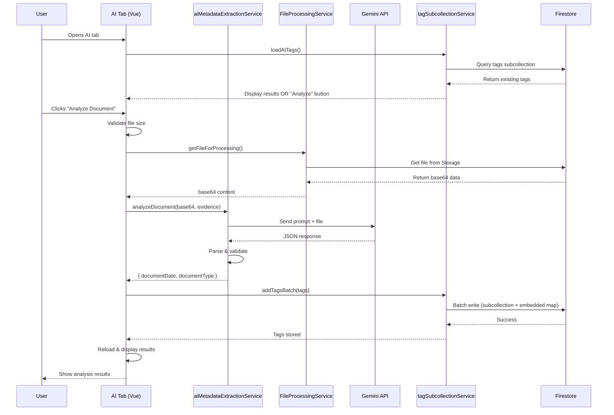

# AI Document Analysis: Document Date & Document Type Extraction

**Date**: 2025-11-07
**Status**: Planning
**Priority**: High
**Epic**: AI-Powered Metadata Extraction

---

## Overview

Implement AI-powered extraction of Document Date and Document Type metadata using Google Gemini via Firebase Vertex AI. This feature enables users to automatically analyze uploaded documents and extract critical metadata fields with confidence-based auto-approval.

---

## User Stories

### Story 1: Automatic Document Analysis
**As a** legal professional
**I want to** click a button to analyze a document and automatically extract its creation date and type
**So that** I don't have to manually review and enter this metadata for every document

**Acceptance Criteria**:
- AI tab displays an "Analyze Document" button in place of the value when no analysis has been performed
- The button occupies the same space where the analyzed value will eventually display
- Clicking the button triggers a single Gemini API call that analyzes both fields
- During analysis, a spinner replaces the button in the same location
- After analysis, the value and confidence badge replace the button/spinner
- Results persist across browser sessions

---

### Story 2: Intelligent Date Detection
**As a** litigation paralegal
**I want to** the AI to distinguish between the original document date and stamp dates
**So that** invoices with "Paid 2024-12-03" stamps are correctly dated to the invoice date, not the payment date

**Acceptance Criteria**:
- AI correctly identifies invoice date (not payment stamp date) on invoices
- AI correctly identifies letter date (not received/scanned date) on correspondence
- AI provides context explaining where the date was found in the document
- Date is stored in ISO 8601 format (YYYY-MM-DD)

---

### Story 3: Document Type Classification
**As a** document reviewer
**I want to** the AI to classify documents into predefined types (Email, Invoice, Letter, etc.)
**So that** I can quickly filter and organize documents by their type

**Acceptance Criteria**:
- AI classifies documents using the DocumentType system category list
- AI only suggests types from the predefined list (Email, Memo, Letter, Contract, Invoice, Report, etc.)
- AI provides reasoning for the classification
- Classification is stored in Firestore and visible in the DocumentTable

---

### Story 4: Confidence-Based Auto-Approval
**As a** case manager
**I want to** high-confidence AI suggestions to be automatically approved
**So that** I only need to review uncertain classifications

**Acceptance Criteria**:
- AI suggestions with e85% confidence are automatically approved (green badge)
- AI suggestions with <85% confidence require review (yellow badge)
- Confidence percentage is clearly displayed next to each field
- Auto-approved items are immediately usable in filtering/search
- Review-required items are flagged for manual review

---

### Story 5: Alternative Suggestions
**As a** document reviewer
**I want to** see alternative suggestions when the AI is uncertain
**So that** I can quickly select the correct value without typing it manually

**Acceptance Criteria**:
- When confidence <95%, up to 2 alternative suggestions are shown in the hover tooltip
- Each alternative displays its confidence percentage and reasoning in the tooltip
- Tooltip shows alternatives below the context information
- Clicking an alternative (future feature) approves it and marks the tag as human-reviewed
- Alternatives are stored in Firestore metadata for audit trail
- Main UI remains clean - alternatives only visible on hover

---

### Story 6: Error Handling and Recovery
**As a** user
**I want to** see clear error messages when analysis fails
**So that** I understand what went wrong and can retry or take alternative action

**Acceptance Criteria**:
- File size errors (>20MB) show clear message: "File too large for AI analysis (max 20MB)"
- Network errors show: "Analysis failed. Please check your connection and try again."
- API errors show: "AI service unavailable. Please try again later."
- All error states include a prominent "Retry" button
- Errors are logged for debugging but don't crash the application

---

### Story 7: Persistent Results
**As a** user
**I want to** see previously analyzed results immediately when opening the AI tab
**So that** I don't have to wait for re-analysis every time I view a document

**Acceptance Criteria**:
- Opening the AI tab loads existing tags from Firestore subcollection
- If tags exist, they display immediately (no "Analyze Document" button)
- Results include original AI confidence, approval status, and timestamp
- Re-analysis is only needed if user explicitly requests it (future feature)

---

## Architecture Decisions

### User Interaction Flow
- **Trigger**: Manual "Analyze Document" button in AI tab 
- **Error Handling**: Show error message with retry button 
- **API Strategy**: Single Gemini API call analyzing both fields together 
- **Confidence Threshold**: 85% for auto-approval (consistent with existing tags) 

### Technical Design
- **Service**: New `aiMetadataExtractionService.js` extends existing AI patterns
- **Storage**: Hybrid pattern (subcollection + embedded map) via `tagSubcollectionService`
- **Model**: Gemini 1.5 Flash via Firebase Vertex AI
- **File Access**: Leverage existing `FileProcessingService.getFileForProcessing()`
- **Security**: All queries scoped by `firmId` from auth store

---

## Implementation Plan

### Phase 1: Core AI Service (Highest Priority)
**File**: `src/services/aiMetadataExtractionService.js`

**Features**:
- Single Gemini API call for both Document Date and Document Type
- Context-aware prompting (distinguish original dates from stamps)
- Structured response parsing (value, confidence, reasoning, alternatives)
- Validation against DocumentType system category
- Error handling (network, API quota, file size)

**Gemini Prompt Strategy**:
```
Analyze this document and extract:

1. Document Date: The date the ORIGINAL document was created/signed
   - IGNORE: Payment stamps, received dates, scanned dates, file metadata dates
   - For invoices: Extract invoice date (NOT payment stamp dates like "Paid 2024-12-03")
   - For letters: Extract letter date (NOT received/scanned dates)
   - For contracts: Extract execution/signature date
   - Format: YYYY-MM-DD (ISO 8601)

2. Document Type: Classify from this list ONLY:
   [Email, Memo, Letter, Contract, Invoice, Report, Affidavit, Audio, Brochure,
    By-laws, Case law, Certificate, Chart, Change order, Cheque, Cheque stub,
    Chronology, Court document, Drawing, Envelope, Evidence log, Fax cover,
    Financial record, Form, Folder, Index, Listing, Medical record, Notes,
    Pay stub, Photo]

For each field, provide:
- value: The extracted value
- confidence: 0-100 percentage
- reasoning: Brief explanation of your determination
- context: Excerpt from document showing where you found this information
- alternatives: If confidence < 95%, suggest up to 2 alternatives with reasoning

Return as JSON.
```

**Expected Response Format**:
```json
{
  "documentDate": {
    "value": "2024-03-15",
    "confidence": 92,
    "reasoning": "Invoice date found in header",
    "context": "Found 'Invoice Date: March 15, 2024' in document header",
    "alternatives": [
      {
        "value": "2024-03-14",
        "confidence": 78,
        "reasoning": "Possible scan date found in footer"
      }
    ]
  },
  "documentType": {
    "value": "Invoice",
    "confidence": 98,
    "reasoning": "Document contains 'INVOICE' header, itemized charges, and total due",
    "context": "Header: 'INVOICE #12345', line items with prices, total amount",
    "alternatives": []
  }
}
```

---

### Phase 2: UI Components (AI Tab)
**File**: `src/components/document/DocumentMetadataPanel.vue`

**UI Design Philosophy**:
The "Analyze Document" button, analyzing spinner, and final value all occupy the **same screen location** - replacing each other as the state changes. This creates a clean, focused UX where the user's attention stays in one place.

**State Transitions**:
1. **Not Analyzed** → Show "Analyze Document" button where value will be
2. **Analyzing** → Replace button with spinner in same location
3. **Analyzed** → Replace spinner with value + confidence badge

**Visual Mockup**:
```
┌─ Document Date ─────────────────────────┐
│ Date: [🤖 Analyze Document]            │  ← State 1: Button
└─────────────────────────────────────────┘

┌─ Document Date ─────────────────────────┐
│ Date: ⟳ Analyzing...                   │  ← State 2: Spinner
└─────────────────────────────────────────┘

┌─ Document Date ─────────────────────────┐
│ Date: 2024-03-15  [92% ✓]             │  ← State 3: Value + Badge (hover for details)
└─────────────────────────────────────────┘
         │
         │ (on hover)
         ↓
    ┌─────────────────────────────────────┐
    │ Context:                            │
    │ Found 'Invoice Date: March 15,      │
    │ 2024' in document header            │
    │                                     │
    │ Alternatives:                       │
    │ • 2024-03-14 (78%)                 │
    │   Possible scan date in footer      │
    └─────────────────────────────────────┘
```

**Tooltip Behavior**:
- **Context** and **Alternatives** shown only on hover as a tooltip
- Tooltip appears when hovering over the value or confidence badge
- Keeps the main UI clean and focused on essential info (value + confidence)
- Details available on demand for users who want to understand the AI's reasoning

**Current State** (lines 244-278):
```vue
<div v-if="activeTab === 'document'">
  <!-- Placeholder content -->
  <div class="metadata-section">
    <h3 class="metadata-section-title">System Fields</h3>
    <div class="metadata-item">
      <span class="metadata-label">Document Date:</span>
      <span class="metadata-value metadata-placeholder">Not yet analyzed</span>
    </div>
    <!-- ... -->
  </div>
</div>
```

**New Design**:
```vue
<div v-if="activeTab === 'document'">
  <!-- Loading State (initial load of existing tags) -->
  <div v-if="loadingAITags" class="ai-loading">
    <v-progress-circular indeterminate size="24" />
    <span>Loading analysis results...</span>
  </div>

  <!-- System Fields Section -->
  <div v-else>
    <div class="metadata-section">
    <!-- Document Date Section -->
    <div class="metadata-section">
      <h3 class="metadata-section-title">Document Date</h3>

      <div class="ai-result">
        <div class="ai-result-value">
          {{ formatDate(aiTags.DocumentDate?.tagName) }}
        </div>

        <div class="ai-result-meta">
          <v-chip
            :color="aiTags.DocumentDate?.autoApproved ? 'success' : 'warning'"
            size="small"
            variant="flat"
          >
            {{ aiTags.DocumentDate?.confidence }}%
            {{ aiTags.DocumentDate?.autoApproved ? ' Auto-approved' : '� Review Required' }}
          </v-chip>
        </div>

        <div v-if="aiTags.DocumentDate?.metadata?.context" class="ai-context">
          <span class="ai-context-label">Context:</span>
          <span class="ai-context-text">{{ aiTags.DocumentDate.metadata.context }}</span>
        </div>

        <!-- Alternatives (if confidence < 95%) -->
        <div
          v-if="aiTags.DocumentDate?.metadata?.aiAlternatives?.length"
          class="ai-alternatives"
        >
          <span class="ai-alternatives-label">Alternative suggestions:</span>
          <div class="ai-alternatives-chips">
            <v-chip
              v-for="alt in aiTags.DocumentDate.metadata.aiAlternatives"
              :key="alt.value"
              size="small"
              variant="outlined"
              @click="approveAlternative('DocumentDate', alt)"
            >
              {{ formatDate(alt.value) }} ({{ alt.confidence }}%)
            </v-chip>
          </div>
        </div>
      </div>
    </div>

    <!-- Document Type Section -->
    <div class="metadata-section">
      <h3 class="metadata-section-title">Document Type</h3>

      <div class="ai-result">
        <div class="ai-result-value">
          {{ aiTags.DocumentType?.tagName }}
        </div>

        <div class="ai-result-meta">
          <v-chip
            :color="aiTags.DocumentType?.autoApproved ? 'success' : 'warning'"
            size="small"
            variant="flat"
          >
            {{ aiTags.DocumentType?.confidence }}%
            {{ aiTags.DocumentType?.autoApproved ? ' Auto-approved' : '� Review Required' }}
          </v-chip>
        </div>

        <div v-if="aiTags.DocumentType?.metadata?.context" class="ai-context">
          <span class="ai-context-label">Context:</span>
          <span class="ai-context-text">{{ aiTags.DocumentType.metadata.context }}</span>
        </div>

        <!-- Alternatives -->
        <div
          v-if="aiTags.DocumentType?.metadata?.aiAlternatives?.length"
          class="ai-alternatives"
        >
          <span class="ai-alternatives-label">Alternative suggestions:</span>
          <div class="ai-alternatives-chips">
            <v-chip
              v-for="alt in aiTags.DocumentType.metadata.aiAlternatives"
              :key="alt.value"
              size="small"
              variant="outlined"
              @click="approveAlternative('DocumentType', alt)"
            >
              {{ alt.value }} ({{ alt.confidence }}%)
            </v-chip>
          </div>
        </div>
      </div>
    </div>
  </div>
</div>
```

**New Script Additions**:
```javascript
import { ref, computed, watch } from 'vue';
import { useAuthStore } from '@/stores/auth';
import aiMetadataExtractionService from '@/services/aiMetadataExtractionService';
import { tagSubcollectionService } from '@/features/organizer/services/tagSubcollectionService';
import FileProcessingService from '@/features/organizer/services/FileProcessingService';

// New reactive state
const loadingAITags = ref(false);
const isAnalyzing = ref(false);
const analysisError = ref(null);
const aiTags = ref({});

// Computed
const hasAIAnalysis = computed(() => {
  return aiTags.value.DocumentDate || aiTags.value.DocumentType;
});

// Methods
const loadAITags = async () => {
  loadingAITags.value = true;
  try {
    const authStore = useAuthStore();
    const firmId = authStore.currentFirm;

    const tags = await tagSubcollectionService.getTags(
      props.fileHash,
      { categoryIds: ['DocumentDate', 'DocumentType'] },
      firmId
    );

    // Convert array to object keyed by categoryId
    aiTags.value = tags.reduce((acc, tag) => {
      acc[tag.categoryId] = tag;
      return acc;
    }, {});
  } catch (error) {
    console.error('Failed to load AI tags:', error);
  } finally {
    loadingAITags.value = false;
  }
};

const analyzeDocument = async () => {
  isAnalyzing.value = true;
  analysisError.value = null;

  try {
    const authStore = useAuthStore();
    const firmId = authStore.currentFirm;
    const matterId = 'general'; // TODO: Make dynamic

    // Validate file size
    const maxSizeMB = parseInt(import.meta.env.VITE_AI_MAX_FILE_SIZE_MB || '20');
    const maxSizeBytes = maxSizeMB * 1024 * 1024;

    if (props.evidence.fileSize > maxSizeBytes) {
      throw new Error(`File too large for AI analysis (max ${maxSizeMB}MB)`);
    }

    // Get file content
    const base64Data = await FileProcessingService.getFileForProcessing(
      props.evidence,
      firmId,
      matterId
    );

    // Extract file extension
    const extension = props.evidence.displayName?.split('.').pop()?.toLowerCase() || 'pdf';

    // Call AI service
    const result = await aiMetadataExtractionService.analyzeDocument(
      base64Data,
      props.evidence,
      extension
    );

    // Store results
    const tagsToStore = [];

    if (result.documentDate) {
      tagsToStore.push({
        categoryId: 'DocumentDate',
        categoryName: 'Document Date',
        tagName: result.documentDate.value,
        confidence: result.documentDate.confidence,
        source: 'ai',
        autoApproved: result.documentDate.confidence >= 85,
        reviewRequired: result.documentDate.confidence < 85,
        metadata: {
          model: 'gemini-1.5-flash',
          processingTime: result.processingTime,
          context: result.documentDate.context,
          aiAlternatives: result.documentDate.alternatives || [],
          reviewReason: result.documentDate.confidence < 85
            ? 'Confidence below threshold'
            : null
        }
      });
    }

    if (result.documentType) {
      tagsToStore.push({
        categoryId: 'DocumentType',
        categoryName: 'Document Type',
        tagName: result.documentType.value,
        confidence: result.documentType.confidence,
        source: 'ai',
        autoApproved: result.documentType.confidence >= 85,
        reviewRequired: result.documentType.confidence < 85,
        metadata: {
          model: 'gemini-1.5-flash',
          processingTime: result.processingTime,
          context: result.documentType.context,
          aiAlternatives: result.documentType.alternatives || [],
          reviewReason: result.documentType.confidence < 85
            ? 'Confidence below threshold'
            : null
        }
      });
    }

    // Store via service (atomic batch write)
    await tagSubcollectionService.addTagsBatch(
      props.fileHash,
      tagsToStore,
      firmId
    );

    // Reload tags
    await loadAITags();

  } catch (error) {
    console.error('AI analysis failed:', error);
    analysisError.value = error.message || 'Analysis failed. Please try again.';
  } finally {
    isAnalyzing.value = false;
  }
};

const retryAnalysis = () => {
  analysisError.value = null;
  analyzeDocument();
};

const approveAlternative = async (categoryId, alternative) => {
  // TODO: Implement alternative approval
  // Update tag with new value, mark as human-reviewed
  console.log('Approve alternative:', categoryId, alternative);
};

const formatDate = (dateString) => {
  if (!dateString) return 'Unknown';
  // Format based on user preferences (props.dateFormat)
  const date = new Date(dateString);
  return date.toLocaleDateString();
};

// Watch for tab changes - load tags when AI tab is opened
watch(() => props.activeTab, (newTab) => {
  if (newTab === 'document') {
    loadAITags();
  }
});
```

**New Styles**:
```css
/* AI Tab States */
.ai-loading,
.ai-analyzing,
.ai-error,
.ai-prompt {
  display: flex;
  flex-direction: column;
  align-items: center;
  justify-content: center;
  padding: 40px 20px;
  text-align: center;
}

.ai-analyzing {
  gap: 16px;
}

.ai-analyzing-detail {
  font-size: 0.875rem;
  color: #666;
  margin: 0;
}

.ai-error {
  gap: 12px;
}

.ai-error h4 {
  color: #dc3545;
  margin: 8px 0;
}

.ai-error p {
  color: #666;
  margin: 0 0 16px 0;
}

.ai-prompt {
  gap: 16px;
}

.ai-prompt p {
  color: #666;
  margin: 0;
}

/* AI Results */
.ai-result {
  display: flex;
  flex-direction: column;
  gap: 12px;
}

.ai-result-value {
  font-size: 1.1rem;
  font-weight: 600;
  color: #333;
}

.ai-result-meta {
  display: flex;
  align-items: center;
  gap: 8px;
}

.ai-context {
  padding: 12px;
  background-color: #f8f9fa;
  border-left: 3px solid #1976d2;
  border-radius: 4px;
  font-size: 0.85rem;
}

.ai-context-label {
  font-weight: 600;
  color: #666;
  margin-right: 8px;
}

.ai-context-text {
  color: #333;
  font-style: italic;
}

.ai-alternatives {
  display: flex;
  flex-direction: column;
  gap: 8px;
  padding-top: 8px;
  border-top: 1px solid #e0e0e0;
}

.ai-alternatives-label {
  font-size: 0.75rem;
  font-weight: 600;
  color: #666;
  text-transform: uppercase;
}

.ai-alternatives-chips {
  display: flex;
  flex-wrap: wrap;
  gap: 6px;
}

.ai-alternatives-chips .v-chip {
  cursor: pointer;
}

.ai-alternatives-chips .v-chip:hover {
  background-color: #e3f2fd !important;
}
```

---

### Phase 3: Integration with Existing Services

**Leverage Existing Infrastructure**:
1.  `FileProcessingService.getFileForProcessing()` - Get base64 file content
2.  `tagSubcollectionService.addTagsBatch()` - Atomic batch write (subcollection + embedded map)
3.  `AIProcessingService` patterns - Firebase Vertex AI initialization
4.  `/systemcategories/DocumentDate` - Date field definition
5.  `/systemcategories/DocumentType` - Type classification list

**New Service Only**:
- `aiMetadataExtractionService.js` - Specialized prompting and parsing for date/type extraction

---

### Phase 4: Data Flow



---

## Success Criteria

### Functional Requirements
-  **UC1**: User can click "Analyze Document" button in AI tab
-  **UC2**: Single Gemini API call extracts both Document Date and Type
-  **UC3**: Results display within 5 seconds for typical PDFs
-  **UC4**: Document Date correctly identifies original document date (ignores stamps)
-  **UC5**: Document Type classifies using predefined system category list
-  **UC6**: Confidence e85% auto-approves tags (green badge)
-  **UC7**: Confidence <85% marks tags as review-required (yellow badge)
-  **UC8**: Confidence <95% displays alternative suggestions
-  **UC9**: Results persist in Firestore (hybrid storage pattern)
-  **UC10**: Reopening AI tab shows existing results (no re-analysis)

### Technical Requirements
-  **TR1**: Uses `aiMetadataExtractionService.js` for AI processing
-  **TR2**: Uses `tagSubcollectionService.addTagsBatch()` for atomic storage
-  **TR3**: Stores tags in subcollection AND embedded map (hybrid pattern)
-  **TR4**: All queries scoped by `firmId` for security
-  **TR5**: Files accessed via `FileProcessingService.getFileForProcessing()`
-  **TR6**: Gemini 1.5 Flash via Firebase Vertex AI
-  **TR7**: File size validated (20MB max)
-  **TR8**: Dates stored in ISO 8601 format (YYYY-MM-DD)
-  **TR9**: Types validated against DocumentType system category
-  **TR10**: Error handling with retry functionality

### Error Handling
-  **EH1**: File >20MB shows clear error message
-  **EH2**: Network errors display with retry button
-  **EH3**: API quota errors inform user gracefully
-  **EH4**: Parse errors logged and generic message shown
-  **EH5**: Errors never crash the application

### Performance
-  **P1**: Analysis completes in <5 seconds for typical PDFs
-  **P2**: Loading existing tags displays instantly (<500ms)
-  **P3**: UI remains responsive during analysis (no blocking)
-  **P4**: Single API call (not separate calls per field)

### User Experience
-  **UX1**: Clear loading states during analysis
-  **UX2**: Confidence percentages clearly displayed
-  **UX3**: Auto-approved vs review-required visually distinct
- ✅ **UX4**: Context and alternatives shown only on hover (clean main UI)
- ✅ **UX5**: Tooltip provides AI reasoning and alternative suggestions on demand
- ✅ **UX6**: Alternative suggestions easy to understand in tooltip
- ✅ **UX7**: Error messages user-friendly (not technical jargon)
- ✅ **UX8**: Value, button, and spinner occupy same location (no layout shift)

---

## Testing Plan

### Unit Tests
- [ ] `aiMetadataExtractionService.analyzeDocument()` - Gemini API call
- [ ] `aiMetadataExtractionService` - Response parsing
- [ ] `aiMetadataExtractionService` - Error handling (network, quota, parse)
- [ ] `aiMetadataExtractionService` - Confidence threshold logic
- [ ] `aiMetadataExtractionService` - Alternative generation logic

### Integration Tests
- [ ] AI tab loads existing tags from Firestore
- [ ] "Analyze Document" button triggers full workflow
- [ ] Results stored in both subcollection and embedded map
- [ ] Tag counters updated atomically
- [ ] Retry functionality works after errors

### Manual Test Cases

#### TC1: Invoice with Payment Stamp
**File**: Invoice dated 2024-03-15 with "Paid 2024-12-03" stamp
**Expected**:
- Document Date: 2024-03-15 (invoice date, NOT stamp date)
- Document Type: Invoice
- Context explains: "Found 'Invoice Date: March 15, 2024' in header"

#### TC2: Letter with Multiple Dates
**File**: Letter dated 2024-05-20, received stamp 2024-05-25
**Expected**:
- Document Date: 2024-05-20 (letter date)
- Document Type: Letter
- Ignores received stamp

#### TC3: High Confidence (e85%)
**File**: Clear invoice with obvious date/type
**Expected**:
- Green badge: " Auto-approved"
- Both fields confidence e85%
- No alternatives shown

#### TC4: Low Confidence (<85%)
**File**: Blurry or ambiguous document
**Expected**:
- Yellow badge: "� Review Required"
- Alternatives displayed (if <95%)
- Clear reasoning for uncertainty

#### TC5: File Too Large
**File**: 25MB PDF
**Expected**:
- Error message: "File too large for AI analysis (max 20MB)"
- Retry button visible
- No API call made

#### TC6: Network Error
**Setup**: Disconnect network during analysis
**Expected**:
- Error message: "Analysis failed. Please check your connection and try again."
- Retry button visible
- Error logged to console

#### TC7: Persistence
**Steps**: Analyze document, close tab, reopen AI tab
**Expected**:
- Results display immediately (no re-analysis)
- Same confidence, values, timestamps

#### TC8: Team Scoping
**Setup**: Two users with different firmIds
**Expected**:
- User A cannot see User B's analysis results
- All queries scoped by firmId

---

## Files to Create/Modify

### New Files
1. **`src/services/aiMetadataExtractionService.js`**
   - Core AI service for date/type extraction
   - Gemini API integration
   - Response parsing and validation
   - Error handling

### Modified Files
1. **`src/components/document/DocumentMetadataPanel.vue`**
   - Replace AI tab placeholder content (lines 244-278)
   - Add reactive state (loadingAITags, isAnalyzing, analysisError, aiTags)
   - Add methods (loadAITags, analyzeDocument, retryAnalysis, approveAlternative)
   - Add styles for AI states and results
   - Add imports for new services

2. **`src/services/firebase.js`** (if needed)
   - Ensure Firebase Vertex AI initialized
   - Export `firebaseAI` for service usage

### Leveraged (No Changes)
-  `src/features/organizer/services/aiProcessingService.js`
-  `src/features/organizer/services/tagSubcollectionService.js`
-  `src/features/organizer/services/FileProcessingService.js`
-  Firestore collections: `/systemcategories/DocumentType`, `/systemcategories/DocumentDate`

---

## Dependencies

### External APIs
- **Google Gemini 1.5 Flash** via Firebase Vertex AI
- Requires: `VITE_FIREBASE_PROJECT_ID` in `.env`

### Environment Variables
```env
VITE_ENABLE_AI_FEATURES=true
VITE_AI_MAX_FILE_SIZE_MB=20
VITE_FIREBASE_PROJECT_ID=your-project-id
```

### Firebase Services
- Firebase Storage (file access)
- Firestore (tag storage)
- Firebase Vertex AI (Gemini API)

---

## Security Considerations

1. **Team Isolation**: All queries MUST be scoped by `firmId`
2. **File Access**: Only authenticated users can access files in their firm
3. **API Keys**: Firebase Vertex AI uses project-scoped authentication (no exposed keys)
4. **Input Validation**: File size limits prevent DoS
5. **Data Privacy**: AI analysis results stored in user's Firestore (not sent to third parties)

---

## Future Enhancements (Out of Scope)

- [ ] Re-analyze document functionality
- [ ] Batch analysis (multiple documents)
- [ ] Custom prompts per document type
- [ ] OCR for scanned documents
- [ ] Multi-language support
- [ ] Firm-level custom document types
- [ ] Advanced review workflow (approve/reject with comments)
- [ ] Analysis history/audit trail
- [ ] Export analysis results

---

## References

- **Architecture Documentation**: `@docs/architecture/file-lifecycle.md`
- **AI Requirements**: `@docs/ai/ai-metadata-extraction-requirements.md`
- **Authentication**: `@docs/architecture/authentication.md`
- **Existing AI Service**: `src/features/organizer/services/aiProcessingService.js`
- **Tag Service**: `src/features/organizer/services/tagSubcollectionService.js`

---

## Notes

### Terminology Compliance
-  **Original**: Real-world document (physical/digital source)
-  **Source**: User's file before upload
-  **Upload**: File in Firebase Storage (`../uploads/` folder)
-  **Document**: General term for evidence
-  **Document Date**: Business transaction date (NOT file creation/upload date)

### Design Decisions
- **Single API call**: More efficient, provides better context for AI
- **85% threshold**: Consistent with existing tag auto-approval
- **Manual trigger**: Gives users control, avoids unexpected API costs
- **Hybrid storage**: Optimizes both table performance and detail views
- **Retry on error**: Better UX than silent failure

### Known Limitations
- Only supports files d20MB
- Requires network connection
- Limited to DocumentType predefined list
- English language only (initially)
- PDF files prioritized (other formats less tested)
