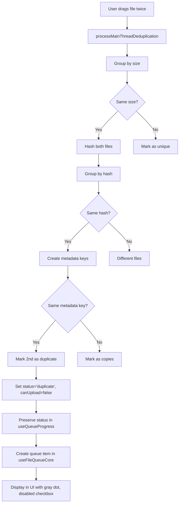

# Duplicate Detection Bug - Debug Session

**Created:** 2025-11-13
**Branch:** `claude/debug-duplicate-detection-bug-011CV56o6M2ZJChPcHVFTZdP`
**Status:** ✅ **RESOLVED**
**Priority:** 🚨 CRITICAL BUG

---

## 🎯 RESOLUTION SUMMARY

**ROOT CAUSE FOUND:** The new upload table (`/testing` → `useUploadTable.js`) completely bypassed all deduplication logic!

**Why Previous Fixes Didn't Work:**
- Commits 1da2f26 and b41e6f5 fixed the OLD upload system (`/upload`)
- The OLD system didn't allow adding files when queue wasn't empty
- Therefore, the "drag same file twice" scenario was NEVER tested
- The NEW system allows adding files anytime but had NO deduplication

**The Fix (Commit: 65fd819):**
- Implemented `deduplicateAgainstExisting()` in `useUploadTable.js`
- Added Phase 1.5: Deduplication check after initial render
- Checks new files against existing queue items + themselves
- Marks one-and-the-same files as `status='same'`, `canUpload=false`

**Terminology Change (Commit: bce2d7f):**
- Changed status from 'duplicate' to **'same'** for client-side detection
- **'same'** = One-and-the-same file (already in current queue) - CLIENT-SIDE
- **'duplicate'** = File already exists in Firebase Storage - SERVER-SIDE (Phase 3b)
- Visual: 'same' shows gray dot, 'duplicate' shows orange dot

**Additional Fixes:**
- Commit ec14b2b: Fixed `isDuplicate` flag to recognize 'same'/'duplicate' status
- Commit 4ac2e33: Added comprehensive debug logging

**Status:** ✅ Deduplication fully implemented in new upload system
**Ready for Testing:** Yes - test by dragging same file twice on `/testing` page

---

## Problem Summary

**Bug:** When dragging and dropping the same file twice, both files appear with status "Ready" (blue dot) instead of the second instance being marked as "Duplicate" (gray dot) with a disabled checkbox.

**Expected Behavior:**
- First instance: Status = "Ready" (🔵 blue dot), checkbox enabled
- Second instance: Status = "Same" (⚪ gray dot), checkbox disabled

**Current Buggy Behavior:**
- First instance: Status = "Ready" (🔵 blue dot), checkbox enabled
- Second instance: Status = "Ready" (🔵 blue dot), checkbox enabled ❌

---

## Previous Attempts (Did Not Fix Bug)

### Attempt 1: Fix useQueueCore.js (Commit: 1da2f26)
- Added logic to mark duplicates with `status='duplicate'` and `canUpload=false`
- Lines 250-254 in useQueueCore.js
- **Result:** Bug persisted

### Attempt 2: Fix useQueueProgress.js (Commit: b41e6f5)
- Fixed status preservation to not overwrite 'duplicate' to 'ready'
- Line 42 in useQueueProgress.js
- **Result:** Bug persisted

---

## Current Debugging Session (Commit: 4ac2e33)

### Changes Made

Added comprehensive debug logging to trace duplicate status through the entire flow:

#### 1. useQueueCore.js - Deduplication Logic
**Added logging at:**
- Line 220: Hash groups count
- Line 223-227: Each hash group processing (hash, file count, file names)
- Line 240-244: Metadata key creation for each file
- Line 254-259: One-and-the-same group detection
- Line 266-270: Individual duplicate marking
- Line 321-324: Final results summary

**What to look for:**
- Are both files in the same hash group?
- Do both files generate the same metadata key?
- Does the duplicate marking code execute?
- What status do files have in final results?

#### 2. useQueueProgress.js - Status Preservation
**Added logging at:**
- Line 37-44: All files before queue preparation
- Line 59-65: Each file during mapping (original vs result)
- Line 74-81: All files after queue preparation

**What to look for:**
- Do files have 'duplicate' status before mapping?
- Is the status being preserved correctly?
- What status do files have after mapping?

#### 3. useFileQueueCore.js - Queue Item Creation
**Added logging at:**
- Line 89-96: File chunk input
- Line 113-118: Each queue item creation
- Line 128-135: Final queue items

**What to look for:**
- Does the fileRef have 'duplicate' status?
- Is canUpload being preserved?
- What status does the final queue item have?

**IMPORTANT FIX:** Also added missing `canUpload` preservation on line 110!

---

## Testing Instructions

### How to Test

1. **Start the dev server:**
   ```bash
   npm run dev
   ```

2. **Open browser console** (F12 or Right-click > Inspect > Console)

3. **Navigate to the upload page** (`/upload` or `/testing`)

4. **Drag and drop the same file twice**
   - Use a small file (e.g., test.txt or test.pdf)
   - Drag it into the upload area
   - Drag the SAME file again (from the same location)

5. **Check the console output** - Look for these logging prefixes:
   - `[DEDUP]` - Hash group processing
   - `[DEDUP-HASH]` - Individual hash group
   - `[DEDUP-METADATA]` - Metadata key creation
   - `[DEDUP-GROUPS]` - Metadata group processing
   - `[DEDUP-MARK]` - Duplicate marking
   - `[DEDUP-RESULT]` - Final results
   - `[PROGRESS]` - Queue preparation
   - `[PROGRESS-MAP]` - Individual file mapping
   - `[QUEUE-CHUNK]` - File chunk processing
   - `[QUEUE-ITEM]` - Queue item creation

### What to Share

**Please copy the entire console output** and share it. Specifically look for:

1. **Hash Group Info:**
   ```
   [DEDUP] Processing hash groups: X groups
   [DEDUP-HASH] Processing hash group: { hash: "...", fileCount: 2, files: [...] }
   ```
   - Are both files in the same hash group?

2. **Metadata Keys:**
   ```
   [DEDUP-METADATA] Creating metadata key for: { fileName: "...", metadataKey: "...", metadata: {...} }
   ```
   - Are both files generating the same metadata key?

3. **Duplicate Marking:**
   ```
   [DEDUP-MARK] Found one-and-the-same files: { count: 2, chosenFile: "...", duplicates: [...] }
   [DEDUP-MARK] Marking as duplicate: { fileName: "...", status: "duplicate", canUpload: false }
   ```
   - Does this log appear?
   - Is the duplicate being marked?

4. **Final Results:**
   ```
   [DEDUP-RESULT] Final results: { totalFiles: 2, statuses: [...] }
   ```
   - What statuses are shown?

5. **Status Preservation:**
   ```
   [PROGRESS-MAP] Processing file for queue: { fileName: "...", originalStatus: "duplicate", resultStatus: "duplicate" }
   ```
   - Is the status being preserved or changed?

6. **Queue Items:**
   ```
   [QUEUE-ITEM] Created queue item: { fileName: "...", status: "duplicate", canUpload: false }
   ```
   - What status and canUpload values are shown?

---

## Potential Root Causes to Investigate

Based on the code flow, here are the potential issues:

### Issue 1: Metadata Key Mismatch
**Hypothesis:** The `lastModified` timestamp might be different for the same file dragged twice.

**How to check:** Look at the `[DEDUP-METADATA]` logs and compare the metadata keys.

**Metadata key format:**
```javascript
`${sourceFileName}_${sourceFileSize}_${lastModified}`
```

**If this is the issue:**
- Both files would have the same hash
- But different metadata keys
- They would be treated as "copies" not "duplicates"

### Issue 2: Hashing Not Running
**Hypothesis:** Files might not be getting hashed if they're added in separate batches.

**How to check:** Look for `[DEDUP-HASH]` logs when the second file is added.

**If this is the issue:**
- The second file wouldn't go through deduplication
- It would skip directly to "ready" status

### Issue 3: Status Being Overwritten Elsewhere
**Hypothesis:** There might be another place in the code that's setting status to 'ready'.

**How to check:** If the logs show `status: "duplicate"` but the UI shows "Ready", there's another place overwriting it.

**If this is the issue:**
- Need to search for other places that set `file.status` or `queueItem.status`

### Issue 4: Batching/Timing Issue
**Hypothesis:** Files added separately might not be deduplicated against each other.

**How to check:** Try dragging both files together (multi-select) vs. one at a time.

**If this is the issue:**
- Need to implement deduplication across existing queue items
- Current implementation might only deduplicate within a single batch

---

## Key Files Modified

| File | Lines Modified | Purpose |
|------|----------------|---------|
| `src/features/upload/composables/useQueueCore.js` | 220, 223-227, 240-244, 254-259, 266-270, 321-324 | Hash group and duplicate detection logging |
| `src/features/upload/composables/useQueueProgress.js` | 37-44, 59-65, 74-81 | Status preservation logging |
| `src/features/upload/composables/useFileQueueCore.js` | 89-96, 110, 113-118, 128-135 | Queue item creation logging + canUpload fix |

---

## Deduplication Flow (Expected)



---

## Next Steps

1. ✅ **Add debug logging** (Completed - Commit 4ac2e33)
2. 🔄 **Test and collect console output** (Waiting for test results)
3. ⏳ **Analyze logs to identify root cause**
4. ⏳ **Implement fix based on findings**
5. ⏳ **Remove debug logging**
6. ⏳ **Final testing and verification**
7. ⏳ **Push to branch and create PR**

---

## Additional Context

### Related Files
- `src/features/upload/components/StatusCell.vue` - Defines 'duplicate' status (gray dot)
- `src/features/upload/components/UploadTableRow.vue` - Checkbox disable logic (line 22)
- `docs/architecture/file-lifecycle.md` - Terminology definitions

### Terminology
- **"Duplicate"** = One-and-the-same file (same hash, same metadata, same location)
- **"Copy"** = Files with same hash but different metadata (name/date/path)
- **"Best file"** = The copy chosen for upload (earliest date → longest path → shortest name)

---

**Last Updated:** 2025-11-13
**Current Commit:** 4ac2e33
**Status:** Awaiting test results
