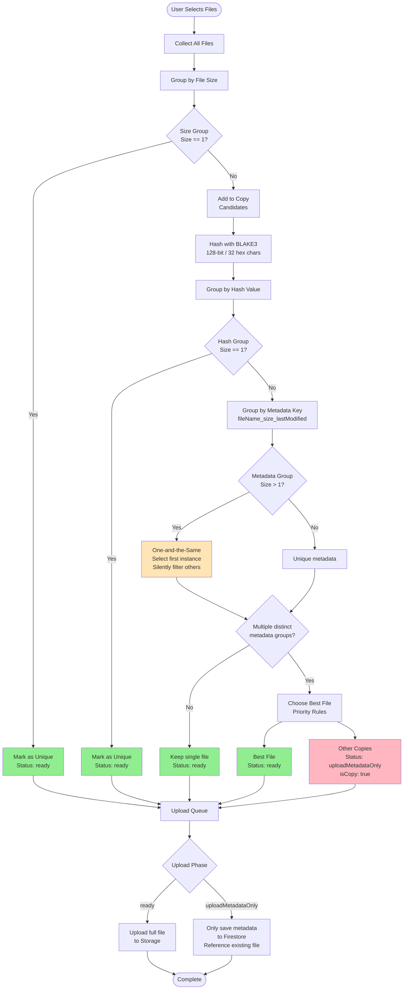
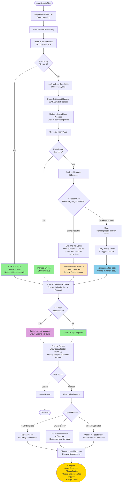

# Client-Side Deduplication Analysis
## Note:  This document is an analysis of two possible deduplication algorithims.  If you are looking for information on the algorithim that was decided on, look elsewhere.

## Terminology

This document uses precise terminology for file deduplication:

- **duplicate** or **duplicates**: Files with the same hash value AND same modified date
- **copy** or **copies**: Files with the same hash value but different file metadata
- **file metadata**: Filesystem metadata (name, size, modified date, path) that does not affect hash value
- **one-and-the-same**: The exact same file (same hash, same metadata, same folder location)


## Current Implementation (Old Upload Page)

### Overview
The old upload page at `/upload` implements a sophisticated client-side deduplication strategy that distinguishes between:
1. **Unique files** - Files with no duplicates
2. **One-and-the-same files** - The exact same file selected multiple times (silently filtered)
3. **Copies** - Files with same hash but different file metadata (marked, only one uploaded)

### Current Workflow - Mermaid Diagram



### Priority Rules for Choosing Best File

When multiple files have same hash but different file metadata (copies):

1. **Earliest modification date** - Older file wins
2. **Longest folder path** - Deeper nested file wins
3. **Shortest filename** - More concise name wins
4. **Alphanumeric filename sort** - Alphabetically first wins
5. **Original selection order** - Earlier selected wins

### Key Components

#### File Locations
- **Worker**: `src/features/upload/workers/fileHashWorker.js`
- **Composables**:
  - `src/features/upload/composables/useQueueDeduplication.js`
  - `src/features/upload/composables/useQueueCore.js`
  - `src/features/upload/composables/useFileProcessor.js`
- **Main View**: `src/features/upload/FileUpload.vue`

#### Hash Algorithm
- **BLAKE3** with 128-bit output (32 hex characters)
- Used as document ID in Firestore for automatic database-level deduplication

#### Processing Paths
1. **Web Worker Path** (preferred) - Uses `fileHashWorker.js` for non-blocking hashing
2. **Main Thread Fallback** - Uses `useQueueCore.js` if worker fails

---

## Proposed "Improved" Workflow (DO NOT IMPLEMENT)

### Claimed Improvements
1. **Simplified Status System** - Use clearer status names
2. **User Visibility** - Show deduplication results to user before upload
3. **Performance Metrics** - Track and display deduplication savings
4. **Incremental Hashing** - Hash files incrementally for better progress feedback
5. **Early Database Check** - Check Firestore for existing files before full processing

### ⚠️ CRITICAL ARCHITECTURAL FLAW

**The "improved" workflow fundamentally breaks the original design's performance optimization.**

#### Original Design (Smart):
- **Phase 1 (Client-Side Only)**: Size grouping and deduplication - NO database queries
- **Phase 2 (During Upload)**: Hashing and database queries happen ONLY when actually uploading
- **Key Benefit**: Database query time is HIDDEN behind the much longer file upload time
- **Result**: User sees fast client-side deduplication, database load minimized

#### "Improved" Design (Broken):
- **Phase 1 (Client-Side)**: Size grouping
- **Phase 2 (Client-Side)**: Hash ALL files before upload
- **Phase 3 (Database Check)**: Query Firestore BEFORE user even clicks upload
- **Key Problem**: Database queries add VISIBLE latency before upload starts
- **Result**: User waits for database queries, increased Firestore load, no benefit

**Verdict**: The "improved" design sacrifices the original's smart performance optimization for no gain. Database queries should remain in the upload phase where their cost is hidden.

### "Improved" Workflow - Mermaid Diagram (For Reference Only - DO NOT IMPLEMENT)



### What to Extract from the "Improved" Proposal

#### 1. Genuine UX Enhancements (Should Implement)
- **Incremental UI Updates**: Show progress as each file is analyzed
- **Clear Status Indicators**: Use simplified status names: `pending`, `ready`, `copy`, `uploading`, `uploaded`, `read error`, `failed`
- **Preview Modal**: Display-only modal showing deduplication results before upload begins
- **Completion Modal**: Show metrics after upload with storage saved and deduplication rate

#### 2. Proper Copy and Duplicate Handling
- **Silently Filter**: One-and-the-same files (duplicate selections) are removed from queue
- **Mark Copies**: Files with same hash but different metadata get `status: copy`
- **Save All Metadata**: ALL metadata from ALL copies saved for litigation discovery
- **Best File Selection**: Only determines which metadata displays as primary in UI (upload choice is irrelevant since content is identical)

**IMPORTANT**: Users CAN exclude files from upload queue entirely, but CANNOT cherry-pick which copy or duplicate to upload.

#### 3. What NOT to Implement (⚠️ Performance Degradation)
- ❌ **Early Database Check**: Query Firestore BEFORE upload (adds visible latency, increases database load)
- ❌ **Pre-Upload Hashing**: Hash ALL files before upload starts (adds visible wait time)
- ❌ **User Override**: Allow users to cherry-pick which copy to upload (violates litigation requirements)

#### 4. Error Handling (Should Implement)
- **Hashing Failure**: File gets `status: read error`
- **Upload Failure**: File gets `status: failed`
- **Disabled Upload**: Checkbox disabled for `read error` status (like .lnk and .tmp files)
- **No Special UI**: Status change and disabled checkbox provide sufficient feedback

#### 5. Checkbox Behavior (Should Implement)
- **During Upload**: Disable ALL checkboxes to prevent unpredictable behavior
- **Error States**: Checkbox disabled for `read error` status

#### 6. Queue Sorting (Should Implement)
- **Sort by folder path** (NOT by size) when files are added to queue
- **Rationale**: Size sorting provides NO performance benefit (adds O(n log n) overhead), while folder path sorting improves UX by grouping related files visually

#### 7. Metrics & Feedback (Should Implement)
- **Deduplication Summary**:
  - Number of unique files
  - Number of copies detected
  - Estimated storage saved (MB/GB)
  - Deduplication rate percentage
- **Real-time Progress**: Show current file being processed and percentage complete

### Status Flow Comparison

#### Current System
```
pending → ready → uploading → completed
pending → ready → uploadMetadataOnly → completed
```

#### Enhanced System (Recommended)
```
pending → ready → uploading → uploaded
pending → copy → uploading (metadata-only) → uploaded
pending → read error (checkbox disabled)
uploading → failed (upload error)
```

**Key Status Definitions:**
- `pending` - File queued, not yet analyzed
- `ready` - Ready to upload (unique files and best files from copy groups)
- `copy` - Copy detected (metadata will be saved, file content skipped)
- `uploading` - Currently uploading
- `uploaded` - Successfully uploaded
- `read error` - Hash/read failure (checkbox disabled)
- `failed` - Upload error

**Note:** One-and-the-same files (duplicate selections) are silently filtered and not shown in queue.

### Implementation Considerations

1. **Backward Compatibility**: New page can coexist with old page during development
2. **Progressive Enhancement**: Start with basic improvements, add advanced features iteratively
3. **Error Handling**: Better error messages for hash failures or network issues
4. **Cancellation**: Allow users to cancel analysis at any stage
5. **Memory Management**: Handle large file sets efficiently

---

## Final Verdict & Implementation Guidance

### Core Algorithm Assessment
✅ **IDENTICAL** - The proposed "improved" deduplication logic is the same as the original (good - don't break what works)

### What Should Be Implemented (UX Enhancements Only)

**1. Status System**
- Simplified status names: `pending`, `ready`, `copy`, `uploading`, `uploaded`, `read error`, `failed`
- Visual indicators (icons, colors) for each status
- Note: One-and-the-same files are silently filtered (not shown in queue)

**2. User Interface**
- Preview modal before upload (display-only, shows deduplication summary)
- Completion modal after upload (shows metrics and storage saved)
- Progress feedback during client-side deduplication
- Disable ALL checkboxes during upload phase to prevent changes
- Sort queue by folder path (NOT by size - no performance benefit)

**3. Error Handling**
- `read error` status for hash failures (checkbox disabled, like .lnk files)
- `failed` status for upload errors
- Continue processing other files when one fails

**4. Metrics Display**
- Deduplication summary showing files, copies, storage saved, deduplication rate
- Real-time progress with current file and percentage

### What Should NOT Be Implemented (Performance Regressions)

❌ **Database Query Before Upload** - Adds visible latency, increases Firestore load
❌ **Pre-Upload Hashing** - Original design hashes DURING upload (hidden cost)
❌ **User Override of Deduplication** - Violates litigation requirements, technically impossible (can't upload multiple files with same hash to same document ID)

**Important Clarification**: Users CAN exclude files from upload queue entirely (before deduplication), but CANNOT cherry-pick which copy or duplicate to upload.

### Implementation Recommendation

**Keep the original architecture exactly as-is, add only UX enhancements.**

The original design is architecturally superior because:
1. Hides expensive operations (hashing, database queries) behind unavoidable upload time
2. Minimizes Firestore database load
3. Provides instant client-side deduplication feedback
4. Complies with litigation discovery requirements (all metadata saved)

The "improved" proposal's architectural changes would degrade performance while adding no meaningful benefit. Only the UX improvements listed above should be implemented.
